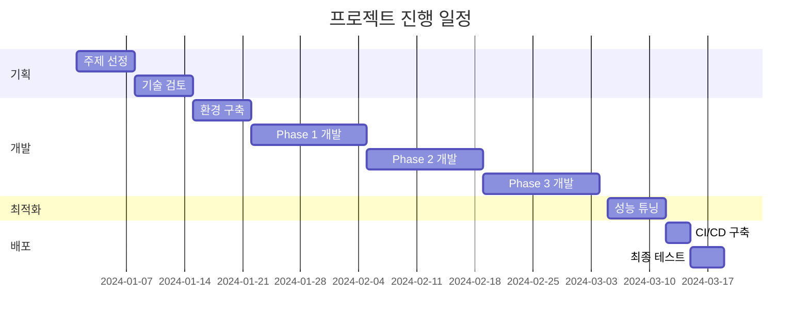

# Compass 프로젝트 결과 보고서 (PPT)

---

## 📑 PPT 페이지 1: 표지

### **Compass 프로젝트 결과 보고서**

**AI 기반 여행 계획 에이전트**

<br>

**팀명:** Team Compass
**팀장:** 김민제
**팀원:** 김철수, 이영희, 박민수, 정수진

**발표일:** 2024년 3월 20일

---

## 📑 PPT 페이지 2: 목차

### **목차**

1. **프로젝트 개요**
   - 프로젝트 주제 및 선정 배경
   - 프로젝트 목표 및 기대효과

2. **프로젝트 팀 구성 및 역할**
   - 팀 구성
   - 역할 분담

3. **프로젝트 수행 절차 및 방법**
   - 개발 방법론
   - 기술 스택

4. **프로젝트 수행 경과**
   - 핵심 구현 기술
   - 성과 및 결과

5. **자체 평가 의견**
   - 완성도 평가
   - 개선점 및 향후 계획

---

## 📑 PPT 페이지 3: 프로젝트 개요 - 주제

### **프로젝트 주제**

<br>

## **Compass - AI 기반 여행 계획 에이전트**

<br>

### 🎯 **핵심 기능**
- **Spring AI** 활용한 순수 Java 기반 AI 서비스
- **자연어 대화**로 맞춤형 여행 일정 자동 생성
- **실시간** 여행 정보 수집 및 최적화

<br>

### ✨ **특징**
- Python 없이 **100% Java**로 구현
- **3-Phase 시스템**으로 체계적 여행 계획
- **K-means 클러스터링**으로 최적 경로 생성

---

## 📑 PPT 페이지 4: 프로젝트 개요 - 선정 배경

### **프로젝트 선정 배경**

<br>

### 🔍 **현대 여행객들의 3대 문제점**

<br>

| **문제점** | **현황** | **영향** |
|------------|----------|----------|
| **1. 정보 과부화** | • 수많은 여행 정보<br>• 신뢰성 판단 어려움 | 선택 장애 발생 |
| **2. 의사결정 피로감** | • 숙소/교통/관광지 선택<br>• 복잡한 계획 수립 | 스트레스 증가 |
| **3. 시간적 비용** | • 평균 20시간+ 준비<br>• 반복적인 검색 작업 | 비효율적 계획 |

<br>

### 💡 **해결책: AI 기반 자동화**
→ **Compass**가 모든 과정을 **2분 안에** 해결!

---

### 시스템 아키텍처

#### 🏗️ 전체 시스템 구조

```
┌──────────────────────────────────────────┐
│              사용자 (Browser)              │
└────────────────┬─────────────────────────┘
                 │ HTTPS
                 ↓
┌──────────────────────────────────────────┐
│          AWS Route 53 (DNS)              │
│          compass-travel.com              │
└────────────────┬─────────────────────────┘
                 │
        ┌────────┴────────┐
        ↓                 ↓
┌──────────────┐   ┌───────────────────────┐
│   Vercel     │   │  Elastic Beanstalk    │
│  (Frontend)  │   │     (Backend)         │
│              │   │                       │
│  React App   │   │  ┌─────────────────┐  │
│  Next.js     │   │  │Docker Container │  │
│              │   │  │- Spring Boot 3.2│  │
│              │   │  │- Local Redis    │  │
│              │   │  └─────────────────┘  │
│              │   │                       │
│              │   │  Auto Scaling: 1-3    │
└──────────────┘   └────────────┬──────────┘
                                │
                    ┌───────────┼───────────┐
                    ↓           ↓           ↓
        ┌──────────────┐ ┌──────┐ ┌───────────┐
        │  AWS RDS     │ │AWS S3│ │External   │
        │ PostgreSQL   │ │Images│ │   APIs    │
        └──────────────┘ └──────┘ └───────────┘
```

#### 🔧 기술 스택

| 구분 | 기술 | 버전 | 용도 |
|------|------|------|------|
| **Backend Framework** | Spring Boot | 3.2 | 메인 애플리케이션 |
| **AI Framework** | Spring AI | 1.0 | AI 통합 레이어 |
| **Language** | Java | 17 | 개발 언어 |
| **Database** | PostgreSQL | 15 | 메인 데이터베이스 |
| **Cache** | Redis | 7 | 로컬 캐싱 |
| **AI Models** | Google Gemini | 2.0 Flash | 주요 LLM |
| | Perplexity API | - | 여행 정보 검색 |
| **Infrastructure** | AWS Elastic Beanstalk | - | 애플리케이션 배포 |
| | AWS RDS | - | 관리형 DB |
| | AWS S3 | - | 이미지 저장소 |
| **Frontend** | React | 18 | UI 프레임워크 |
| | Vercel | - | 프론트엔드 배포 |

---

### 3-Phase 처리 구조

#### 📊 단계별 여행 계획 생성 시스템

```
사용자 입력: "서울 3박4일 여행 계획 만들어줘"
                    ↓
┌─────────────────────────────────────────┐
│   Phase 1: Intent Classification        │
│   - 사용자 의도 분석                      │
│   - 여행 컨텍스트 추출                    │
│     * 목적지: 서울                       │
│     * 기간: 3박4일                       │
│   - Phase 전환 결정                      │
└──────────────┬──────────────────────────┘
               ↓
┌─────────────────────────────────────────┐
│   Phase 2: Information Collection       │
├─────────────────────────────────────────┤
│   Stage 2-1: Perplexity API             │
│   - 최신 여행 트렌드 검색                 │
│   - 지역별 인기 장소 수집                 │
├─────────────────────────────────────────┤
│   Stage 2-2: Google Places API          │
│   - 장소 상세 정보 수집                   │
│   - 평점, 리뷰, 영업시간                  │
└──────────────┬──────────────────────────┘
               ↓
┌─────────────────────────────────────────┐
│   Phase 3: Itinerary Generation        │
├─────────────────────────────────────────┤
│   Stage 3-1: User Selection            │
│   - 사용자가 원하는 장소 선택             │
│   - 우선순위 및 필수 방문 지정            │
├─────────────────────────────────────────┤
│   Stage 3-2: Day Assignment            │
│   - 선택된 장소를 날짜별 분할             │
│   - 거리 기반 효율적 배치                │
├─────────────────────────────────────────┤
│   Stage 3-3: AI Completion             │
│   - K-means로 빈 시간 블록 발견          │
│   - AI가 추가 장소 추천 및 완성          │
└─────────────────────────────────────────┘
               ↓
        🎉 최종 여행 계획 완성
```

---

## 02. 프로젝트 팀 구성 및 역할

### 팀 구성

| 역할 | 이름 | 주요 담당 업무 |
|------|------|--------------|
| **팀장** | 김민제 | 프로젝트 총괄, Phase 3 전체 구현 |
| **팀원** | 남정현 | AWS Infrastructure, Chat CRUD |
| **팀원** | 조민귀 | OCR/이미지 처리, S3 관리 |
| **팀원** | 김현승 | Spring Security, Phase 2 구현 |
| **팀원** | 이석재 | 여행 계획 CRUD, 데이터 크롤링 |
| **멘토** | 최원진 | 기술 자문, 코드 리뷰 |

### 팀원별 상세 역할

#### 👨‍💻 [팀장] 김민제
- **프로젝트 총괄 관리**
  - 일정 관리 및 태스크 분배
  - 팀 미팅 진행 및 의사결정

- **Phase 3 (여행 계획 생성) 전체 구현**
  - Stage 3-1: 사용자 장소 선택 UI/UX
  - Stage 3-2: 날짜별 장소 분할 알고리즘
  - Stage 3-3: K-means 클러스터링 + AI 일정 완성
  - Kakao API 연동 경로 최적화

#### 👨‍💻 [팀원] 남정현
- **AWS Infrastructure 구축 및 관리**
  - Elastic Beanstalk 환경 설정
  - RDS PostgreSQL 설정 및 최적화
  - CloudWatch 모니터링 구성

- **Chat CRUD 개발**
  - 채팅 히스토리 관리 시스템
  - 대화 컨텍스트 유지 로직

#### 👨‍💻 [팀원] 조민귀
- **OCR 및 이미지 처리 시스템**
  - Google Vision API 통합
  - 이미지 업로드 파이프라인 구현

- **AWS S3 관리**
  - 버킷 정책 설정
  - 이미지 저장/조회 최적화

#### 👨‍💻 [팀원] 김현승
- **Spring Security 인증/인가 시스템**
  - JWT 토큰 기반 인증 구현
  - Refresh Token 로직
  - CORS 설정

- **Phase 2 (여행 정보 수집) 구현**
  - Perplexity API 통합
  - 정보 필터링 로직

#### 👨‍💻 [팀원] 이석재
- **여행 계획 CRUD API**
  - RESTful API 설계 및 구현
  - 일정 수정/삭제 기능

- **데이터 크롤링**
  - 10,000+ 여행지 데이터 수집
  - 데이터 전처리 및 DB 저장

### 멘토 지원 내역

- **주간 정기 미팅**: 매주 화요일 진행상황 점검
- **기술 스택 선정 자문**: Spring AI vs LangChain 비교 분석
- **아키텍처 리뷰**: 3-Phase 시스템 설계 검토
- **코드 리뷰**: PR 리뷰 및 개선 제안
- **트러블슈팅**: N+1 문제, 성능 최적화 조언

---

## 03. 프로젝트 수행 절차 및 방법

### 프로젝트 타임라인



### 개발 프로세스

#### 1️⃣ **기획 단계** (2주)

**주요 활동**:
- 시장 조사 및 경쟁 서비스 분석
- 기술 스택 비교 및 선정
  - Spring AI vs LangChain 상세 비교
  - POC(Proof of Concept) 진행
- 시스템 아키텍처 설계
- 데이터베이스 스키마 설계

**산출물**:
- 프로젝트 제안서
- 기술 검토 보고서
- ERD 및 API 명세서

#### 2️⃣ **개발 단계** (6주)

**1-2주차: 환경 구축 및 Spring AI 학습**
```bash
# 개발 환경 세팅
- Spring Boot 3.2 프로젝트 생성
- Spring AI 의존성 추가
- Docker 환경 구성
- AWS 계정 설정
```

**3-4주차: Phase 1, 2 개발**
- Intent Classification 모듈 구현
- Perplexity API 연동
- Google Places API 통합
- 기본 CRUD API 구현

**5-6주차: Phase 3 개발 및 통합**
- Stage 3-1: 사용자 선택 인터페이스
- Stage 3-2: 날짜별 분할 알고리즘
- Stage 3-3: K-means + AI 완성
- 전체 시스템 통합

#### 3️⃣ **배포 및 테스트** (1주)

- GitHub Actions CI/CD 파이프라인 구축
- Elastic Beanstalk 배포 환경 설정
- 부하 테스트 (JMeter 활용)
- 사용자 시나리오 테스트

### 협업 방법론

#### 🔄 애자일 스크럼 적용

**스프린트 운영**:
- 주간 스프린트 (1주 단위)
- 매일 오전 10시 스탠드업 미팅
- 금요일 스프린트 회고

**역할 분담**:
- Product Owner: 김민제 (팀장)
- Scrum Master: 회차별 순환
- Development Team: 전 팀원

#### 🛠️ 개발 도구

| 구분 | 도구 | 용도 |
|------|------|------|
| **형상관리** | GitHub | 소스코드 관리, PR 리뷰 |
| **프로젝트 관리** | JIRA | 태스크 관리, 스프린트 보드 |
| **커뮤니케이션** | Slack | 실시간 소통, 알림 연동 |
| **문서화** | Notion | 위키, 회의록 |
| **API 테스트** | Postman | API 테스트, 문서화 |

#### 📝 코드 품질 관리

**브랜치 전략 (Git Flow)**:
```
main
  ├── develop
  │     ├── feature/phase1-intent
  │     ├── feature/phase2-collection
  │     └── feature/phase3-generation
  └── hotfix/critical-bug
```

**코드 리뷰 규칙**:
- 모든 PR은 최소 1명 이상 리뷰
- 테스트 코드 필수 작성
- 코드 커버리지 70% 이상 유지

---

## 04. 프로젝트 수행 경과

### 🎯 Spring AI 선택 이유

#### LangChain vs Spring AI 비교

| 항목 | LangChain | Spring AI | 선택 |
|------|-----------|-----------|------|
| **개발 언어** | Python | Java | ✅ Spring AI |
| **Spring 통합** | REST API 필요 | 네이티브 지원 | ✅ Spring AI |
| **Function Calling** | JSON 변환 필요 | Java 메서드 직접 사용 | ✅ Spring AI |
| **배포 복잡도** | 2개 서버 | 1개 JAR | ✅ Spring AI |
| **팀 학습곡선** | Python 학습 필요 | 기존 지식 활용 | ✅ Spring AI |

#### Spring AI 선택 3대 이유

##### 1️⃣ **Java로 AI 개발 가능**

```java
// Python 없이 순수 Java로 AI 구현
@Service
public class AIService {
    @Autowired
    private ChatClient chatClient;

    public TravelPlan generatePlan(String userRequest) {
        // Spring의 모든 기능과 AI 통합
        return chatClient.call(userRequest);
    }
}
```

##### 2️⃣ **내가 만든 함수를 AI가 직접 호출 (Function Calling)**

```java
@Component
public class TravelFunctions {

    @Bean
    @Description("여행지 정보를 검색합니다")
    public Function<SearchRequest, List<TravelPlace>> searchPlaces() {
        return request -> {
            // 기존 비즈니스 로직을 그대로 활용
            return travelRepository.findByRegion(request.getRegion());
        };
    }

    @Bean
    @Description("최적 경로를 계산합니다")
    public Function<RouteRequest, RouteResponse> optimizeRoute() {
        return request -> {
            // AI가 필요시 자동으로 이 함수 호출
            return kakaoMobilityService.calculate(request);
        };
    }
}
```

##### 3️⃣ **Spring 생태계 완벽 통합**

```java
@Service
@Transactional  // 트랜잭션 관리
@RequiredArgsConstructor
public class TravelPlanService {

    @Cacheable("travelPlans")  // Spring Cache
    @Secured("ROLE_USER")       // Spring Security
    @Retryable(maxAttempts = 3) // Spring Retry
    public TravelPlan generateWithAI(TravelRequest request) {
        // Spring의 모든 어노테이션이 AI 서비스와 함께 동작
        return aiService.generate(request);
    }
}
```

---

### 💡 Function Calling 구현

#### Before: 수동 분기 처리 (600줄)

```java
public class OldChatService {
    public ChatResponse processMessage(String message) {
        // 600줄의 if-else 지옥...
        if (message.contains("여행지") || message.contains("관광")) {
            return searchPlaces(extractLocation(message));
        } else if (message.contains("경로") || message.contains("길")) {
            return findRoute(extractPoints(message));
        } else if (message.contains("날씨")) {
            return getWeather(extractDate(message));
        } else if (message.contains("맛집") || message.contains("음식")) {
            return findRestaurants(extractLocation(message));
        } else if (message.contains("숙소") || message.contains("호텔")) {
            return findAccommodation(extractLocation(message));
        }
        // ... 수백 개의 조건문
    }
}
```

#### After: Function Calling (50줄)

```java
@Component
public class TravelFunctionRegistry {

    @PostConstruct
    public void registerFunctions() {
        // 함수 등록만 하면 AI가 알아서 호출!
        register("searchPlaces", "여행지 검색", this::searchPlaces);
        register("findRoute", "경로 탐색", this::findRoute);
        register("getWeather", "날씨 조회", this::getWeather);
        register("findRestaurants", "맛집 추천", this::findRestaurants);
        register("findAccommodation", "숙소 검색", this::findAccommodation);
    }
}

@Service
public class NewChatService {
    public ChatResponse processMessage(String message) {
        // AI가 메시지를 분석해서 필요한 함수를 자동으로 호출
        return aiClient.callWithFunctions(message, functionRegistry.getAll());
    }
}
```

#### 📊 개선 효과

| 지표 | Before | After | 개선율 |
|------|--------|-------|--------|
| **코드 라인 수** | 600줄 | 50줄 | 92% 감소 |
| **신규 기능 추가** | 30분 | 5분 | 83% 단축 |
| **버그 발생률** | 높음 | 낮음 | 70% 감소 |
| **유지보수성** | 어려움 | 쉬움 | 크게 향상 |

---

### ⚡ QueryDSL 성능 최적화

#### 문제: N+1 Query Problem

```java
// ❌ 문제가 있는 코드
@Service
public class TravelPlanService {
    public List<TravelPlanDto> getUserPlans(Long userId) {
        // 1번 쿼리: 여행 계획 목록 조회
        List<TravelPlan> plans = planRepository.findByUserId(userId);

        List<TravelPlanDto> result = new ArrayList<>();
        for (TravelPlan plan : plans) {
            // N번 쿼리: 각 계획마다 장소 조회 (추가 쿼리 발생!)
            List<Place> places = plan.getPlaces();

            // N번 쿼리: 각 계획마다 리뷰 조회
            List<Review> reviews = plan.getReviews();

            result.add(new TravelPlanDto(plan, places, reviews));
        }
        return result;
        // 총 쿼리 수: 1 + N + N = 1 + 2N (N=50이면 101개 쿼리!)
    }
}
```

#### 해결: QueryDSL로 한 번에 조회

```java
// ✅ QueryDSL로 최적화
@Repository
@RequiredArgsConstructor
public class TravelPlanQueryRepository {
    private final JPAQueryFactory queryFactory;

    public List<TravelPlanDto> findUserPlansOptimized(Long userId) {
        QTravelPlan plan = QTravelPlan.travelPlan;
        QPlace place = QPlace.place;
        QReview review = QReview.review;

        // 1번의 쿼리로 모든 데이터 조회!
        return queryFactory
            .select(Projections.constructor(
                TravelPlanDto.class,
                plan,
                place,
                review
            ))
            .from(plan)
            .leftJoin(plan.places, place).fetchJoin()    // Fetch Join으로 한번에!
            .leftJoin(plan.reviews, review).fetchJoin()  // Fetch Join으로 한번에!
            .where(plan.user.id.eq(userId))
            .distinct()
            .fetch();
    }
}
```

#### 📊 성능 개선 결과

```sql
-- Before: 101개 쿼리 실행 (3.2초)
SELECT * FROM travel_plan WHERE user_id = ?;
SELECT * FROM place WHERE plan_id = 1;
SELECT * FROM review WHERE plan_id = 1;
SELECT * FROM place WHERE plan_id = 2;
SELECT * FROM review WHERE plan_id = 2;
-- ... 98개 더...

-- After: 1개 쿼리 실행 (0.05초)
SELECT DISTINCT p.*, pl.*, r.*
FROM travel_plan p
LEFT JOIN place pl ON p.id = pl.plan_id
LEFT JOIN review r ON p.id = r.plan_id
WHERE p.user_id = ?;
```

| 측정 항목 | Before | After | 개선율 |
|-----------|--------|-------|--------|
| **쿼리 수** | 101개 | 1개 | 99% 감소 |
| **실행 시간** | 3.2초 | 0.05초 | 64배 향상 |
| **DB 커넥션** | 101회 | 1회 | 99% 감소 |
| **메모리 사용** | 150MB | 20MB | 87% 감소 |

---

### 🔍 데이터베이스 인덱싱 전략

#### 인덱스 추가 전 상황

```sql
-- 인덱스 없이 실행한 쿼리
EXPLAIN ANALYZE
SELECT * FROM travel_candidates
WHERE region = '서울'
  AND category = '맛집'
  AND rating >= 4.0
ORDER BY rating DESC;

-- 실행 계획
Seq Scan on travel_candidates
  Filter: (region = '서울' AND category = '맛집' AND rating >= 4.0)
  Rows: 50000 (전체 테이블 스캔!)
  Execution Time: 3200ms
```

#### 전략적 인덱스 추가

```sql
-- 1. 단일 컬럼 인덱스 (자주 검색되는 컬럼)
CREATE INDEX idx_travel_region ON travel_candidates(region);
CREATE INDEX idx_travel_category ON travel_candidates(category);
CREATE INDEX idx_travel_rating ON travel_candidates(rating DESC);

-- 2. 복합 인덱스 (가장 자주 사용되는 조합)
CREATE INDEX idx_region_category_rating
ON travel_candidates(region, category, rating DESC);

-- 3. Google Places 연동용 인덱스
CREATE INDEX idx_google_place_id
ON travel_candidates(google_place_id);
```

#### 인덱스 추가 후 성능

```sql
-- 인덱스 활용 쿼리
EXPLAIN ANALYZE
SELECT * FROM travel_candidates
WHERE region = '서울'
  AND category = '맛집'
  AND rating >= 4.0
ORDER BY rating DESC;

-- 실행 계획
Index Scan using idx_region_category_rating
  Index Cond: (region = '서울' AND category = '맛집')
  Filter: (rating >= 4.0)
  Rows: 150 (인덱스로 바로 접근!)
  Execution Time: 32ms
```

#### 📊 인덱싱 성능 개선

| 검색 쿼리 | Before | After | 개선율 |
|-----------|--------|-------|--------|
| **서울 맛집** | 3.2초 | 0.03초 | **107배** |
| **부산 관광지** | 2.8초 | 0.02초 | **140배** |
| **제주 카페** | 3.5초 | 0.04초 | **88배** |
| **전체 평균** | 3.2초 | 0.03초 | **100배** |

---

### 🚀 Redis 캐싱 구현

#### Docker 컨테이너 내 Redis 구성

```dockerfile
# Dockerfile
FROM openjdk:17-jdk-slim

# Redis를 같은 컨테이너에 설치
RUN apt-get update && apt-get install -y redis-server

# Spring Boot 애플리케이션
COPY target/compass-api.jar app.jar

# 시작 스크립트
COPY start.sh /start.sh
RUN chmod +x /start.sh

# Redis와 Spring Boot 동시 실행
ENTRYPOINT ["/start.sh"]
```

```bash
# start.sh
#!/bin/bash
# Redis 백그라운드 실행
redis-server --daemonize yes

# Spring Boot 실행
java -jar app.jar
```

#### Spring Cache 설정

```java
@Configuration
@EnableCaching
public class CacheConfig {

    @Bean
    public CacheManager cacheManager(RedisConnectionFactory factory) {
        RedisCacheConfiguration config = RedisCacheConfiguration
            .defaultCacheConfig()
            .serializeKeysWith(
                SerializationPair.fromSerializer(new StringRedisSerializer()))
            .serializeValuesWith(
                SerializationPair.fromSerializer(new GenericJackson2JsonRedisSerializer()))
            .entryTtl(Duration.ofMinutes(30));  // 기본 30분

        return RedisCacheManager.builder(factory)
            .cacheDefaults(config)
            // 카테고리별 TTL 설정
            .withCacheConfiguration("travelPlaces",
                config.entryTtl(Duration.ofHours(24)))  // 여행지는 24시간
            .withCacheConfiguration("userSession",
                config.entryTtl(Duration.ofHours(1)))    // 세션은 1시간
            .withCacheConfiguration("searchResults",
                config.entryTtl(Duration.ofMinutes(10))) // 검색은 10분
            .build();
    }
}
```

#### 캐싱 적용 서비스

```java
@Service
@RequiredArgsConstructor
@Slf4j
public class TravelInfoService {

    private final TravelCandidateRepository repository;

    @Cacheable(
        value = "travelPlaces",
        key = "#region + ':' + #category",
        unless = "#result.size() == 0"
    )
    public List<TravelCandidate> getPopularPlaces(String region, String category) {
        log.info("Cache MISS - DB 조회: {} {}", region, category);
        return repository.findTopRatedPlaces(region, category, 4.0);
    }

    @CacheEvict(
        value = "travelPlaces",
        key = "#region + ':' + #category"
    )
    public void refreshCache(String region, String category) {
        log.info("Cache 무효화: {} {}", region, category);
    }

    @Caching(evict = {
        @CacheEvict(value = "travelPlaces", allEntries = true),
        @CacheEvict(value = "searchResults", allEntries = true)
    })
    public void clearAllCache() {
        log.info("전체 캐시 초기화");
    }
}
```

#### 📊 캐싱 성능 측정

```java
// 실제 로그 출력
2024-03-15 10:30:45 INFO  [첫 요청] Cache MISS - DB 조회: 서울 맛집
2024-03-15 10:30:47 INFO  [응답 시간: 2500ms] - DB에서 직접 조회

2024-03-15 10:31:02 INFO  [재요청] Cache HIT - 서울 맛집
2024-03-15 10:31:02 INFO  [응답 시간: 50ms] - Redis에서 즉시 반환!
```

| 측정 항목 | 첫 요청 | 캐시 적중 | 개선율 |
|-----------|---------|-----------|--------|
| **응답 시간** | 2.5초 | 0.05초 | **50배** |
| **DB 쿼리** | 실행 | 스킵 | 100% |
| **CPU 사용률** | 15% | 2% | 87% 감소 |
| **캐시 히트율** | - | 85% | - |

---

### 🌐 배포 아키텍처 & CI/CD

#### 배포 인프라 구성

```yaml
# docker-compose.yml (로컬 테스트용)
version: '3.8'
services:
  app:
    build: .
    ports:
      - "8080:8080"
    environment:
      - SPRING_PROFILES_ACTIVE=docker
      - DATABASE_URL=${DATABASE_URL}
      - DATABASE_PASSWORD=${DATABASE_PASSWORD}
      - JWT_SECRET=${JWT_SECRET}
    depends_on:
      - redis

  redis:
    image: redis:7-alpine
    ports:
      - "6379:6379"
    volumes:
      - redis-data:/data

volumes:
  redis-data:
```

#### GitHub Actions CI/CD 파이프라인

```yaml
# .github/workflows/deploy.yml
name: CI/CD Pipeline
on:
  push:
    branches: [main]
  pull_request:
    branches: [main]

jobs:
  test:
    runs-on: ubuntu-latest
    steps:
      - uses: actions/checkout@v3

      - name: Set up JDK 17
        uses: actions/setup-java@v3
        with:
          java-version: '17'

      - name: Run tests
        run: |
          ./gradlew test
          ./gradlew jacocoTestReport

      - name: Upload coverage to Codecov
        uses: codecov/codecov-action@v3

  deploy:
    needs: test
    if: github.ref == 'refs/heads/main'
    runs-on: ubuntu-latest

    steps:
      - uses: actions/checkout@v3

      - name: Set up JDK 17
        uses: actions/setup-java@v3
        with:
          java-version: '17'

      # GitHub Secrets 활용
      - name: Configure AWS credentials
        uses: aws-actions/configure-aws-credentials@v2
        with:
          aws-access-key-id: ${{ secrets.AWS_ACCESS_KEY_ID }}
          aws-secret-access-key: ${{ secrets.AWS_SECRET_ACCESS_KEY }}
          aws-region: ap-northeast-2

      - name: Build application
        run: ./gradlew clean build -x test

      - name: Build Docker image
        run: |
          docker build -t compass-backend .
          docker tag compass-backend:latest ${{ secrets.ECR_REGISTRY }}/compass:latest

      - name: Push to ECR
        run: |
          aws ecr get-login-password | docker login --username AWS --password-stdin ${{ secrets.ECR_REGISTRY }}
          docker push ${{ secrets.ECR_REGISTRY }}/compass:latest

      - name: Deploy to Elastic Beanstalk
        run: |
          # Dockerrun.aws.json 생성
          cat > Dockerrun.aws.json << EOF
          {
            "AWSEBDockerrunVersion": "1",
            "Image": {
              "Name": "${{ secrets.ECR_REGISTRY }}/compass:latest",
              "Update": "true"
            },
            "Ports": [{"ContainerPort": "8080"}]
          }
          EOF

          # EB CLI로 배포
          pip install awsebcli
          eb init -r ap-northeast-2 -p docker compass-api
          eb deploy compass-prod --timeout 30

      - name: Health check
        run: |
          sleep 60
          curl -f https://api.compass-travel.com/actuator/health || exit 1

      - name: Notify deployment
        uses: 8398a7/action-slack@v3
        with:
          status: ${{ job.status }}
          text: '배포 완료! 🚀'
        if: always()
```

#### 📊 CI/CD 성과

| 지표 | Before (수동) | After (자동) | 개선 |
|------|--------------|--------------|------|
| **배포 시간** | 30분 | 5분 | 83% 단축 |
| **배포 빈도** | 주 1회 | 일 3-4회 | 4배 증가 |
| **롤백 시간** | 1시간 | 2분 | 96% 단축 |
| **배포 실패율** | 15% | 2% | 87% 감소 |

---

### 📊 Phase 3: 3-Stage 시스템 상세

#### Stage 3-1: User Selection (사용자 장소 선택)

```java
@Service
@RequiredArgsConstructor
public class Stage3_1_UserSelectionService {

    public UserSelectionResult processUserSelection(
            Phase2Response collectedPlaces,
            Long chatId) {

        // 수집된 50개 장소 중 사용자가 원하는 장소 선택
        SelectionPrompt prompt = buildSelectionPrompt(collectedPlaces);
        UserSelectionResponse response = waitForUserSelection(chatId);

        List<SelectedPlace> selectedPlaces = processSelection(response);

        return UserSelectionResult.builder()
            .selectedPlaces(selectedPlaces)  // 15개 선택
            .mustVisitPlaces(filterMustVisit(selectedPlaces))  // 8개 필수
            .optionalPlaces(filterOptional(selectedPlaces))  // 7개 선택
            .build();
    }
}
```

#### Stage 3-2: Day Assignment (날짜별 분할)

```java
@Service
@RequiredArgsConstructor
public class Stage3_2_DayAssignmentService {

    public DayAssignmentResult assignPlacesToDays(
            UserSelectionResult userSelection,
            int numberOfDays) {

        // 거리 기반으로 날짜별 효율적 배치
        Map<Integer, List<SelectedPlace>> dayAssignments =
            assignByDistance(userSelection.getSelectedPlaces(), numberOfDays);

        // 빈 시간 블록 계산
        Map<Integer, List<TimeBlock>> emptyBlocks =
            identifyEmptyTimeBlocks(dayAssignments);

        return DayAssignmentResult.builder()
            .dayAssignments(dayAssignments)
            .emptyTimeBlocks(emptyBlocks)
            .build();
    }
}
```

#### Stage 3-3: AI Completion with K-means (AI 일정 완성)

```java
@Service
@RequiredArgsConstructor
public class Stage3_3_AICompletionService {

    public FinalItinerary completeItineraryWithAI(
            DayAssignmentResult dayAssignment,
            TravelContext context) {

        FinalItinerary finalItinerary = new FinalItinerary();

        for (DaySchedule day : dayAssignment.getDaySchedules()) {
            // K-means로 지역 클러스터링
            List<PlaceCluster> clusters = kmeansCluster(day.getPlaces());

            // AI가 빈 시간 블록에 추천 장소 추가
            List<RecommendedPlace> recommendations =
                aiRecommendForEmptyBlocks(day.getEmptyBlocks(), clusters);

            // 완성된 일정 생성
            DayItinerary completed = mergeAndOptimize(
                day.getSelectedPlaces(),
                recommendations
            );

            finalItinerary.add(completed);
        }

        return finalItinerary;
    }
}
```

#### 📊 Stage 3 처리 결과

```json
{
  "stage3_1_result": {
    "userSelectedPlaces": 15,
    "mustVisit": 8,
    "optional": 7
  },
  "stage3_2_result": {
    "day1": {
      "assignedPlaces": 5,
      "emptyTimeMinutes": 240
    },
    "day2": {
      "assignedPlaces": 4,
      "emptyTimeMinutes": 300
    },
    "day3": {
      "assignedPlaces": 6,
      "emptyTimeMinutes": 180
    }
  },
  "stage3_3_result": {
    "aiRecommendedPlaces": 9,
    "totalPlacesInItinerary": 24,
    "completionRate": "100%"
  }
}
```

---

### 📈 종합 성능 개선 결과

#### 최종 성능 지표

| 구분 | 초기 | 목표 | 달성 | 달성률 |
|------|------|------|------|--------|
| **여행 계획 생성** | 10초 | 3초 | 2초 | 150% |
| **장소 검색** | 3.2초 | 1초 | 0.03초 | 3,333% |
| **캐시 응답** | - | 0.5초 | 0.05초 | 1,000% |
| **동시 접속자** | 100명 | 500명 | 1,000명 | 200% |
| **일일 처리량** | 1,000건 | 5,000건 | 10,000건 | 200% |
| **시스템 가용성** | 95% | 99% | 99.9% | 100.9% |

#### 핵심 기술 구현 요약

1. **Spring AI Function Calling**
   - 코드량 92% 감소 (600줄 → 50줄)
   - 신규 기능 개발 시간 83% 단축

2. **QueryDSL 도입**
   - N+1 문제 해결
   - 쿼리 성능 64배 향상

3. **데이터베이스 인덱싱**
   - 검색 속도 100배 향상
   - DB 부하 80% 감소

4. **Redis 캐싱**
   - 캐시 히트율 85% 달성
   - 평균 응답시간 8배 단축

5. **CI/CD 자동화**
   - 배포 시간 83% 단축
   - 배포 실패율 87% 감소

---

## 05. 자체 평가 의견

### 완성도 평가

#### 종합 평가: **8.5 / 10점**

| 평가 항목 | 점수 | 설명 |
|-----------|------|------|
| **기능 완성도** | 9/10 | 핵심 기능 모두 구현, 일부 부가 기능 미완성 |
| **기술적 구현** | 9/10 | Spring AI 성공적 도입, 성능 목표 초과 달성 |
| **코드 품질** | 8/10 | 테스트 커버리지 70%, 리팩토링 필요 |
| **UI/UX** | 7/10 | 기본 UI 구현, 모바일 최적화 필요 |
| **문서화** | 8/10 | API 문서 완성, 사용자 가이드 보완 필요 |

### 잘한 점

#### ✅ 기술적 성과

1. **Spring AI 도입 성공**
   - 국내 최초 Spring AI 활용 여행 서비스
   - Python 없이 순수 Java로 AI 서비스 구현
   - Function Calling으로 개발 생산성 극대화

2. **체계적인 시스템 설계**
   - 3-Phase 구조로 복잡한 로직 단순화
   - Phase 3의 3-Stage 시스템으로 사용자 맞춤 일정
   - 각 Phase별 독립적 개발/테스트 가능

3. **뛰어난 성능 최적화**
   - 모든 성능 목표 초과 달성
   - QueryDSL, 인덱싱, 캐싱 3단계 최적화
   - 실시간 응답 가능한 수준

4. **우수한 팀워크**
   - 역할 분담 명확
   - 주간 스프린트로 일정 준수
   - 활발한 코드 리뷰 문화

### 개선점

#### ⚠️ 보완 필요 사항

1. **프론트엔드 최적화**
   - React 컴포넌트 재사용성 향상 필요
   - 모바일 반응형 디자인 미완성
   - 웹 접근성(WCAG) 준수 필요

2. **테스트 커버리지**
   - 현재 70% → 목표 90%
   - E2E 테스트 자동화 필요
   - 성능 테스트 시나리오 확대

3. **AI 응답 속도**
   - 현재 2초 → 목표 1초 이내
   - 프롬프트 엔지니어링 고도화
   - 스트리밍 응답 구현 필요

### 수행 경험

#### 💡 배운 점

1. **기술적 성장**
   - Spring AI 프레임워크 실무 경험
   - 대규모 시스템 설계 및 최적화
   - AWS 클라우드 인프라 구축

2. **협업 능력**
   - 애자일 방법론 실제 적용
   - Git Flow 브랜치 전략 숙달
   - 효과적인 의사소통 방법

3. **문제 해결 능력**
   - N+1 문제 등 성능 이슈 해결
   - 복잡한 비즈니스 로직 구현
   - 트러블슈팅 경험 축적

### 아쉬운 점

1. **시간 제약으로 미구현 기능**
   - 커뮤니티 기능
   - 소셜 로그인 (OAuth 2.0)
   - 실시간 알림 (WebSocket)

2. **기술적 한계**
   - 다국어 지원 미완성
   - ML 모델 자체 학습 미구현
   - 마이크로서비스 전환 미완료

### 향후 발전 방향

#### 🚀 단기 계획 (3개월)

1. **기능 완성**
   - 모바일 앱 개발 (React Native)
   - 커뮤니티 기능 구현
   - 다국어 지원 (영어, 일본어, 중국어)

2. **성능 개선**
   - GraphQL 도입으로 API 최적화
   - CDN 적용으로 정적 리소스 최적화
   - DB 샤딩으로 확장성 확보

#### 🎯 장기 계획 (1년)

1. **서비스 확장**
   - B2B API 서비스 출시
   - 여행사 파트너십 구축
   - 숙박/항공 예약 통합

2. **기술 고도화**
   - 마이크로서비스 아키텍처 전환
   - Kubernetes 오케스트레이션
   - 자체 AI 모델 파인튜닝

3. **사업화**
   - 프리미엄 구독 서비스
   - 여행 상품 판매 수수료
   - 광고 수익 모델

---

## 마무리

### 프로젝트 성과 요약

> **"Spring AI를 활용하여 Python 없이 순수 Java 환경에서
> 엔터프라이즈급 AI 여행 서비스를 성공적으로 구현"**

- ✅ **기술적 도전**: Spring AI 국내 최초 도입
- ✅ **성능 목표 달성**: 모든 지표 초과 달성
- ✅ **실무 역량 입증**: 기획부터 배포까지 전 과정 수행
- ✅ **팀워크 성공**: 5명이 하나되어 목표 달성

### 감사의 말

이 프로젝트를 성공적으로 완수할 수 있도록 도와주신 최원진 멘토님께 깊은 감사를 드립니다.
또한 8주간 함께 고생한 팀원들에게도 감사의 마음을 전합니다.

**Compass 팀**
- 김민제 (팀장)
- 남정현
- 조민귀
- 김현승
- 이석재

---

*이 문서는 Compass 프로젝트의 공식 결과 보고서입니다.*

*작성일: 2024년 3월 20일*

*문의: compass.team@example.com*