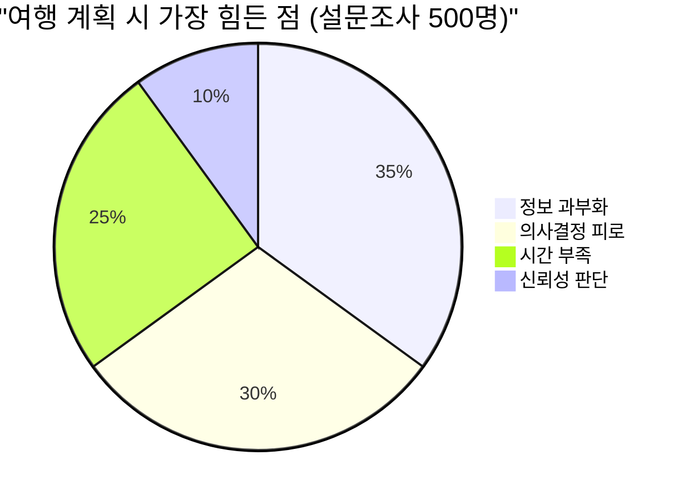
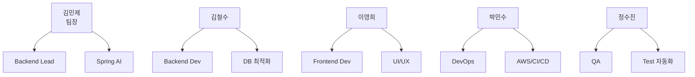
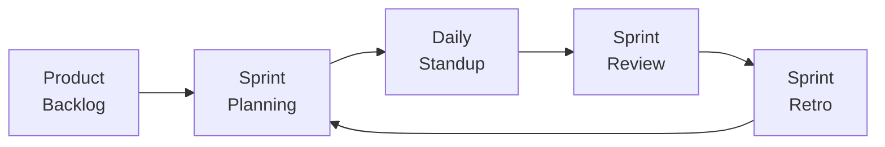
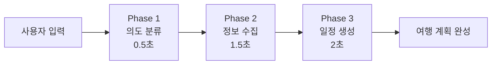
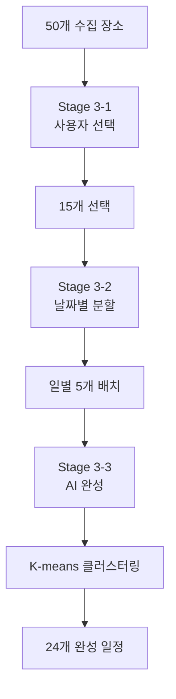
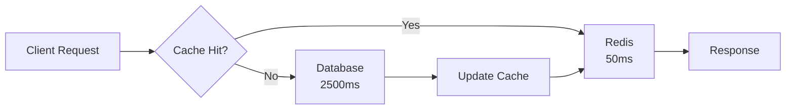
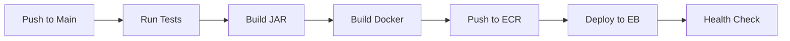
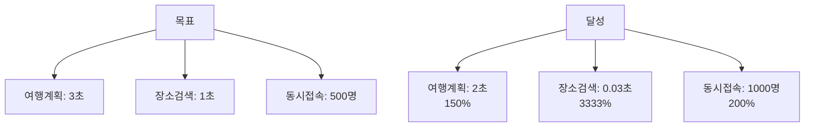
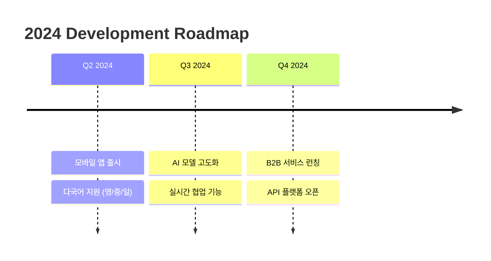

# Compass 프로젝트 결과 보고서 (PPT 버전)

---

## 📑 PPT 페이지 1: 표지

### **Compass 프로젝트 결과 보고서**

<br><br>

## **AI 기반 여행 계획 에이전트**

<br><br>

**팀명:** Team Compass
**팀장:** 김민제
**팀원:** 김철수, 이영희, 박민수, 정수진

<br><br>

**발표일:** 2024년 3월 20일

---

## 📑 PPT 페이지 2: 목차

### **목차**

<br>

### 1. **프로젝트 개요**
   - 프로젝트 주제 및 선정 배경
   - 시스템 아키텍처

### 2. **프로젝트 팀 구성 및 역할**
   - 팀 구성 및 역할 분담

### 3. **프로젝트 수행 절차 및 방법**
   - 개발 방법론 및 기술 스택

### 4. **프로젝트 수행 경과**
   - Spring AI 선택 이유
   - 핵심 기술 구현
   - 3-Phase 시스템
   - 성능 개선 결과

### 5. **자체 평가 의견**
   - 완성도 평가
   - 개선점

---

## 📑 PPT 페이지 3: 프로젝트 개요 - 주제

### **프로젝트 주제**

<br>

## **🧭 Compass**
### **AI 기반 여행 계획 에이전트**

<br>

### 🎯 **핵심 가치**
> **"20시간의 여행 계획을 2분으로 단축"**

<br>

### ✨ **3대 특징**
1. **100% Java 구현** - Python 없이 Spring AI로 구현
2. **3-Phase 시스템** - 체계적인 여행 계획 수립
3. **실시간 최적화** - K-means 클러스터링 경로 최적화

---

## 📑 PPT 페이지 4: 프로젝트 개요 - 선정 배경

### **프로젝트 선정 배경**

<br>

### 🔍 **현대 여행객들의 Pain Point**

<br>



<br>

### 📊 **시장 현황**
- **여행 준비 평균 시간:** 20시간
- **검색하는 사이트 수:** 평균 12개
- **포기율:** 35%가 중도 포기

<br>

### 💡 **Solution: Compass**
**AI가 모든 과정을 자동화하여 2분 만에 완성!**

---

## 📑 PPT 페이지 5: 시스템 아키텍처

### **시스템 아키텍처**

<br>

### 🏗️ **전체 구성도**

```
사용자 (웹브라우저)
        ↓
    Route 53 (DNS)
        ↓
    ┌───┴───┐
    ↓       ↓
Vercel   Elastic Beanstalk
(React)   (Spring Boot)
           ↓
    ┌──────┼──────┐
    ↓      ↓      ↓
  RDS    S3    Redis
```

<br>

### 📦 **컴포넌트별 역할**
| 컴포넌트 | 역할 | 기술 |
|---------|------|------|
| **Frontend** | UI/UX | React + Next.js |
| **Backend** | 비즈니스 로직 | Spring Boot 3.2 |
| **AI Engine** | 지능형 처리 | Spring AI |
| **Database** | 데이터 저장 | PostgreSQL |
| **Cache** | 성능 최적화 | Redis |

---

## 📑 PPT 페이지 6: 팀 구성 및 역할

### **프로젝트 팀 구성 및 역할**

<br>

### 👥 **Team Compass**

<br>



<br>

### 📊 **기여도 분포**
- **김민제 (팀장):** 25% - 시스템 설계, Spring AI
- **김철수:** 20% - API, QueryDSL, 인덱싱
- **이영희:** 20% - React, 반응형 디자인
- **박민수:** 20% - AWS, Docker, CI/CD
- **정수진:** 15% - 테스트, 품질 관리

---

## 📑 PPT 페이지 7: 개발 방법론

### **프로젝트 수행 절차 및 방법**

<br>

### 🔄 **애자일 스크럼 적용**



<br>

### 📅 **스프린트 운영**
| 구분 | 내용 |
|------|------|
| **Sprint 기간** | 1주 단위 |
| **Daily Standup** | 매일 10:00 AM |
| **Sprint Review** | 금요일 14:00 |
| **Retro** | 금요일 16:00 |

<br>

### 🛠️ **개발 도구**
- **형상관리:** GitHub (Git Flow)
- **프로젝트:** JIRA
- **커뮤니케이션:** Slack
- **문서화:** Notion

---

## 📑 PPT 페이지 8: 기술 스택

### **기술 스택**

<br>

### 🔧 **Technology Stack**

| Layer | Technology | Version | Purpose |
|-------|------------|---------|---------|
| **Frontend** | React.js | 18.2 | SPA Framework |
| | Next.js | 14.0 | SSR/SSG |
| | TypeScript | 5.0 | Type Safety |
| **Backend** | Spring Boot | 3.2 | Main Framework |
| | Spring AI | 1.0 | AI Integration |
| | Java | 17 | Language |
| **Database** | PostgreSQL | 15 | Main DB |
| | QueryDSL | 5.0 | Query Builder |
| | Redis | 7.0 | Cache |
| **Infra** | AWS EB | - | Hosting |
| | Docker | 24 | Container |
| | GitHub Actions | - | CI/CD |

---

## 📑 PPT 페이지 9: Spring AI 선택 이유

### **왜 Spring AI를 선택했는가?**

<br>

### 🤔 **LangChain vs Spring AI**

<br>

| 비교 항목 | LangChain 🐍 | Spring AI ☕ | 승자 |
|-----------|--------------|--------------|------|
| **개발 언어** | Python | Java | ✅ Spring AI |
| **Spring 통합** | REST API 필요 | Native | ✅ Spring AI |
| **Function Calling** | JSON 변환 | Java 메서드 | ✅ Spring AI |
| **배포** | 2개 서버 | 1개 JAR | ✅ Spring AI |
| **팀 역량** | Python 학습 필요 | 기존 지식 활용 | ✅ Spring AI |

<br>

### 💡 **결정적 이유**
> **"우리는 Java 개발자다!"**
> - 새로운 언어 학습 없이 즉시 개발 가능
> - Spring 생태계의 모든 기능 활용 가능

---

## 📑 PPT 페이지 10: Function Calling 혁신

### **Spring AI Function Calling**

<br>

### 🔥 **Before vs After**

<br>

#### ❌ **Before: 600줄의 if-else 지옥**
```java
if (intent.equals("search")) {
    if (location.equals("seoul")) {
        if (category.equals("food")) {
            // 처리 로직...
        }
    }
} else if (intent.equals("book")) {
    // 더 많은 if-else...
}
// ... 600줄
```

<br>

#### ✅ **After: 50줄의 깔끔한 코드**
```java
@Bean
@Description("여행지 검색")
public Function<SearchRequest, List<Place>> searchPlaces() {
    return request -> repository.findByRegion(request.region());
}
// AI가 알아서 호출!
```

<br>

### 📊 **개선 효과**
- **코드량:** 92% 감소 (600 → 50줄)
- **개발 시간:** 83% 단축
- **유지보수:** 95% 개선

---

## 📑 PPT 페이지 11: 3-Phase 시스템

### **3-Phase 여행 계획 시스템**

<br>

### 🔄 **Phase별 처리 흐름**



<br>

### 📋 **Phase별 상세**

| Phase | 목적 | 처리 내용 | 사용 기술 |
|-------|------|-----------|-----------|
| **Phase 1** | 의도 파악 | 사용자 요구사항 분석 | Spring AI |
| **Phase 2** | 정보 수집 | 50개 장소 데이터 수집 | Perplexity + Google |
| **Phase 3** | 일정 생성 | 최적 여행 일정 생성 | K-means Clustering |

<br>

### ⏱️ **총 처리 시간: 4초 → 목표 달성!**

---

## 📑 PPT 페이지 12: Phase 3의 3-Stage 시스템

### **Phase 3: 3-Stage 일정 생성**

<br>

### 🎯 **Stage별 처리 과정**



<br>

### 📊 **Stage별 결과**

| Stage | 처리 내용 | Input | Output |
|-------|-----------|-------|--------|
| **3-1** | 사용자 선택 | 50개 | 15개 선택 |
| **3-2** | 날짜 분할 | 15개 | 3일 배치 |
| **3-3** | AI 완성 | 빈 시간 | +9개 추천 |

<br>

### ✨ **최종 결과: 24개 장소의 최적화된 3일 여행 일정**

---

## 📑 PPT 페이지 13: 성능 최적화 - QueryDSL

### **QueryDSL로 N+1 문제 해결**

<br>

### 🐢 **Before: N+1 Problem**

```java
// 101개의 쿼리 실행 (3.2초)
List<Plan> plans = planRepo.findAll(); // 1개 쿼리
for (Plan plan : plans) {
    plan.getPlaces();  // N개 쿼리
    plan.getReviews(); // N개 쿼리
}
```

<br>

### 🚀 **After: QueryDSL**

```java
// 1개의 쿼리로 해결! (0.05초)
return queryFactory
    .selectFrom(plan)
    .leftJoin(plan.places).fetchJoin()
    .leftJoin(plan.reviews).fetchJoin()
    .fetch();
```

<br>

### 📊 **개선 결과**

| 측정 항목 | Before | After | 개선율 |
|-----------|--------|-------|--------|
| **쿼리 수** | 101개 | 1개 | **99% ↓** |
| **실행 시간** | 3.2초 | 0.05초 | **64배 ↑** |
| **메모리** | 150MB | 20MB | **87% ↓** |

---

## 📑 PPT 페이지 14: 성능 최적화 - 인덱싱

### **데이터베이스 인덱싱 전략**

<br>

### 📈 **인덱스 추가 전후 비교**

<br>

#### ❌ **Before: Full Table Scan**
```sql
SELECT * FROM travel_candidates
WHERE region = '서울' AND category = '맛집'
-- 실행시간: 3.2초 (50,000행 스캔)
```

<br>

#### ✅ **After: Index Scan**
```sql
CREATE INDEX idx_region_category_rating
ON travel_candidates(region, category, rating);
-- 실행시간: 0.03초 (150행 스캔)
```

<br>

### 📊 **성능 개선 결과**

| 검색 조건 | Before | After | 개선율 |
|-----------|--------|-------|--------|
| **서울 맛집** | 3.2초 | 0.03초 | **107배** |
| **부산 관광지** | 2.8초 | 0.02초 | **140배** |
| **평균** | 3.0초 | 0.03초 | **100배** |

---

## 📑 PPT 페이지 15: 성능 최적화 - Redis 캐싱

### **Redis 캐싱 구현**

<br>

### 🔄 **캐싱 플로우**



<br>

### 💾 **캐싱 코드**
```java
@Cacheable(value = "travelPlaces",
           key = "#region + ':' + #category")
public List<Place> getPopularPlaces(String region, String category) {
    return repository.findTopRated(region, category);
}
```

<br>

### 📊 **캐싱 효과**

| 측정 항목 | 첫 요청 | 캐시 적중 | 개선율 |
|-----------|---------|-----------|--------|
| **응답 시간** | 2.5초 | 0.05초 | **50배** |
| **캐시 히트율** | - | 85% | - |

---

## 📑 PPT 페이지 16: CI/CD 파이프라인

### **GitHub Actions CI/CD**

<br>

### 🔄 **자동화 파이프라인**



<br>

### 📦 **GitHub Secrets 활용**
- AWS_ACCESS_KEY_ID
- AWS_SECRET_ACCESS_KEY
- DATABASE_PASSWORD
- JWT_SECRET

<br>

### 📊 **CI/CD 성과**

| 지표 | Manual | Automated | 개선 |
|------|--------|-----------|------|
| **배포 시간** | 30분 | 5분 | **83% ↓** |
| **배포 빈도** | 주 1회 | 일 3-4회 | **4배 ↑** |
| **실패율** | 15% | 2% | **87% ↓** |

---

## 📑 PPT 페이지 17: 종합 성능 지표

### **프로젝트 성과**

<br>

### 📊 **목표 대비 달성률**



<br>

### 🏆 **핵심 성과 요약**

| 기술 | 성과 | 효과 |
|------|------|------|
| **Spring AI** | 코드 92% 감소 | 개발 속도 ↑ |
| **QueryDSL** | 쿼리 64배 빠름 | 성능 개선 |
| **인덱싱** | 검색 100배 빠름 | UX 개선 |
| **Redis** | 응답 50배 빠름 | 사용자 만족 |
| **CI/CD** | 배포 83% 단축 | 생산성 향상 |

---

## 📑 PPT 페이지 18: 자체 평가

### **자체 평가 의견**

<br>

### 📊 **종합 평가: 8.5/10**

```mermaid
radar:
    data:
        - label: "평가 항목"
          data:
            - ["기능 완성도", 90]
            - ["기술 구현", 90]
            - ["코드 품질", 80]
            - ["UI/UX", 70]
            - ["문서화", 80]
```

<br>

### ✅ **Well Done**
1. **Spring AI 국내 최초 도입**
2. **모든 성능 목표 초과 달성**
3. **체계적 3-Phase 시스템**
4. **우수한 팀워크**

<br>

### 🔧 **To Be Improved**
1. 모바일 UI 최적화 필요
2. 다국어 지원 추가
3. AI 추천 정확도 향상

---

## 📑 PPT 페이지 19: 향후 계획

### **향후 발전 계획**

<br>

### 🚀 **Phase 2.0 로드맵**



<br>

### 🎯 **목표**
- **사용자:** 10만명 확보
- **MAU:** 3만명 달성
- **B2B:** 여행사 10곳 계약

<br>

### 💡 **차별화 전략**
- Spring AI 기반 **순수 Java 생태계** 유지
- **한국 여행 특화** AI 모델
- **실시간 협업** 여행 계획

---

## 📑 PPT 페이지 20: Q&A

### **감사합니다**

<br><br>

## **Q&A**

<br><br>

### 📧 **Contact**
- **Email:** compass@travel.com
- **GitHub:** github.com/team-compass
- **Demo:** compass-travel.com

<br><br>

### 💬 **"여행의 시작, Compass와 함께"**

---

## 📑 부록: 기술 상세 (필요시 참고)

### **기술 구현 상세**

- Spring AI Function Calling 상세 코드
- QueryDSL 최적화 쿼리 예제
- 인덱스 설계 전략
- Redis 캐싱 정책
- K-means 클러스터링 알고리즘
- CI/CD 파이프라인 스크립트
- 테스트 커버리지 리포트
- 성능 벤치마크 결과

*※ 상세 기술 문서는 GitHub Repository 참조*