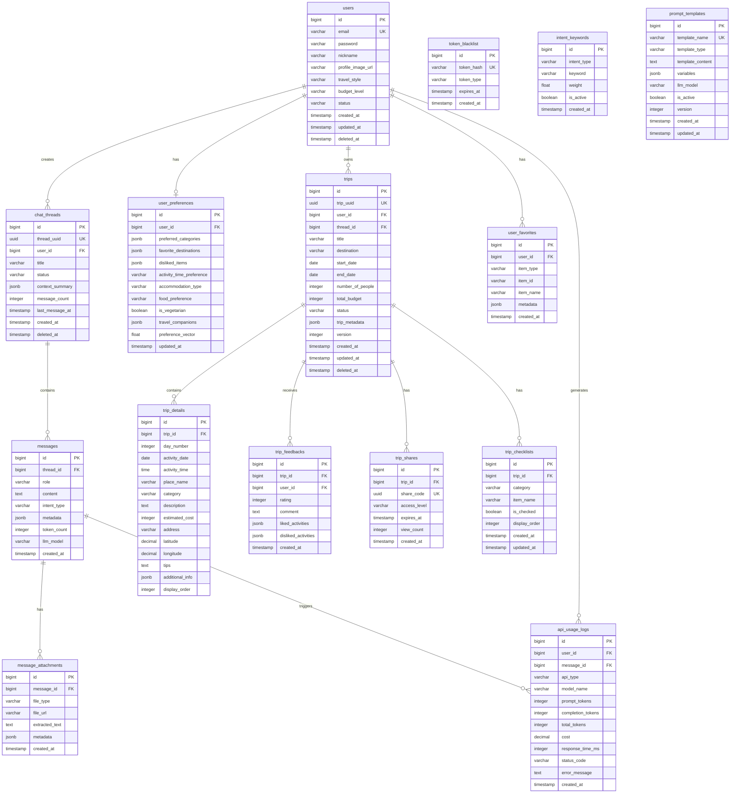

# 📊 Compass 데이터베이스 ERD

## 🎯 엔티티 추출 (요구사항 기반)

### 핵심 엔티티
1. **users** - 사용자 정보 관리
2. **user_preferences** - 사용자 선호도 정보
3. **chat_threads** - 채팅방 정보
4. **messages** - 채팅 메시지
5. **message_attachments** - 메시지 첨부파일
6. **trips** - 여행 계획
7. **trip_details** - 여행 일정 상세
8. **trip_feedbacks** - 여행 평가
9. **trip_shares** - 여행 공유 정보
10. **trip_checklists** - 여행 체크리스트
11. **api_usage_logs** - API 사용 로그
12. **token_blacklist** - 토큰 블랙리스트
13. **intent_keywords** - 의도 분류 키워드
14. **prompt_templates** - 프롬프트 템플릿
15. **user_favorites** - 사용자 즐겨찾기

---

## 🗄️ ERD 다이어그램



---

## 📋 테이블 상세 명세

### 1. users (사용자)
| 컬럼명 | 타입 | 제약조건 | 설명 |
|--------|------|----------|------|
| id | BIGSERIAL | PK | 사용자 고유 ID |
| email | VARCHAR(255) | UK, NOT NULL | 이메일 (로그인 ID) |
| password | VARCHAR(255) | NOT NULL | BCrypt 암호화된 비밀번호 |
| nickname | VARCHAR(100) | | 사용자 닉네임 |
| profile_image_url | VARCHAR(500) | | 프로필 이미지 URL |
| travel_style | VARCHAR(50) | | 여행 스타일 (REST/SIGHTSEEING/ACTIVITY) |
| budget_level | VARCHAR(50) | | 예산 수준 (BUDGET/STANDARD/LUXURY) |
| status | VARCHAR(20) | DEFAULT 'ACTIVE' | 계정 상태 (ACTIVE/INACTIVE/DELETED) |
| created_at | TIMESTAMP | DEFAULT NOW() | 가입일시 |
| updated_at | TIMESTAMP | | 수정일시 |
| deleted_at | TIMESTAMP | | 삭제일시 (soft delete) |

### 2. user_preferences (사용자 선호도)
| 컬럼명 | 타입 | 제약조건 | 설명 |
|--------|------|----------|------|
| id | BIGSERIAL | PK | 선호도 ID |
| user_id | BIGINT | FK, UK | 사용자 ID |
| preferred_categories | JSONB | | 선호 카테고리 (최대 3개) |
| favorite_destinations | JSONB | | 선호 여행지 목록 |
| disliked_items | JSONB | | 비선호 항목 (블랙리스트) |
| activity_time_preference | VARCHAR(50) | | 활동 시간 선호 (MORNING/EVENING) |
| accommodation_type | VARCHAR(50) | | 숙박 선호 (HOTEL/GUESTHOUSE/AIRBNB) |
| food_preference | VARCHAR(100) | | 음식 선호 (한식/양식/일식 등) |
| is_vegetarian | BOOLEAN | DEFAULT FALSE | 채식주의 여부 |
| travel_companions | JSONB | | 동행인 정보 |
| preference_vector | FLOAT[] | | 벡터화된 선호도 (RAG용) |
| updated_at | TIMESTAMP | | 최종 업데이트 시간 |

### 3. chat_threads (채팅방)
| 컬럼명 | 타입 | 제약조건 | 설명 |
|--------|------|----------|------|
| id | BIGSERIAL | PK | 채팅방 ID |
| thread_uuid | UUID | UK, DEFAULT gen_random_uuid() | 채팅방 고유 식별자 |
| user_id | BIGINT | FK, NOT NULL | 사용자 ID |
| title | VARCHAR(255) | | 채팅방 제목 |
| status | VARCHAR(20) | DEFAULT 'ACTIVE' | 상태 (ACTIVE/ARCHIVED/DELETED) |
| context_summary | JSONB | | 대화 컨텍스트 요약 |
| message_count | INTEGER | DEFAULT 0 | 메시지 수 |
| last_message_at | TIMESTAMP | | 마지막 메시지 시간 |
| created_at | TIMESTAMP | DEFAULT NOW() | 생성일시 |
| deleted_at | TIMESTAMP | | 삭제일시 |

### 4. messages (메시지)
| 컬럼명 | 타입 | 제약조건 | 설명 |
|--------|------|----------|------|
| id | BIGSERIAL | PK | 메시지 ID |
| thread_id | BIGINT | FK, NOT NULL | 채팅방 ID |
| role | VARCHAR(20) | NOT NULL | 역할 (USER/ASSISTANT/SYSTEM) |
| content | TEXT | NOT NULL | 메시지 내용 |
| intent_type | VARCHAR(50) | | 의도 분류 (PLANNING/RECOMMENDATION/INFO) |
| metadata | JSONB | | 메타데이터 (키워드, 엔티티 등) |
| token_count | INTEGER | | 토큰 사용량 |
| llm_model | VARCHAR(50) | | 사용된 LLM 모델 |
| created_at | TIMESTAMP | DEFAULT NOW() | 생성일시 |

### 5. message_attachments (메시지 첨부파일)
| 컬럼명 | 타입 | 제약조건 | 설명 |
|--------|------|----------|------|
| id | BIGSERIAL | PK | 첨부파일 ID |
| message_id | BIGINT | FK, NOT NULL | 메시지 ID |
| file_type | VARCHAR(50) | | 파일 타입 (IMAGE/DOCUMENT) |
| file_url | VARCHAR(500) | NOT NULL | 파일 URL |
| extracted_text | TEXT | | OCR 추출 텍스트 |
| metadata | JSONB | | 파일 메타데이터 |
| created_at | TIMESTAMP | DEFAULT NOW() | 업로드 일시 |

### 6. trips (여행 계획)
| 컬럼명 | 타입 | 제약조건 | 설명 |
|--------|------|----------|------|
| id | BIGSERIAL | PK | 여행 ID |
| trip_uuid | UUID | UK, DEFAULT gen_random_uuid() | 여행 고유 식별자 |
| user_id | BIGINT | FK, NOT NULL | 사용자 ID |
| thread_id | BIGINT | FK | 생성된 채팅방 ID |
| title | VARCHAR(255) | NOT NULL | 여행 제목 |
| destination | VARCHAR(255) | NOT NULL | 목적지 |
| start_date | DATE | NOT NULL | 출발일 |
| end_date | DATE | NOT NULL | 도착일 |
| number_of_people | INTEGER | | 여행 인원 |
| total_budget | INTEGER | | 총 예산 |
| status | VARCHAR(20) | DEFAULT 'PLANNING' | 상태 (PLANNING/CONFIRMED/ONGOING/COMPLETED) |
| trip_metadata | JSONB | | 추가 메타데이터 |
| version | INTEGER | DEFAULT 1 | 버전 (낙관적 잠금) |
| created_at | TIMESTAMP | DEFAULT NOW() | 생성일시 |
| updated_at | TIMESTAMP | | 수정일시 |
| deleted_at | TIMESTAMP | | 삭제일시 |

### 7. trip_details (여행 일정 상세)
| 컬럼명 | 타입 | 제약조건 | 설명 |
|--------|------|----------|------|
| id | BIGSERIAL | PK | 일정 ID |
| trip_id | BIGINT | FK, NOT NULL | 여행 ID |
| day_number | INTEGER | NOT NULL | 일차 |
| activity_date | DATE | | 활동 날짜 |
| activity_time | TIME | | 활동 시간 |
| place_name | VARCHAR(255) | NOT NULL | 장소명 |
| category | VARCHAR(50) | | 카테고리 (관광지/식당/숙박) |
| description | TEXT | | 설명 |
| estimated_cost | INTEGER | | 예상 비용 |
| address | VARCHAR(500) | | 주소 |
| latitude | DECIMAL(10,8) | | 위도 |
| longitude | DECIMAL(11,8) | | 경도 |
| tips | TEXT | | 팁/주의사항 |
| additional_info | JSONB | | 추가 정보 |
| display_order | INTEGER | | 표시 순서 |

### 8. trip_feedbacks (여행 평가)
| 컬럼명 | 타입 | 제약조건 | 설명 |
|--------|------|----------|------|
| id | BIGSERIAL | PK | 평가 ID |
| trip_id | BIGINT | FK, NOT NULL | 여행 ID |
| user_id | BIGINT | FK, NOT NULL | 사용자 ID |
| rating | INTEGER | CHECK (1-5) | 평점 |
| comment | TEXT | | 코멘트 |
| liked_activities | JSONB | | 좋았던 활동 |
| disliked_activities | JSONB | | 싫었던 활동 |
| created_at | TIMESTAMP | DEFAULT NOW() | 작성일시 |

### 9. api_usage_logs (API 사용 로그)
| 컬럼명 | 타입 | 제약조건 | 설명 |
|--------|------|----------|------|
| id | BIGSERIAL | PK | 로그 ID |
| user_id | BIGINT | FK | 사용자 ID |
| message_id | BIGINT | FK | 메시지 ID |
| api_type | VARCHAR(50) | | API 타입 (OPENAI/GEMINI/TOUR/WEATHER) |
| model_name | VARCHAR(100) | | 모델명 |
| prompt_tokens | INTEGER | | 프롬프트 토큰 |
| completion_tokens | INTEGER | | 완성 토큰 |
| total_tokens | INTEGER | | 총 토큰 |
| cost | DECIMAL(10,6) | | 비용 (USD) |
| response_time_ms | INTEGER | | 응답 시간 (ms) |
| status_code | VARCHAR(10) | | 상태 코드 |
| error_message | TEXT | | 에러 메시지 |
| created_at | TIMESTAMP | DEFAULT NOW() | 호출일시 |

---

## 🔑 인덱스 전략

### Primary Indexes
```sql
-- 자주 조회되는 컬럼들에 대한 인덱스
CREATE INDEX idx_users_email ON users(email);
CREATE INDEX idx_users_status ON users(status) WHERE status = 'ACTIVE';

CREATE INDEX idx_chat_threads_user_id ON chat_threads(user_id);
CREATE INDEX idx_chat_threads_status ON chat_threads(status);

CREATE INDEX idx_messages_thread_id ON messages(thread_id);
CREATE INDEX idx_messages_created_at ON messages(created_at DESC);

CREATE INDEX idx_trips_user_id ON trips(user_id);
CREATE INDEX idx_trips_status ON trips(status);
CREATE INDEX idx_trips_dates ON trips(start_date, end_date);

CREATE INDEX idx_trip_details_trip_id ON trip_details(trip_id);
CREATE INDEX idx_trip_details_day ON trip_details(trip_id, day_number);

-- 복합 인덱스
CREATE INDEX idx_messages_thread_created ON messages(thread_id, created_at DESC);
CREATE INDEX idx_api_logs_user_created ON api_usage_logs(user_id, created_at DESC);
```

### Full-Text Search Indexes
```sql
-- 메시지 검색용 전문 검색 인덱스
CREATE INDEX idx_messages_content_gin ON messages USING gin(to_tsvector('korean', content));

-- 여행 계획 검색용
CREATE INDEX idx_trips_title_gin ON trips USING gin(to_tsvector('korean', title));
CREATE INDEX idx_trip_details_place_gin ON trip_details USING gin(to_tsvector('korean', place_name));
```

### JSONB Indexes
```sql
-- JSONB 컬럼에 대한 GIN 인덱스
CREATE INDEX idx_user_preferences_categories ON user_preferences USING gin(preferred_categories);
CREATE INDEX idx_messages_metadata ON messages USING gin(metadata);
CREATE INDEX idx_trips_metadata ON trips USING gin(trip_metadata);
```

---

## 🔄 관계 설명

### 1:1 관계
- users ↔ user_preferences (사용자는 하나의 선호도 설정을 가짐)

### 1:N 관계
- users → chat_threads (사용자는 여러 채팅방을 가질 수 있음)
- users → trips (사용자는 여러 여행 계획을 가질 수 있음)
- chat_threads → messages (채팅방은 여러 메시지를 포함)
- messages → message_attachments (메시지는 여러 첨부파일을 가질 수 있음)
- trips → trip_details (여행은 여러 일정을 포함)
- trips → trip_feedbacks (여행은 여러 평가를 받을 수 있음)

### N:M 관계 (Join Table 통해 구현)
- 현재 설계에서는 N:M 관계가 없음
- 향후 그룹 여행 기능 추가 시 users ↔ trips 관계가 N:M이 될 수 있음

---

## 🚀 확장 고려사항

### 향후 추가 가능한 테이블
1. **group_trips** - 그룹 여행 관리
2. **trip_participants** - 여행 참가자 관리 (N:M)
3. **notifications** - 알림 관리
4. **user_sessions** - 세션 관리
5. **recommendation_history** - 추천 이력
6. **weather_cache** - 날씨 정보 캐시
7. **tour_cache** - 관광지 정보 캐시
8. **hotel_cache** - 호텔 정보 캐시

### 성능 최적화 전략
1. **파티셔닝**: messages, api_usage_logs 테이블을 날짜 기준으로 파티셔닝
2. **캐싱**: Redis를 활용한 자주 조회되는 데이터 캐싱
3. **읽기 전용 복제본**: 조회 성능 향상을 위한 읽기 전용 DB 구성
4. **벡터 DB**: 개인화 추천을 위한 벡터 검색 최적화 (pgvector 확장)

---

## 📝 DDL Scripts

### 기본 테이블 생성 (MVP)
```sql
-- Enable UUID extension
CREATE EXTENSION IF NOT EXISTS "uuid-ossp";
CREATE EXTENSION IF NOT EXISTS "pgvector";

-- Users table
CREATE TABLE users (
    id BIGSERIAL PRIMARY KEY,
    email VARCHAR(255) UNIQUE NOT NULL,
    password VARCHAR(255) NOT NULL,
    nickname VARCHAR(100),
    profile_image_url VARCHAR(500),
    travel_style VARCHAR(50),
    budget_level VARCHAR(50),
    status VARCHAR(20) DEFAULT 'ACTIVE',
    created_at TIMESTAMP DEFAULT CURRENT_TIMESTAMP,
    updated_at TIMESTAMP,
    deleted_at TIMESTAMP
);

-- User preferences table
CREATE TABLE user_preferences (
    id BIGSERIAL PRIMARY KEY,
    user_id BIGINT UNIQUE NOT NULL REFERENCES users(id) ON DELETE CASCADE,
    preferred_categories JSONB,
    favorite_destinations JSONB,
    disliked_items JSONB,
    activity_time_preference VARCHAR(50),
    accommodation_type VARCHAR(50),
    food_preference VARCHAR(100),
    is_vegetarian BOOLEAN DEFAULT FALSE,
    travel_companions JSONB,
    preference_vector vector(1536), -- OpenAI embedding dimension
    updated_at TIMESTAMP DEFAULT CURRENT_TIMESTAMP
);

-- Chat threads table
CREATE TABLE chat_threads (
    id BIGSERIAL PRIMARY KEY,
    thread_uuid UUID UNIQUE DEFAULT gen_random_uuid(),
    user_id BIGINT NOT NULL REFERENCES users(id) ON DELETE CASCADE,
    title VARCHAR(255),
    status VARCHAR(20) DEFAULT 'ACTIVE',
    context_summary JSONB,
    message_count INTEGER DEFAULT 0,
    last_message_at TIMESTAMP,
    created_at TIMESTAMP DEFAULT CURRENT_TIMESTAMP,
    deleted_at TIMESTAMP
);

-- Messages table
CREATE TABLE messages (
    id BIGSERIAL PRIMARY KEY,
    thread_id BIGINT NOT NULL REFERENCES chat_threads(id) ON DELETE CASCADE,
    role VARCHAR(20) NOT NULL,
    content TEXT NOT NULL,
    intent_type VARCHAR(50),
    metadata JSONB,
    token_count INTEGER,
    llm_model VARCHAR(50),
    created_at TIMESTAMP DEFAULT CURRENT_TIMESTAMP
);

-- Trips table
CREATE TABLE trips (
    id BIGSERIAL PRIMARY KEY,
    trip_uuid UUID UNIQUE DEFAULT gen_random_uuid(),
    user_id BIGINT NOT NULL REFERENCES users(id) ON DELETE CASCADE,
    thread_id BIGINT REFERENCES chat_threads(id),
    title VARCHAR(255) NOT NULL,
    destination VARCHAR(255) NOT NULL,
    start_date DATE NOT NULL,
    end_date DATE NOT NULL,
    number_of_people INTEGER,
    total_budget INTEGER,
    status VARCHAR(20) DEFAULT 'PLANNING',
    trip_metadata JSONB,
    version INTEGER DEFAULT 1,
    created_at TIMESTAMP DEFAULT CURRENT_TIMESTAMP,
    updated_at TIMESTAMP,
    deleted_at TIMESTAMP
);

-- Trip details table
CREATE TABLE trip_details (
    id BIGSERIAL PRIMARY KEY,
    trip_id BIGINT NOT NULL REFERENCES trips(id) ON DELETE CASCADE,
    day_number INTEGER NOT NULL,
    activity_date DATE,
    activity_time TIME,
    place_name VARCHAR(255) NOT NULL,
    category VARCHAR(50),
    description TEXT,
    estimated_cost INTEGER,
    address VARCHAR(500),
    latitude DECIMAL(10,8),
    longitude DECIMAL(11,8),
    tips TEXT,
    additional_info JSONB,
    display_order INTEGER
);

-- API usage logs table
CREATE TABLE api_usage_logs (
    id BIGSERIAL PRIMARY KEY,
    user_id BIGINT REFERENCES users(id),
    message_id BIGINT REFERENCES messages(id),
    api_type VARCHAR(50),
    model_name VARCHAR(100),
    prompt_tokens INTEGER,
    completion_tokens INTEGER,
    total_tokens INTEGER,
    cost DECIMAL(10,6),
    response_time_ms INTEGER,
    status_code VARCHAR(10),
    error_message TEXT,
    created_at TIMESTAMP DEFAULT CURRENT_TIMESTAMP
);
```

---

## 🔐 보안 고려사항

1. **암호화**
   - 비밀번호: BCrypt 해싱
   - 민감 데이터: AES-256 암호화
   - API 키: 환경변수 관리

2. **접근 제어**
   - Row Level Security (RLS) 적용
   - 사용자별 데이터 격리
   - JWT 토큰 기반 인증

3. **감사 로그**
   - 모든 데이터 변경 이력 추적
   - API 호출 로그 기록
   - 비정상 접근 패턴 감지

4. **데이터 보호**
   - 개인정보 마스킹
   - Soft Delete 적용
   - 정기 백업 및 복구 테스트