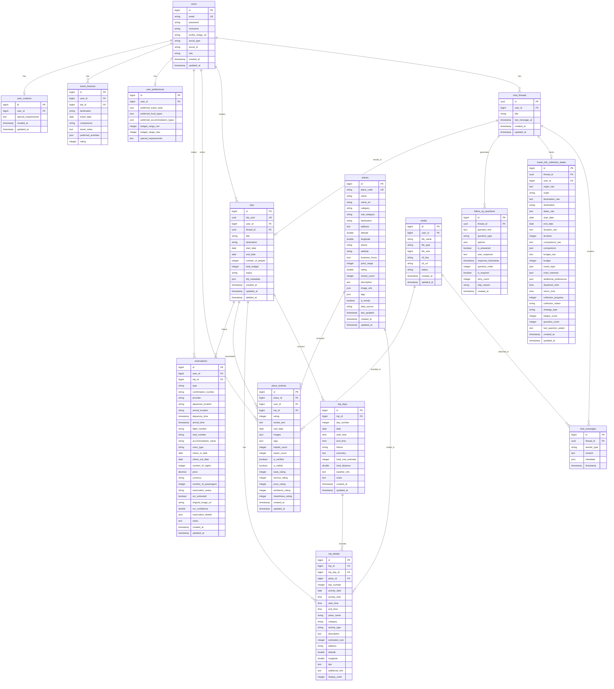

# 📊 Compass 프로젝트 ERD (Entity Relationship Diagram)

## ERD 다이어그램



## 주요 관계 설명

### 1. 사용자 중심 관계
- **users** → **chat_threads**: 1:N (한 사용자가 여러 대화 스레드 생성)
- **users** → **trips**: 1:N (한 사용자가 여러 여행 계획 생성)
- **users** → **user_preferences**: 1:1 (사용자별 선호도 설정)

### 2. 대화 플로우 관계
- **chat_threads** → **chat_messages**: 1:N (한 스레드에 여러 메시지)
- **chat_threads** → **travel_info_collection_states**: 1:1 (스레드별 정보 수집 상태)
- **chat_threads** → **follow_up_questions**: 1:N (스레드별 여러 후속 질문)
- **chat_threads** → **trips**: 1:1 (대화 결과로 여행 계획 생성)

### 3. 여행 계획 관계
- **trips** → **trip_days**: 1:N (여행 계획의 일자별 일정)
- **trip_days** → **trip_details**: 1:N (일자별 세부 일정)
- **places** → **trip_details**: 1:N (장소가 여러 일정에 포함)
- **places** → **place_reviews**: 1:N (장소별 여러 리뷰)

### 4. 예약 관계
- **users** → **reservations**: 1:N (사용자별 여러 예약)
- **trips** → **reservations**: 1:N (여행별 여러 예약, Nullable)

## 데이터 흐름

```
사용자 입력
    ↓
ChatThread 생성
    ↓
ChatMessage 저장 + TravelInfoCollectionState 업데이트
    ↓
FollowUpQuestion 생성 및 응답 수집
    ↓
정보 수집 완료
    ↓
Trip 생성
    ↓
TripDay 생성 (일자별)
    ↓
TripDetail 생성 (세부 일정)
    ↓
Place 참조 (Tour API + Perplexity)
    ↓
Reservation 연결 (OCR 추출 포함)
    ↓
여행 완료 후 PlaceReview 작성
```

## 인덱스 전략

### 성능 최적화 인덱스
1. **places**: destination + category 복합 인덱스 (빈번한 조회)
2. **trip_details**: trip_id + day_number (일정 조회)
3. **follow_up_questions**: thread_id + is_answered (미응답 질문 조회)
4. **place_reviews**: place_id + rating (장소별 리뷰 조회)
5. **reservations**: user_id + type + departure_time (예약 조회)

## 주의사항

1. **UUID 사용**: chat_threads, trips는 UUID 사용으로 보안 강화
2. **Soft Delete**: trips 테이블은 deleted_at으로 소프트 삭제
3. **JSON 컬럼**: PostgreSQL의 jsonb 타입 활용으로 유연한 데이터 저장
4. **OCR 추적**: reservations 테이블에서 OCR 추출 정보 관리
5. **데이터 소스**: places 테이블에서 Tour API vs Perplexity 구분