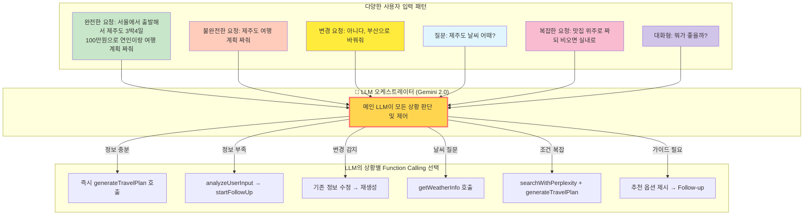
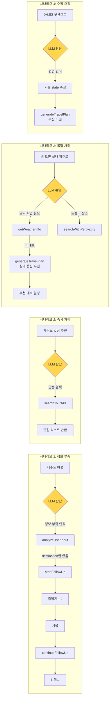
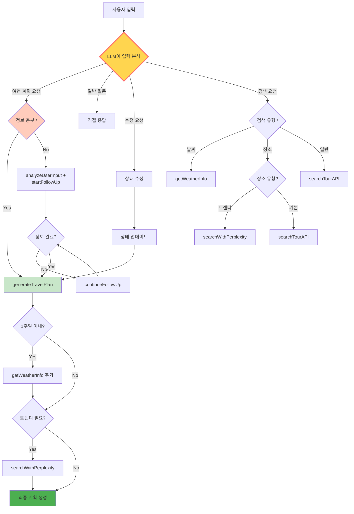
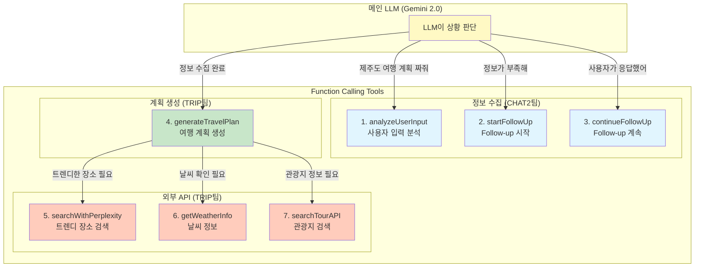
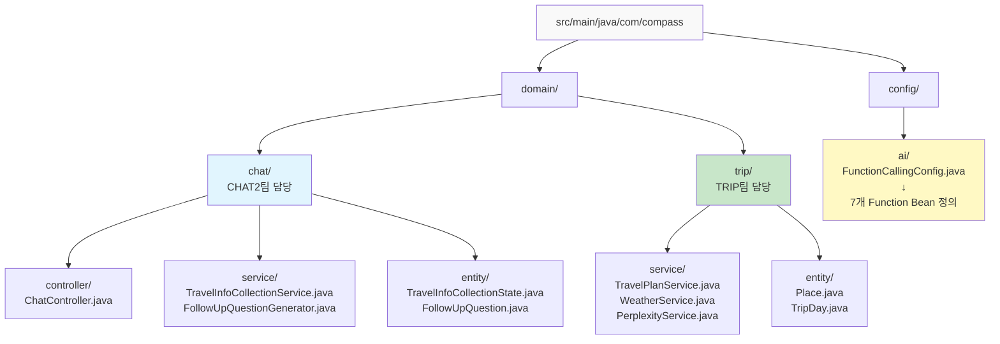
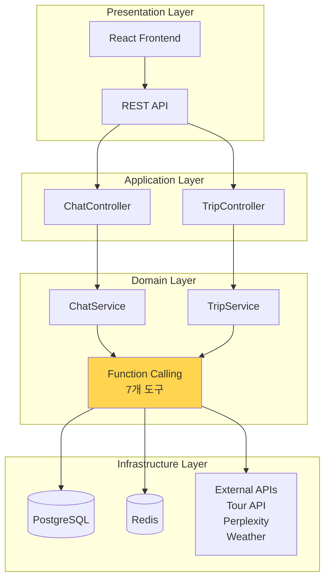

# 🚀 Compass 개발 가이드 - 팀원용 상세 매뉴얼

> **작성일**: 2024년 12월
> **대상**: Compass 프로젝트 개발팀 (CHAT2팀 2명, TRIP팀 2명)
> **목적**: 3일 내 MVP 개발을 위한 구체적인 가이드

---

## 📌 목차
1. [프로젝트 개요](#1-프로젝트-개요)
2. [전체 시스템 플로우](#2-전체-시스템-플로우)
3. [기술 아키텍처](#3-기술-아키텍처)
4. [도메인별 개발 가이드](#4-도메인별-개발-가이드)
5. [Function Calling 구현 방법](#5-function-calling-구현-방법)
6. [API 명세](#6-api-명세)
7. [데이터베이스 스키마](#7-데이터베이스-스키마)
8. [통합 테스트 시나리오](#8-통합-테스트-시나리오)
9. [개발 일정](#9-개발-일정)

---

## 1. 프로젝트 개요

### 🎯 목표
**AI 기반 맞춤형 여행 계획 자동 생성 서비스**
- 사용자가 "제주도 3박4일 여행 계획 짜줘"라고 입력하면
- AI가 자동으로 필요한 정보를 수집하고
- 완성된 여행 일정을 생성

### 💡 핵심 기술
- **Spring AI**: LLM 통합 프레임워크
- **Function Calling**: LLM이 필요한 도구를 자동 선택/실행
- **Gemini 2.0 Flash**: 메인 LLM 모델

### 👥 팀 구성
- **CHAT2팀** (2명): LLM 통합, Function Calling, Follow-up 시스템
- **TRIP팀** (2명): 여행 계획 생성, 외부 API 연동, 장소 데이터

---

## 2. 전체 시스템 플로우

### 🎯 LLM 오케스트레이터의 지능적 대응


### 🔄 실제 동작 시나리오별 플로우


### 🔧 LLM 오케스트레이터 의사결정 트리


---

## 3. 기술 아키텍처

### 📊 MVP Function Calling 구조 (7개만!)


### 📦 프로젝트 폴더 구조


### 🏗️ 레이어드 아키텍처


---

## 4. 도메인별 개발 가이드

### 📘 CHAT2팀 개발 가이드 (2명)

#### 담당자 1: LLM 통합 & Function Calling
**개발 파일 목록:**
1. `FunctionCallingConfig.java`
2. `ChatServiceImpl.java` (수정)
3. `MainLLMOrchestrator.java` (새로 생성)

**1️⃣ FunctionCallingConfig.java 구현**
```java
package com.compass.config.ai;

import org.springframework.context.annotation.Bean;
import org.springframework.context.annotation.Configuration;
import org.springframework.context.annotation.Description;
import java.util.function.Function;

@Configuration
public class FunctionCallingConfig {
    
    private final TravelInfoCollectionService infoService;
    private final FollowUpQuestionGenerator questionGenerator;
    private final TravelPlanService planService;
    
    // 생성자 주입
    public FunctionCallingConfig(/* 의존성 주입 */) {
        // ...
    }
    
    /**
     * Function Calling 도구 1: 사용자 입력 분석
     * LLM이 사용자 메시지에서 여행 정보를 추출할 때 사용
     */
    @Bean
    @Description("사용자 입력에서 여행 정보를 추출합니다")
    public Function<UserInputRequest, ExtractedInfo> analyzeUserInput() {
        return request -> {
            String userMessage = request.message();
            
            // 정보 추출 로직
            ExtractedInfo info = new ExtractedInfo();
            
            // 목적지 추출
            if (userMessage.contains("제주")) {
                info.setDestination("제주도");
            } else if (userMessage.contains("부산")) {
                info.setDestination("부산");
            }
            
            // 기간 추출
            if (userMessage.contains("3박4일")) {
                info.setDuration(4);
                info.setNights(3);
            } else if (userMessage.contains("2박3일")) {
                info.setDuration(3);
                info.setNights(2);
            }
            
            // 추출된 정보를 DB에 저장
            infoService.updateCollectionState(
                request.threadId(), 
                info
            );
            
            return info;
        };
    }
    
    /**
     * Function Calling 도구 2: Follow-up 질문 시작
     */
    @Bean
    @Description("누락된 정보에 대한 follow-up 질문을 생성합니다")
    public Function<FollowUpRequest, FollowUpResponse> startFollowUp() {
        return request -> {
            String threadId = request.threadId();
            
            // 현재 수집된 정보 조회
            TravelInfoCollectionState state = 
                infoService.getState(threadId);
            
            // 누락된 정보 확인
            List<String> missingFields = 
                checkMissingFields(state);
            
            if (missingFields.isEmpty()) {
                return new FollowUpResponse(
                    "COMPLETE",
                    "모든 정보가 수집되었습니다",
                    null
                );
            }
            
            // 다음 질문 생성
            String nextQuestion = 
                questionGenerator.generateNext(
                    missingFields.get(0),
                    state
                );
            
            return new FollowUpResponse(
                "IN_PROGRESS",
                nextQuestion,
                missingFields.get(0)
            );
        };
    }
    
    /**
     * Function Calling 도구 3: Follow-up 계속
     */
    @Bean
    @Description("사용자 응답을 처리하고 다음 질문을 생성합니다")
    public Function<ContinueFollowUpRequest, FollowUpResponse> continueFollowUp() {
        return request -> {
            // 사용자 응답 저장
            infoService.processUserResponse(
                request.threadId(),
                request.fieldType(),
                request.userResponse()
            );
            
            // 다음 질문 생성 (startFollowUp과 유사)
            return startFollowUp().apply(
                new FollowUpRequest(request.threadId())
            );
        };
    }
    
    // Record 클래스들 (요청/응답 DTO)
    public record UserInputRequest(
        String threadId,
        String message
    ) {}
    
    public record ExtractedInfo(
        String destination,
        String origin,
        Integer duration,
        Integer nights,
        String dates,
        Integer budget,
        String companions,
        String travelStyle
    ) {}
    
    public record FollowUpRequest(
        String threadId
    ) {}
    
    public record FollowUpResponse(
        String status,      // IN_PROGRESS, COMPLETE
        String question,
        String fieldType    // ORIGIN, BUDGET, DATES 등
    ) {}
}
```

**2️⃣ ChatServiceImpl.java 수정**
```java
package com.compass.domain.chat.service;

@Service
@Slf4j
public class ChatServiceImpl implements ChatService {
    
    private final ChatModel chatModel;  // Spring AI의 ChatModel
    
    // 시스템 프롬프트 (50토큰 이내)
    private static final String SYSTEM_PROMPT = """
        당신은 한국인을 위한 AI 여행 플래너 '컴패스'입니다.
        친근하고 공손한 한국어를 사용하며, Function Calling으로 작업을 수행합니다.
        사용자의 예산과 취향을 최우선으로 고려합니다.
        """;
    
    @Override
    public ChatResponse processMessage(ChatRequest request) {
        String userMessage = request.getMessage();
        String threadId = request.getThreadId();
        
        // 메시지 저장
        saveMessage(threadId, userMessage, "USER");
        
        // LLM에게 전달할 메시지 구성
        List<Message> messages = new ArrayList<>();
        messages.add(new SystemMessage(SYSTEM_PROMPT));
        messages.add(new UserMessage(userMessage));
        
        // LLM 호출 (Function Calling 자동 처리)
        ChatResponse response = chatModel.call(
            new Prompt(messages)
        );
        
        // 응답 저장
        String aiResponse = response.getResult().getOutput().getContent();
        saveMessage(threadId, aiResponse, "ASSISTANT");
        
        return new ChatResponse(aiResponse);
    }
}
```

#### 담당자 2: Follow-up 시스템
**개발 파일 목록:**
1. `TravelInfoCollectionService.java`
2. `FollowUpQuestionGenerator.java`
3. `TravelInfoCollectionState.java` (엔티티)
4. `FollowUpQuestion.java` (엔티티)

**1️⃣ TravelInfoCollectionService.java**
```java
package com.compass.domain.chat.service;

@Service
@Transactional
@Slf4j
public class TravelInfoCollectionService {
    
    private final TravelInfoCollectionStateRepository repository;
    
    /**
     * 정보 수집 상태 조회
     */
    public TravelInfoCollectionState getState(String threadId) {
        return repository.findByThreadId(UUID.fromString(threadId))
            .orElseGet(() -> createNewState(threadId));
    }
    
    /**
     * 새로운 수집 상태 생성
     */
    private TravelInfoCollectionState createNewState(String threadId) {
        TravelInfoCollectionState state = TravelInfoCollectionState.builder()
            .threadId(UUID.fromString(threadId))
            .collectionProgress(0)
            .collectionStatus("IN_PROGRESS")
            .createdAt(LocalDateTime.now())
            .build();
        
        return repository.save(state);
    }
    
    /**
     * 사용자 응답 처리
     */
    public void processUserResponse(
        String threadId, 
        String fieldType, 
        String response
    ) {
        TravelInfoCollectionState state = getState(threadId);
        
        switch (fieldType) {
            case "ORIGIN":
                state.setOrigin(response);
                state.setOriginRaw(response);
                break;
            case "DESTINATION":
                state.setDestination(response);
                state.setDestinationRaw(response);
                break;
            case "DATES":
                parseDates(response, state);
                break;
            case "BUDGET":
                state.setBudget(parseBudget(response));
                state.setBudgetRaw(response);
                break;
            case "COMPANIONS":
                state.setCompanions(response);
                state.setCompanionsRaw(response);
                break;
            case "TRAVEL_STYLE":
                state.setTravelStyle(Arrays.asList(response.split(",")));
                break;
        }
        
        // 진행률 업데이트
        updateProgress(state);
        repository.save(state);
    }
    
    /**
     * 진행률 계산
     */
    private void updateProgress(TravelInfoCollectionState state) {
        int filledFields = 0;
        int totalFields = 7;  // 필수 필드 수
        
        if (state.getOrigin() != null) filledFields++;
        if (state.getDestination() != null) filledFields++;
        if (state.getStartDate() != null) filledFields++;
        if (state.getEndDate() != null) filledFields++;
        if (state.getBudget() != null) filledFields++;
        if (state.getCompanions() != null) filledFields++;
        if (state.getTravelStyle() != null) filledFields++;
        
        int progress = (filledFields * 100) / totalFields;
        state.setCollectionProgress(progress);
        
        if (progress == 100) {
            state.setCollectionStatus("COMPLETE");
        }
    }
    
    /**
     * 날짜 파싱
     */
    private void parseDates(String dateString, TravelInfoCollectionState state) {
        // "12월 25일부터 28일까지" 같은 문자열 파싱
        // 간단한 구현 예시
        if (dateString.contains("12월 25일")) {
            state.setStartDate(LocalDate.of(2024, 12, 25));
        }
        if (dateString.contains("28일")) {
            state.setEndDate(LocalDate.of(2024, 12, 28));
        }
        state.setDatesRaw(dateString);
    }
    
    /**
     * 예산 파싱
     */
    private Integer parseBudget(String budgetString) {
        // "100만원", "1,000,000원" 같은 문자열 파싱
        String numbers = budgetString.replaceAll("[^0-9]", "");
        
        if (budgetString.contains("만원")) {
            return Integer.parseInt(numbers) * 10000;
        }
        
        return Integer.parseInt(numbers);
    }
    
    /**
     * 정보 수집 완료 여부 확인
     */
    public boolean isCollectionComplete(String threadId) {
        TravelInfoCollectionState state = getState(threadId);
        return "COMPLETE".equals(state.getCollectionStatus());
    }
}
```

**2️⃣ FollowUpQuestionGenerator.java**
```java
package com.compass.domain.chat.service;

@Component
@Slf4j
public class FollowUpQuestionGenerator {
    
    // 질문 템플릿
    private static final Map<String, List<String>> QUESTION_TEMPLATES = Map.of(
        "ORIGIN", List.of(
            "어디에서 출발하시나요? 🚗",
            "출발지를 알려주세요.",
            "어느 도시에서 출발하실 예정인가요?"
        ),
        "DESTINATION", List.of(
            "어디로 여행을 가고 싶으신가요? ✈️",
            "목적지를 알려주세요.",
            "가고 싶은 여행지가 있으신가요?"
        ),
        "DATES", List.of(
            "언제 여행을 가실 예정인가요? 📅",
            "여행 날짜를 알려주세요.",
            "출발일과 도착일을 알려주시겠어요?"
        ),
        "BUDGET", List.of(
            "예산은 얼마로 생각하고 계신가요? 💰",
            "여행 예산을 알려주세요.",
            "1인당 예산은 어느 정도로 계획하고 계신가요?"
        ),
        "COMPANIONS", List.of(
            "누구와 함께 가시나요? 👥",
            "동행인을 알려주세요.",
            "혼자 가시나요, 아니면 누구와 함께 가시나요?"
        ),
        "TRAVEL_STYLE", List.of(
            "어떤 스타일의 여행을 원하시나요? 🎨",
            "선호하는 여행 스타일이 있으신가요?",
            "휴양, 관광, 맛집 탐방 중 어떤 걸 선호하시나요?"
        )
    );
    
    /**
     * 다음 질문 생성
     */
    public String generateNext(String fieldType, TravelInfoCollectionState state) {
        // 사용자 피로도를 고려한 전략 선택
        String strategy = determineStrategy(state);
        
        if ("QUICK".equals(strategy)) {
            // 빠른 전략: 짧고 직접적인 질문
            return QUESTION_TEMPLATES.get(fieldType).get(0);
        } else {
            // 상세 전략: 친근하고 자세한 질문
            return generateDetailedQuestion(fieldType, state);
        }
    }
    
    /**
     * 전략 결정 (2가지만)
     */
    private String determineStrategy(TravelInfoCollectionState state) {
        // 질문 횟수가 3개 이상이면 빠른 전략
        if (state.getQuestionCount() != null && state.getQuestionCount() >= 3) {
            return "QUICK";
        }
        
        return "DETAILED";
    }
    
    /**
     * 상세 질문 생성
     */
    private String generateDetailedQuestion(String fieldType, TravelInfoCollectionState state) {
        StringBuilder question = new StringBuilder();
        
        // 맥락을 고려한 질문 생성
        if ("BUDGET".equals(fieldType) && state.getCompanions() != null) {
            if (state.getCompanions().contains("가족")) {
                question.append("가족 여행이시군요! 전체 예산은 얼마로 생각하고 계신가요? ");
            } else if (state.getCompanions().contains("연인")) {
                question.append("연인과의 여행이네요 💕 두 분 합쳐서 예산은 얼마로 생각하시나요? ");
            }
        } else {
            // 기본 템플릿 사용
            List<String> templates = QUESTION_TEMPLATES.get(fieldType);
            question.append(templates.get(1));
        }
        
        // 선택지 제공
        question.append("\n\n");
        question.append(getQuickOptions(fieldType));
        
        return question.toString();
    }
    
    /**
     * 빠른 선택지 제공
     */
    private String getQuickOptions(String fieldType) {
        return switch (fieldType) {
            case "ORIGIN" -> "🔸 서울  🔸 부산  🔸 대구  🔸 기타";
            case "BUDGET" -> "🔸 50만원 이하  🔸 50-100만원  🔸 100-200만원  🔸 200만원 이상";
            case "TRAVEL_STYLE" -> "🔸 휴양  🔸 관광  🔸 맛집  🔸 액티비티";
            case "COMPANIONS" -> "🔸 혼자  🔸 연인  🔸 가족  🔸 친구";
            default -> "";
        };
    }
    
    /**
     * 필수 필드 체크
     */
    public List<String> checkMissingFields(TravelInfoCollectionState state) {
        List<String> missing = new ArrayList<>();
        
        // 순서대로 체크 (중요도 순)
        if (state.getDestination() == null) missing.add("DESTINATION");
        if (state.getOrigin() == null) missing.add("ORIGIN");
        if (state.getStartDate() == null || state.getEndDate() == null) missing.add("DATES");
        if (state.getBudget() == null) missing.add("BUDGET");
        if (state.getCompanions() == null) missing.add("COMPANIONS");
        if (state.getTravelStyle() == null) missing.add("TRAVEL_STYLE");
        
        return missing;
    }
}
```

---

### 📗 TRIP팀 개발 가이드 (2명)

#### 담당자 1: 여행 계획 생성
**개발 파일 목록:**
1. `TravelPlanService.java`
2. `Place.java` (엔티티)
3. `PlaceRepository.java`

**1️⃣ Function Calling 도구 4: 여행 계획 생성**
```java
package com.compass.config.ai;

// FunctionCallingConfig.java에 추가
@Bean
@Description("수집된 정보를 바탕으로 여행 계획을 생성합니다")
public Function<GeneratePlanRequest, TravelPlanResponse> generateTravelPlan() {
    return request -> {
        String threadId = request.threadId();
        
        // 수집된 정보 조회
        TravelInfoCollectionState state = 
            infoService.getState(threadId);
        
        // 정보 완료 체크
        if (state.getCollectionProgress() < 100) {
            throw new IllegalStateException(
                "정보 수집이 완료되지 않았습니다"
            );
        }
        
        // 여행 계획 생성
        TravelPlan plan = planService.generatePlan(state);
        
        // 응답 변환
        return new TravelPlanResponse(
            plan.getId(),
            formatPlanAsText(plan),
            plan.getDays()
        );
    };
}

public record GeneratePlanRequest(
    String threadId
) {}

public record TravelPlanResponse(
    Long planId,
    String planText,
    List<DayPlan> days
) {}
```

**2️⃣ TravelPlanService.java**
```java
package com.compass.domain.trip.service;

@Service
@Transactional
@Slf4j
public class TravelPlanService {
    
    private final PlaceRepository placeRepository;
    private final TripRepository tripRepository;
    private final WeatherService weatherService;
    private final PerplexityService perplexityService;
    
    /**
     * 여행 계획 생성 (메인 메서드)
     */
    public TravelPlan generatePlan(TravelInfoCollectionState state) {
        log.info("여행 계획 생성 시작: {}", state.getDestination());
        
        // 1. 기본 여행 정보 생성
        Trip trip = createTrip(state);
        
        // 2. 일자별 계획 생성
        List<TripDay> days = createDailyPlans(state, trip);
        
        // 3. 장소 선택 (하이브리드: DB + Perplexity)
        assignPlacesToDays(days, state);
        
        // 4. 날씨 정보 추가 (1주일 이내)
        if (isWithinWeek(state.getStartDate())) {
            addWeatherInfo(days, state.getDestination());
        }
        
        // 5. 저장 및 반환
        tripRepository.save(trip);
        
        return TravelPlan.from(trip, days);
    }
    
    /**
     * Trip 엔티티 생성
     */
    private Trip createTrip(TravelInfoCollectionState state) {
        return Trip.builder()
            .threadId(UUID.fromString(state.getThreadId()))
            .userId(state.getUserId())
            .title(generateTitle(state))
            .destination(state.getDestination())
            .startDate(state.getStartDate())
            .endDate(state.getEndDate())
            .numberOfPeople(parseNumberOfPeople(state.getCompanions()))
            .totalBudget(state.getBudget())
            .status("DRAFT")
            .createdAt(LocalDateTime.now())
            .build();
    }
    
    /**
     * 일자별 계획 생성
     */
    private List<TripDay> createDailyPlans(TravelInfoCollectionState state, Trip trip) {
        List<TripDay> days = new ArrayList<>();
        
        long duration = ChronoUnit.DAYS.between(
            state.getStartDate(), 
            state.getEndDate()
        ) + 1;
        
        for (int i = 0; i < duration; i++) {
            TripDay day = TripDay.builder()
                .trip(trip)
                .dayNumber(i + 1)
                .date(state.getStartDate().plusDays(i))
                .theme(generateDayTheme(i + 1, state.getDestination()))
                .build();
            
            days.add(day);
        }
        
        return days;
    }
    
    /**
     * 장소 할당 (하이브리드 방식)
     */
    private void assignPlacesToDays(List<TripDay> days, TravelInfoCollectionState state) {
        // 1. DB에서 기본 장소 조회
        List<Place> dbPlaces = placeRepository.findByDestination(
            state.getDestination()
        );
        
        // 2. Perplexity로 트렌디한 장소 검색 (5개만)
        List<Place> trendyPlaces = searchTrendyPlaces(state);
        
        // 3. 일자별로 장소 배분
        int placesPerDay = 5;  // 하루 5개 장소
        
        for (TripDay day : days) {
            List<Place> dayPlaces = selectPlacesForDay(
                day.getDayNumber(),
                dbPlaces,
                trendyPlaces,
                placesPerDay,
                state.getTravelStyle()
            );
            
            // TripDetail 생성
            for (int i = 0; i < dayPlaces.size(); i++) {
                Place place = dayPlaces.get(i);
                
                TripDetail detail = TripDetail.builder()
                    .trip(day.getTrip())
                    .dayNumber(day.getDayNumber())
                    .place(place)
                    .activityTime(calculateTime(i))
                    .displayOrder(i + 1)
                    .build();
                
                day.addDetail(detail);
            }
        }
    }
    
    /**
     * Perplexity로 트렌디한 장소 검색
     */
    private List<Place> searchTrendyPlaces(TravelInfoCollectionState state) {
        String query = String.format(
            "%s 최신 핫플레이스 인스타그램 인기 2024",
            state.getDestination()
        );
        
        // Perplexity API 호출 (Function Calling으로)
        List<String> placeNames = perplexityService.search(query);
        
        // Place 엔티티로 변환
        return placeNames.stream()
            .limit(5)
            .map(name -> Place.builder()
                .name(name)
                .destination(state.getDestination())
                .category("TRENDY")
                .isTrendy(true)
                .dataSource("PERPLEXITY")
                .build()
            )
            .collect(Collectors.toList());
    }
    
    /**
     * 하루 일정용 장소 선택
     */
    private List<Place> selectPlacesForDay(
        int dayNumber,
        List<Place> dbPlaces,
        List<Place> trendyPlaces,
        int count,
        List<String> travelStyle
    ) {
        List<Place> selected = new ArrayList<>();
        
        // 첫날: 유명 관광지 위주
        if (dayNumber == 1) {
            selected.addAll(
                dbPlaces.stream()
                    .filter(p -> "ATTRACTION".equals(p.getCategory()))
                    .limit(3)
                    .collect(Collectors.toList())
            );
            
            // 맛집 1개
            selected.addAll(
                dbPlaces.stream()
                    .filter(p -> "RESTAURANT".equals(p.getCategory()))
                    .limit(1)
                    .collect(Collectors.toList())
            );
            
            // 트렌디 장소 1개
            if (!trendyPlaces.isEmpty()) {
                selected.add(trendyPlaces.get(0));
            }
        }
        // 둘째날 이후: 스타일에 맞춰서
        else {
            if (travelStyle.contains("맛집")) {
                // 맛집 위주
                selected.addAll(
                    dbPlaces.stream()
                        .filter(p -> "RESTAURANT".equals(p.getCategory()) || 
                                    "CAFE".equals(p.getCategory()))
                        .limit(3)
                        .collect(Collectors.toList())
                );
            } else {
                // 관광지 위주
                selected.addAll(
                    dbPlaces.stream()
                        .filter(p -> "ATTRACTION".equals(p.getCategory()))
                        .limit(3)
                        .collect(Collectors.toList())
                );
            }
            
            // 트렌디 장소 추가
            int trendyIndex = Math.min(dayNumber - 1, trendyPlaces.size() - 1);
            if (trendyIndex >= 0) {
                selected.add(trendyPlaces.get(trendyIndex));
            }
        }
        
        // 부족하면 랜덤 추가
        while (selected.size() < count && !dbPlaces.isEmpty()) {
            Place random = dbPlaces.get(
                new Random().nextInt(dbPlaces.size())
            );
            if (!selected.contains(random)) {
                selected.add(random);
            }
        }
        
        return selected;
    }
    
    /**
     * 시간 계산
     */
    private LocalTime calculateTime(int order) {
        return switch (order) {
            case 0 -> LocalTime.of(9, 0);   // 첫 번째 장소
            case 1 -> LocalTime.of(11, 0);  // 두 번째 장소
            case 2 -> LocalTime.of(13, 0);  // 점심
            case 3 -> LocalTime.of(15, 0);  // 오후 장소
            case 4 -> LocalTime.of(17, 0);  // 저녁
            default -> LocalTime.of(19, 0);
        };
    }
    
    /**
     * 텍스트 형식으로 변환
     */
    private String formatPlanAsText(TravelPlan plan) {
        StringBuilder text = new StringBuilder();
        
        text.append("🎯 ").append(plan.getTitle()).append("\n\n");
        
        for (DayPlan day : plan.getDays()) {
            text.append("📅 Day ").append(day.getDayNumber())
                .append(" (").append(day.getDate()).append(")\n");
            text.append("테마: ").append(day.getTheme()).append("\n\n");
            
            for (PlaceInfo place : day.getPlaces()) {
                text.append(place.getTime()).append(" - ")
                    .append(place.getName()).append("\n");
                
                if (place.getDescription() != null) {
                    text.append("  ").append(place.getDescription()).append("\n");
                }
            }
            
            text.append("\n");
        }
        
        return text.toString();
    }
}
```

#### 담당자 2: 외부 API 연동
**개발 파일 목록:**
1. `WeatherService.java`
2. `PerplexityService.java`
3. `TourAPIService.java`

**1️⃣ Function Calling 도구 5-7: 외부 API 연동**
```java
package com.compass.config.ai;

// FunctionCallingConfig.java에 추가

/**
 * Function Calling 도구 5: Perplexity 검색
 */
@Bean
@Description("Perplexity로 최신 트렌디한 장소를 검색합니다")
public Function<PerplexitySearchRequest, List<String>> searchWithPerplexity() {
    return request -> {
        String query = request.query();
        
        // Perplexity API 호출
        PerplexityResponse response = perplexityClient.search(
            PerplexityRequest.builder()
                .model("pplx-7b-online")
                .messages(List.of(
                    new Message("user", query)
                ))
                .temperature(0.2)
                .maxTokens(1000)
                .build()
        );
        
        // 응답에서 장소명 추출
        String content = response.getChoices().get(0).getMessage().getContent();
        return extractPlaceNames(content);
    };
}

/**
 * Function Calling 도구 6: 날씨 정보
 */
@Bean
@Description("여행 날짜의 날씨 정보를 가져옵니다")
public Function<WeatherRequest, WeatherInfo> getWeatherInfo() {
    return request -> {
        // 1주일 이내 체크
        long daysUntil = ChronoUnit.DAYS.between(
            LocalDate.now(), 
            request.date()
        );
        
        if (daysUntil > 7) {
            return new WeatherInfo(
                request.destination(),
                request.date(),
                "날씨 정보는 1주일 이내만 제공됩니다",
                null,
                null
            );
        }
        
        // OpenWeatherMap API 호출
        return weatherService.getWeather(
            request.destination(),
            request.date()
        );
    };
}

/**
 * Function Calling 도구 7: Tour API 검색
 */
@Bean
@Description("한국관광공사 Tour API로 관광지를 검색합니다")
public Function<TourSearchRequest, List<PlaceInfo>> searchTourAPI() {
    return request -> {
        // Tour API 호출
        List<TourItem> items = tourAPIService.search(
            request.destination(),
            request.category()
        );
        
        // PlaceInfo로 변환
        return items.stream()
            .map(item -> new PlaceInfo(
                item.getTitle(),
                item.getAddress(),
                item.getMapX(),
                item.getMapY(),
                item.getImageUrl()
            ))
            .limit(10)
            .collect(Collectors.toList());
    };
}
```

**2️⃣ WeatherService.java**
```java
package com.compass.domain.trip.service;

@Service
@Slf4j
public class WeatherService {
    
    @Value("${openweather.api.key}")
    private String apiKey;
    
    private final RestTemplate restTemplate;
    
    /**
     * 날씨 정보 조회
     */
    public WeatherInfo getWeather(String destination, LocalDate date) {
        try {
            // 도시명을 좌표로 변환
            Coordinates coords = getCoordinates(destination);
            
            // OpenWeatherMap API 호출
            String url = String.format(
                "https://api.openweathermap.org/data/2.5/forecast?" +
                "lat=%f&lon=%f&appid=%s&units=metric&lang=kr",
                coords.lat(), coords.lon(), apiKey
            );
            
            WeatherResponse response = restTemplate.getForObject(
                url, 
                WeatherResponse.class
            );
            
            // 해당 날짜의 날씨 찾기
            WeatherData weatherData = findWeatherForDate(response, date);
            
            return new WeatherInfo(
                destination,
                date,
                weatherData.getDescription(),
                weatherData.getTemp(),
                weatherData.getRainProbability()
            );
            
        } catch (Exception e) {
            log.error("날씨 정보 조회 실패: ", e);
            return new WeatherInfo(
                destination,
                date,
                "날씨 정보를 가져올 수 없습니다",
                null,
                null
            );
        }
    }
    
    /**
     * 도시명을 좌표로 변환
     */
    private Coordinates getCoordinates(String city) {
        // 주요 도시 좌표 (하드코딩)
        return switch (city) {
            case "제주", "제주도" -> new Coordinates(33.4996, 126.5312);
            case "부산" -> new Coordinates(35.1796, 129.0756);
            case "서울" -> new Coordinates(37.5665, 126.9780);
            default -> new Coordinates(37.5665, 126.9780);  // 기본값: 서울
        };
    }
    
    public record Coordinates(double lat, double lon) {}
    
    public record WeatherInfo(
        String destination,
        LocalDate date,
        String description,
        Double temperature,
        Integer rainProbability
    ) {}
}
```

**3️⃣ Place.java 엔티티**
```java
package com.compass.domain.trip.entity;

@Entity
@Table(name = "places", indexes = {
    @Index(name = "idx_place_destination", columnList = "destination"),
    @Index(name = "idx_place_category", columnList = "category")
})
@Getter
@NoArgsConstructor(access = AccessLevel.PROTECTED)
@Builder
@AllArgsConstructor
public class Place extends BaseEntity {
    
    @Id
    @GeneratedValue(strategy = GenerationType.IDENTITY)
    private Long id;
    
    @Column(unique = true)
    private String placeCode;  // Tour API 코드
    
    @Column(nullable = false, length = 100)
    private String name;
    
    @Column(length = 100)
    private String nameEn;
    
    @Enumerated(EnumType.STRING)
    @Column(length = 20)
    private PlaceCategory category;
    
    @Column(length = 50)
    private String destination;  // 제주, 부산 등
    
    @Column(columnDefinition = "TEXT")
    private String address;
    
    private Double latitude;
    private Double longitude;
    
    @Column(length = 20)
    private String phone;
    
    @Column(length = 200)
    private String website;
    
    @Column(columnDefinition = "jsonb")
    private String businessHours;  // JSON
    
    private Integer priceRange;  // 1-5
    
    private Double rating;
    private Integer reviewCount;
    
    @Column(columnDefinition = "TEXT")
    private String description;
    
    @Column(columnDefinition = "jsonb")
    private String imageUrls;  // JSON Array
    
    @Column(columnDefinition = "jsonb")
    private String tags;  // JSON Array
    
    @Column(nullable = false)
    private Boolean isTrendy = false;  // Perplexity 검색 여부
    
    @Enumerated(EnumType.STRING)
    @Column(nullable = false)
    private DataSource dataSource = DataSource.TOUR_API;
    
    public enum PlaceCategory {
        ATTRACTION,     // 관광지
        RESTAURANT,     // 맛집
        CAFE,          // 카페
        HOTEL,         // 숙박
        SHOPPING,      // 쇼핑
        ACTIVITY,      // 액티비티
        TRENDY         // 트렌디 (Perplexity)
    }
    
    public enum DataSource {
        TOUR_API,      // 한국관광공사
        PERPLEXITY,    // Perplexity 검색
        MANUAL         // 수동 입력
    }
}
```

---

## 5. Function Calling 구현 방법

### 🔑 핵심 개념
Function Calling은 LLM이 사용자 요청을 처리하기 위해 **필요한 도구(함수)를 자동으로 선택하고 호출**하는 기능입니다.

### 📝 구현 단계

#### Step 1: Spring AI 의존성 추가
```xml
<!-- pom.xml -->
<dependency>
    <groupId>org.springframework.ai</groupId>
    <artifactId>spring-ai-vertex-ai-gemini-spring-boot-starter</artifactId>
    <version>1.0.0-M5</version>
</dependency>
```

#### Step 2: Function Bean 정의
```java
@Bean
@Description("이 설명을 보고 LLM이 언제 호출할지 결정합니다")
public Function<입력타입, 출력타입> 함수명() {
    return input -> {
        // 비즈니스 로직
        return output;
    };
}
```

#### Step 3: LLM이 자동으로 호출
```java
// LLM에게 메시지 전달
ChatResponse response = chatModel.call(userMessage);

// LLM이 필요하다고 판단하면 자동으로 Function 호출
// 예: "제주도 날씨 알려줘" → getWeatherInfo() 자동 호출
```

### 🎯 Function Calling 플로우
```
1. 사용자: "제주도 3박4일 여행 계획 짜줘"
   ↓
2. LLM 판단: "여행 정보 추출이 필요하군"
   ↓
3. analyzeUserInput() 호출
   ↓
4. 결과: {destination: "제주도", duration: 4}
   ↓
5. LLM 판단: "정보가 부족하군"
   ↓
6. startFollowUp() 호출
   ↓
7. 결과: "출발지는 어디인가요?"
```

---

## 6. API 명세

### 📡 REST API 엔드포인트

#### 1. 채팅 API
```http
POST /api/chat/message
Content-Type: application/json
Authorization: Bearer {JWT_TOKEN}

{
  "threadId": "550e8400-e29b-41d4-a716-446655440000",
  "message": "제주도 3박4일 여행 계획 짜줘"
}

Response:
{
  "response": "여행 정보를 수집하겠습니다. 출발지는 어디인가요?",
  "status": "COLLECTING",
  "progress": 14
}
```

#### 2. 빠른 입력 폼 API
```http
POST /api/chat/quick-form
Content-Type: application/json

{
  "destination": "제주도",
  "origin": "서울",
  "dates": {
    "start": "2024-12-25",
    "end": "2024-12-28"
  },
  "budget": 1000000,
  "travelers": 2,
  "travelStyle": ["맛집", "휴양"]
}

Response:
{
  "threadId": "550e8400-e29b-41d4-a716-446655440000",
  "status": "SUCCESS",
  "message": "정보가 저장되었습니다. 여행 계획을 생성하시겠습니까?"
}
```

#### 3. Follow-up 응답 API
```http
POST /api/chat/follow-up/response
Content-Type: application/json

{
  "threadId": "550e8400-e29b-41d4-a716-446655440000",
  "fieldType": "ORIGIN",
  "response": "서울"
}

Response:
{
  "nextQuestion": "예산은 얼마로 생각하고 계신가요?",
  "fieldType": "BUDGET",
  "progress": 42,
  "options": ["50만원 이하", "50-100만원", "100-200만원", "200만원 이상"]
}
```

#### 4. 여행 계획 조회 API
```http
GET /api/trips/{tripId}

Response:
{
  "id": 1,
  "title": "겨울 제주도 3박4일 여행",
  "destination": "제주도",
  "startDate": "2024-12-25",
  "endDate": "2024-12-28",
  "days": [
    {
      "dayNumber": 1,
      "date": "2024-12-25",
      "theme": "동부 관광",
      "places": [
        {
          "time": "09:00",
          "name": "성산일출봉",
          "category": "ATTRACTION",
          "description": "유네스코 세계자연유산",
          "duration": 90
        }
      ]
    }
  ]
}
```

---

## 7. 데이터베이스 스키마

### 📊 필수 테이블 (5개)

#### 1. travel_info_collection_states
```sql
CREATE TABLE travel_info_collection_states (
    id BIGSERIAL PRIMARY KEY,
    thread_id UUID NOT NULL,
    user_id BIGINT,
    
    -- 원본 데이터 (사용자 입력 그대로)
    origin_raw TEXT,
    destination_raw TEXT,
    dates_raw TEXT,
    budget_raw TEXT,
    companions_raw TEXT,
    
    -- 파싱된 데이터
    origin VARCHAR(100),
    destination VARCHAR(100),
    start_date DATE,
    end_date DATE,
    duration INTEGER,
    budget INTEGER,
    companions VARCHAR(200),
    travel_style JSONB,
    
    -- 수집 상태
    collection_progress INTEGER DEFAULT 0,
    collection_status VARCHAR(20) DEFAULT 'IN_PROGRESS',
    question_count INTEGER DEFAULT 0,
    
    created_at TIMESTAMP,
    updated_at TIMESTAMP,
    
    CONSTRAINT uk_thread_id UNIQUE (thread_id)
);

CREATE INDEX idx_collection_thread ON travel_info_collection_states(thread_id);
CREATE INDEX idx_collection_user ON travel_info_collection_states(user_id);
```

#### 2. follow_up_questions
```sql
CREATE TABLE follow_up_questions (
    id BIGSERIAL PRIMARY KEY,
    thread_id UUID NOT NULL,
    question_text TEXT NOT NULL,
    question_type VARCHAR(50),  -- ORIGIN, DESTINATION, BUDGET 등
    options JSONB,               -- 선택지
    is_answered BOOLEAN DEFAULT FALSE,
    user_response TEXT,
    response_timestamp TIMESTAMP,
    question_order INTEGER,
    created_at TIMESTAMP DEFAULT CURRENT_TIMESTAMP,
    
    FOREIGN KEY (thread_id) REFERENCES chat_threads(id)
);

CREATE INDEX idx_followup_thread ON follow_up_questions(thread_id);
CREATE INDEX idx_followup_answered ON follow_up_questions(is_answered);
```

#### 3. places
```sql
CREATE TABLE places (
    id BIGSERIAL PRIMARY KEY,
    place_code VARCHAR(50) UNIQUE,  -- Tour API 코드
    name VARCHAR(100) NOT NULL,
    name_en VARCHAR(100),
    category VARCHAR(20),            -- ATTRACTION, RESTAURANT, CAFE 등
    destination VARCHAR(50),         -- 제주, 부산 등
    address TEXT,
    latitude DOUBLE PRECISION,
    longitude DOUBLE PRECISION,
    phone VARCHAR(20),
    website VARCHAR(200),
    business_hours JSONB,
    price_range INTEGER,             -- 1-5
    rating DOUBLE PRECISION,
    review_count INTEGER,
    description TEXT,
    image_urls JSONB,
    tags JSONB,
    is_trendy BOOLEAN DEFAULT FALSE,
    data_source VARCHAR(20) DEFAULT 'TOUR_API',
    created_at TIMESTAMP DEFAULT CURRENT_TIMESTAMP,
    updated_at TIMESTAMP DEFAULT CURRENT_TIMESTAMP
);

CREATE INDEX idx_place_destination ON places(destination);
CREATE INDEX idx_place_category ON places(category);
CREATE INDEX idx_place_trendy ON places(is_trendy);
```

#### 4. trips (기존 테이블 활용)
```sql
-- 기존 테이블 사용, thread_id 타입만 확인
ALTER TABLE trips 
ALTER COLUMN thread_id TYPE UUID USING thread_id::UUID;
```

#### 5. trip_days
```sql
CREATE TABLE trip_days (
    id BIGSERIAL PRIMARY KEY,
    trip_id BIGINT NOT NULL,
    day_number INTEGER NOT NULL,
    date DATE NOT NULL,
    start_time TIME,
    end_time TIME,
    theme VARCHAR(100),
    summary TEXT,
    total_cost_estimate INTEGER,
    total_distance DOUBLE PRECISION,
    weather_info TEXT,
    notes TEXT,
    created_at TIMESTAMP DEFAULT CURRENT_TIMESTAMP,
    updated_at TIMESTAMP DEFAULT CURRENT_TIMESTAMP,
    
    FOREIGN KEY (trip_id) REFERENCES trips(id)
);

CREATE INDEX idx_trip_day_trip ON trip_days(trip_id);
CREATE INDEX idx_trip_day_date ON trip_days(date);
```

### 📝 초기 데이터 (places 테이블)
```sql
-- 제주도 주요 관광지 (최소 50개)
INSERT INTO places (name, category, destination, address, description, data_source) VALUES
('성산일출봉', 'ATTRACTION', '제주', '제주특별자치도 서귀포시 성산읍', '유네스코 세계자연유산', 'TOUR_API'),
('한라산', 'ATTRACTION', '제주', '제주특별자치도 제주시 한라산', '한국 최고봉', 'TOUR_API'),
('우도', 'ATTRACTION', '제주', '제주특별자치도 제주시 우도면', '아름다운 섬', 'TOUR_API'),
('흑돼지거리', 'RESTAURANT', '제주', '제주특별자치도 제주시', '제주 흑돼지 맛집', 'TOUR_API'),
('동문시장', 'SHOPPING', '제주', '제주특별자치도 제주시 동문로', '전통시장', 'TOUR_API');

-- 더 많은 데이터...
```

---

## 8. 통합 테스트 시나리오

### 🧪 E2E 테스트 케이스

#### Test Case 1: 전체 플로우
```java
@Test
@DisplayName("사용자 입력부터 여행 계획 생성까지 전체 플로우")
void testFullFlow() {
    // Given
    String threadId = UUID.randomUUID().toString();
    String userMessage = "제주도 3박4일 여행 계획 짜줘";
    
    // When - Step 1: 첫 메시지
    ChatResponse response1 = chatService.processMessage(
        new ChatRequest(threadId, userMessage)
    );
    
    // Then
    assertThat(response1.getResponse()).contains("출발지");
    
    // When - Step 2: Follow-up 응답
    FollowUpResponse response2 = followUpService.processResponse(
        new FollowUpRequest(threadId, "ORIGIN", "서울")
    );
    
    // Then
    assertThat(response2.getNextQuestion()).contains("예산");
    
    // When - Step 3: 모든 정보 입력 완료
    // ... (나머지 정보 입력)
    
    // When - Step 4: 계획 생성
    TravelPlan plan = planService.generatePlan(threadId);
    
    // Then
    assertThat(plan).isNotNull();
    assertThat(plan.getDays()).hasSize(4);
    assertThat(plan.getDays().get(0).getPlaces()).isNotEmpty();
}
```

#### Test Case 2: Function Calling 동작
```java
@Test
@DisplayName("LLM이 올바른 Function을 호출하는지 확인")
void testFunctionCalling() {
    // Given
    String message = "제주도 날씨 어때?";
    
    // When
    // LLM이 getWeatherInfo Function을 호출해야 함
    
    // Then
    verify(weatherService, times(1)).getWeather("제주도", any());
}
```

### 📋 체크리스트
- [ ] 사용자 입력 → 정보 추출 성공
- [ ] Follow-up 질문 생성 및 순서
- [ ] 정보 수집 완료 판단
- [ ] 여행 계획 생성
- [ ] DB 장소 + Perplexity 장소 조합
- [ ] 날씨 정보 반영 (1주일 이내)
- [ ] 에러 처리 (API 실패 등)

---

## 9. 개발 일정

### 📅 3일 스프린트

#### Day 1 (12/20) - 기본 구현
**오전 (09:00-13:00)**
- [ ] CHAT2-1: FunctionCallingConfig 기본 3개 도구
- [ ] CHAT2-2: TravelInfoCollectionService 구현
- [ ] TRIP-1: Place 엔티티 및 Repository
- [ ] TRIP-2: 초기 데이터 50개 입력

**오후 (14:00-18:00)**
- [ ] CHAT2-1: ChatServiceImpl 수정
- [ ] CHAT2-2: FollowUpQuestionGenerator 구현
- [ ] TRIP-1: generateTravelPlan Function 구현
- [ ] TRIP-2: 기본 템플릿 여행 계획 생성

**저녁 (19:00-21:00)**
- [ ] 통합 테스트
- [ ] Day 1 완료 체크

#### Day 2 (12/21) - 기능 추가
**오전 (09:00-13:00)**
- [ ] CHAT2-1: 빠른 입력 폼 API
- [ ] CHAT2-2: 2가지 전략 구현
- [ ] TRIP-1: Perplexity 연동
- [ ] TRIP-2: Weather API 연동

**오후 (14:00-18:00)**
- [ ] CHAT2-1: Follow-up 개선
- [ ] CHAT2-2: 진행률 계산
- [ ] TRIP-1: Tour API 연동
- [ ] TRIP-2: 하이브리드 장소 선택

**저녁 (19:00-21:00)**
- [ ] API 테스트
- [ ] Day 2 완료 체크

#### Day 3 (12/22) - 통합 및 마무리
**오전 (09:00-13:00)**
- [ ] 전체 플로우 테스트
- [ ] 버그 수정
- [ ] 성능 테스트

**오후 (14:00-18:00)**
- [ ] 최종 통합
- [ ] 문서 정리
- [ ] 발표 준비

---

## 🚨 주의사항

### ⚠️ 꼭 지켜야 할 것
1. **Function Calling은 @Bean과 @Description 필수**
2. **시스템 프롬프트는 50토큰 이내**
3. **Perplexity는 5개 장소만 (비용 절감)**
4. **날씨는 1주일 이내만 조회**
5. **복잡한 로직 피하기 (MVP 우선)**

### 🔥 자주 발생하는 문제
1. **Function이 호출되지 않음**
   - 해결: @Description을 명확하게 작성
   
2. **토큰 초과**
   - 해결: 시스템 프롬프트 줄이기
   
3. **API 호출 실패**
   - 해결: try-catch로 감싸고 기본값 반환

### 📞 도움 요청
- **CHAT2 관련**: @김민준
- **TRIP 관련**: @이서연
- **DB 관련**: @박지호
- **프론트엔드**: @최유진

---

## 📚 참고 자료
- [Spring AI 공식 문서](https://docs.spring.io/spring-ai/reference/)
- [Gemini API 문서](https://ai.google.dev/docs)
- [Tour API 문서](https://api.visitkorea.or.kr/)
- [OpenWeatherMap API](https://openweathermap.org/api)

---

**작성자**: Compass 개발팀
**최종 수정**: 2024년 12월
**버전**: 1.0.0