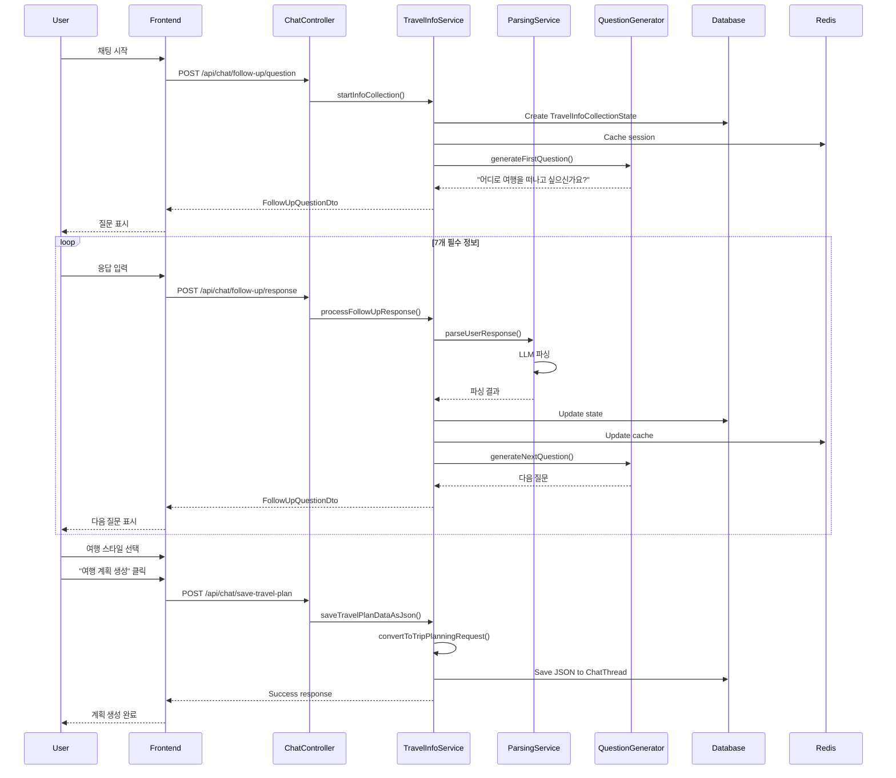

# Follow-up 질문 시스템 워크플로우 문서

## 📋 목차
1. [개요](#개요)
2. [시스템 아키텍처](#시스템-아키텍처)
3. [핵심 컴포넌트](#핵심-컴포넌트)
4. [전체 워크플로우](#전체-워크플로우)
5. [데이터 플로우](#데이터-플로우)
6. [API 엔드포인트](#api-엔드포인트)
7. [데이터 모델](#데이터-모델)
8. [시퀀스 다이어그램](#시퀀스-다이어그램)

## 개요

Follow-up 질문 시스템은 사용자로부터 여행 정보를 체계적으로 수집하는 대화형 인터페이스입니다. 필수 여행 정보(출발지, 목적지, 날짜, 예산 등)를 단계별로 수집하고, 완료 시 JSON 형태로 저장하여 실제 여행 계획 생성에 활용합니다.

### 주요 특징
- **단계별 정보 수집**: 7가지 필수 정보를 순차적으로 수집
- **자연어 처리**: LLM을 통한 사용자 입력 파싱
- **상태 관리**: Redis 캐싱 + PostgreSQL 영구 저장
- **JSON 데이터 저장**: 수집된 정보를 구조화된 JSON으로 저장

## 시스템 아키텍처

```
┌─────────────┐     ┌─────────────────┐     ┌──────────────┐
│   Frontend  │────▶│   Spring Boot   │────▶│  PostgreSQL  │
│   (React)   │     │   Backend API   │     │   Database   │
└─────────────┘     └─────────────────┘     └──────────────┘
                            │                        ▲
                            ▼                        │
                    ┌─────────────┐          ┌──────┴──────┐
                    │   LLM API   │          │    Redis    │
                    │  (Gemini)   │          │   (Cache)   │
                    └─────────────┘          └─────────────┘
```

## 핵심 컴포넌트

### 1. Backend Services (CHAT2 Domain)

#### TravelInfoCollectionService
- **역할**: 정보 수집 프로세스 전체 관리
- **주요 메소드**:
  - `startInfoCollection()`: 새 수집 세션 시작
  - `processFollowUpResponse()`: 사용자 응답 처리
  - `saveTravelPlanDataAsJson()`: JSON 변환 및 저장
  - `convertToTripPlanningRequest()`: Entity → DTO 변환

#### FollowUpQuestionGenerator
- **역할**: 다음 질문 생성 로직
- **주요 메소드**:
  - `generateNextQuestion()`: 수집 상태 기반 질문 생성
  - `identifyMissingInfo()`: 누락 정보 식별
  - `createQuestionForField()`: 필드별 맞춤 질문 생성

#### NaturalLanguageParsingService
- **역할**: LLM을 통한 자연어 입력 파싱
- **주요 메소드**:
  - `parseUserResponse()`: 사용자 응답 파싱
  - `extractTravelInfo()`: 여행 정보 추출
  - `validateParsedData()`: 파싱 데이터 검증

#### TravelQuestionFlowEngine
- **역할**: 질문 플로우 제어 및 상태 전환
- **주요 메소드**:
  - `determineNextStep()`: 다음 단계 결정
  - `validateCurrentState()`: 현재 상태 유효성 검증
  - `shouldComplete()`: 수집 완료 여부 판단

### 2. Frontend Components

#### ChatInterface.tsx
- **역할**: 채팅 UI 및 사용자 인터랙션 관리
- **주요 기능**:
  - Follow-up 질문 표시
  - 사용자 응답 입력 처리
  - 여행 스타일 선택 UI
  - 여행 계획 생성 버튼

### 3. Database Entities

#### TravelInfoCollectionState
- **역할**: 수집 상태 영구 저장
- **주요 필드**:
  - 파싱된 정보: `origin`, `destination`, `startDate`, `endDate`, `budget`
  - 원본 입력: `originRaw`, `destinationRaw`, `datesRaw`, `budgetRaw`
  - 상태 관리: `currentStep`, `isCompleted`, `sessionId`

#### ChatThread
- **역할**: 채팅 스레드 관리
- **추가 필드**: `travelPlanData` (JSON 저장용)

## 전체 워크플로우

### Phase 1: 초기화
```
1. 사용자가 채팅 시작
2. ChatController가 요청 수신
3. TravelInfoCollectionService.startInfoCollection() 호출
4. 새 TravelInfoCollectionState 생성 (세션 ID 발급)
5. 첫 번째 질문 반환 ("어디로 여행을 떠나고 싶으신가요?")
```

### Phase 2: 정보 수집 루프
```
반복 수행 (7개 필수 정보):
1. 프론트엔드가 질문 표시
2. 사용자가 응답 입력
3. API 호출: POST /api/chat/follow-up/response
4. NaturalLanguageParsingService가 입력 파싱
5. TravelInfoCollectionState 업데이트
6. FollowUpQuestionGenerator가 다음 질문 생성
7. 응답으로 다음 질문 반환
```

### Phase 3: 수집 완료
```
1. 모든 필수 정보 수집 완료 확인
2. 여행 스타일 선택 UI 표시
3. "여행 계획 생성" 버튼 활성화
```

### Phase 4: JSON 저장 및 계획 생성
```
1. 사용자가 "여행 계획 생성" 버튼 클릭
2. API 호출: POST /api/chat/save-travel-plan/{threadId}
3. TravelInfoCollectionState → TripPlanningRequest 변환
4. JSON 문자열로 변환
5. ChatThread.travelPlanData 필드에 저장
6. 여행 계획 생성 서비스 호출
```

## 데이터 플로우

### 1. 수집 단계별 정보 흐름

```
사용자 입력 (자연어)
    ↓
NaturalLanguageParsingService (LLM 파싱)
    ↓
파싱된 데이터 + 원본 텍스트
    ↓
TravelInfoCollectionState (DB 저장)
    ↓
Redis Cache (세션 관리)
```

### 2. 필수 수집 정보 (순차적)

| 순서 | 필드 | 질문 예시 | 저장 형태 |
|------|------|----------|-----------|
| 1 | origin | "어디에서 출발하시나요?" | 파싱: "서울", 원본: "서울에서 출발할게요" |
| 2 | destination | "어디로 여행을 떠나고 싶으신가요?" | 파싱: "제주도", 원본: "제주도로 가고 싶어요" |
| 3 | dates | "언제 여행을 가시나요?" | 파싱: LocalDate, 원본: "1월 15일부터 17일까지" |
| 4 | duration | "며칠 동안 여행하시나요?" | 파싱: 3, 원본: "2박 3일" |
| 5 | companions | "누구와 함께 여행하시나요?" | 파싱: 2, 원본: "친구 2명이랑" |
| 6 | budget | "예산은 어느 정도 생각하시나요?" | 파싱: 500000, 원본: "50만원 정도" |
| 7 | travelStyle | "어떤 스타일의 여행을 원하시나요?" | 선택: ["NATURE", "FOOD"] |

### 3. JSON 변환 프로세스

```java
TravelInfoCollectionState (Entity)
         ↓
convertToTripPlanningRequest() 메소드
         ↓
TripPlanningRequest (DTO)
         ↓
ObjectMapper.writeValueAsString()
         ↓
JSON String
         ↓
ChatThread.travelPlanData (TEXT 컬럼)
```

## API 엔드포인트

### Follow-up 질문 관련

| Method | Endpoint | 설명 | Request | Response |
|--------|----------|------|---------|----------|
| POST | `/api/chat/follow-up/question` | Follow-up 질문 생성 | `{threadId, message}` | `FollowUpQuestionDto` |
| POST | `/api/chat/follow-up/response` | 사용자 응답 처리 | `{sessionId, response}` | `FollowUpQuestionDto` |
| GET | `/api/chat/follow-up/state/{threadId}` | 수집 상태 조회 | - | `TravelInfoStatusDto` |
| POST | `/api/chat/save-travel-plan/{threadId}` | JSON 저장 | - | `{success, message, dataSize}` |
| GET | `/api/chat/travel-plan/{threadId}` | JSON 조회 | - | JSON String |

### 정보 수집 관련

| Method | Endpoint | 설명 |
|--------|----------|------|
| POST | `/api/chat/collect-info` | 수집 시작 |
| POST | `/api/chat/follow-up` | 후속 응답 처리 |
| GET | `/api/chat/collection-status/{sessionId}` | 상태 조회 |
| POST | `/api/chat/complete-collection/{sessionId}` | 수집 완료 |

## 데이터 모델

### TravelInfoCollectionState (Entity)
```java
{
  id: Long,
  user: User,
  chatThread: ChatThread,
  sessionId: String,
  
  // 파싱된 데이터
  origin: String,
  destination: String,
  startDate: LocalDate,
  endDate: LocalDate,
  durationNights: Integer,
  numberOfTravelers: Integer,
  budgetPerPerson: Integer,
  budgetCurrency: String,
  travelStyle: String,
  
  // 원본 입력
  originRaw: String,
  destinationRaw: String,
  datesRaw: String,
  durationRaw: String,
  companionsRaw: String,
  budgetRaw: String,
  
  // 상태 관리
  currentStep: CollectionStep,
  isCompleted: Boolean,
  createdAt: LocalDateTime,
  updatedAt: LocalDateTime
}
```

### TripPlanningRequest (DTO → JSON)
```json
{
  "userId": 123,
  "destination": "제주도",
  "startDate": "2024-01-15",
  "endDate": "2024-01-17",
  "duration": 3,
  "budget": 500000,
  "companions": 2,
  "travelStyles": ["NATURE", "FOOD"],
  "preferences": {
    "origin": "서울",
    "originRaw": "서울에서 출발할게요",
    "destinationRaw": "제주도로 가고 싶어요",
    "datesRaw": "1월 15일부터 17일까지",
    "durationRaw": "2박 3일",
    "companionsRaw": "친구 2명이랑",
    "budgetRaw": "50만원 정도"
  }
}
```

## 시퀀스 다이어그램

### 정보 수집 플로우


## 주요 특징 및 장점

### 1. 유연한 자연어 처리
- LLM을 통한 다양한 입력 형식 지원
- 원본 텍스트 보존으로 컨텍스트 유지

### 2. 단계별 검증
- 각 단계마다 입력 유효성 검증
- 누락 정보 자동 감지 및 재질문

### 3. 상태 관리
- Redis 캐싱으로 빠른 응답
- PostgreSQL 영구 저장으로 안정성 확보

### 4. 확장 가능한 구조
- 새로운 필드 추가 용이
- 다국어 지원 가능한 구조

### 5. 데이터 활용성
- 구조화된 JSON으로 다양한 서비스 연동 가능
- 여행 계획 생성, 추천, 분석 등에 활용

## 향후 개선 사항

1. **지능형 질문 생성**: 사용자 선호도 학습을 통한 맞춤형 질문
2. **멀티모달 입력**: 이미지, 음성 입력 지원
3. **실시간 검증**: 입력과 동시에 유효성 검증
4. **다국어 지원**: 영어, 일본어, 중국어 등 지원
5. **AI 추천**: 수집된 정보 기반 자동 추천