# 미디어 도메인 아키텍처 및 의존성 매핑

## 📋 개요

이 문서는 Compass 백엔드 프로젝트의 **미디어 도메인** 아키텍처와 의존성 관계를 시각적으로 표현하고 분석합니다.

**생성일**: 2024년 1월  
**담당자**: 미디어 도메인 전담 개발자  
**범위**: `com.compass.domain.media` 패키지 전체

---

## 🏗️ 전체 아키텍처 다이어그램

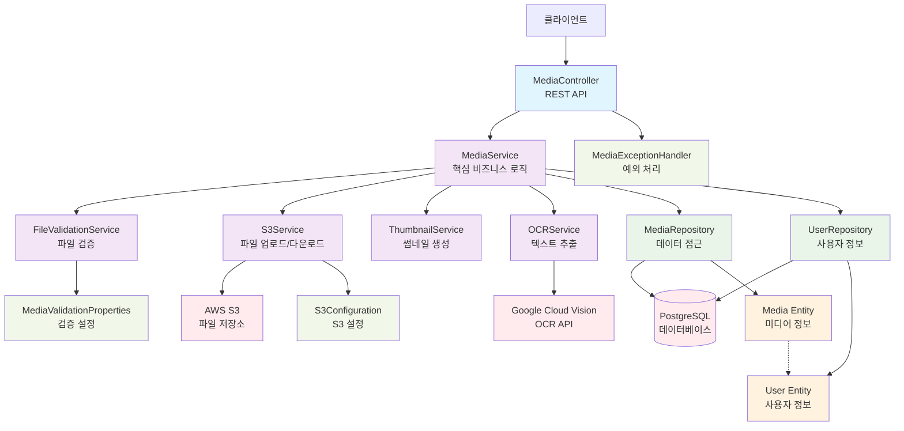

---

## 🔄 계층별 상세 아키텍처

### 1. Presentation Layer (프레젠테이션 계층)

```mermaid
graph LR
    CLIENT[클라이언트<br/>웹/모바일] --> JWT[JWT 인증]
    JWT --> MC[MediaController]
    
    MC --> UPLOAD[POST /upload<br/>파일 업로드]
    MC --> GET[GET /{id}<br/>파일 조회]
    MC --> LIST[GET /list<br/>목록 조회]
    MC --> DELETE[DELETE /{id}<br/>파일 삭제]
    MC --> OCR_POST[POST /{id}/ocr<br/>OCR 처리]
    MC --> OCR_GET[GET /{id}/ocr<br/>OCR 결과]
    MC --> HEALTH[GET /health<br/>헬스 체크]
    
    classDef endpoint fill:#e3f2fd
    class UPLOAD,GET,LIST,DELETE,OCR_POST,OCR_GET,HEALTH endpoint
```

### 2. Business Logic Layer (비즈니스 로직 계층)

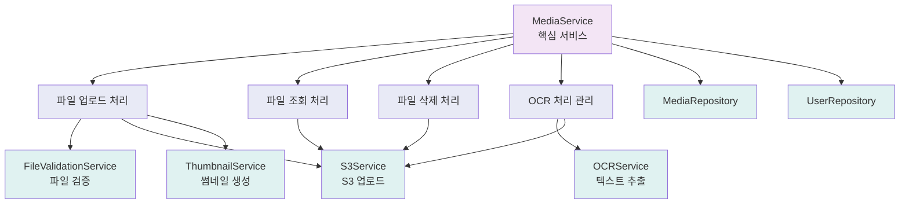

### 3. Data Access Layer (데이터 접근 계층)

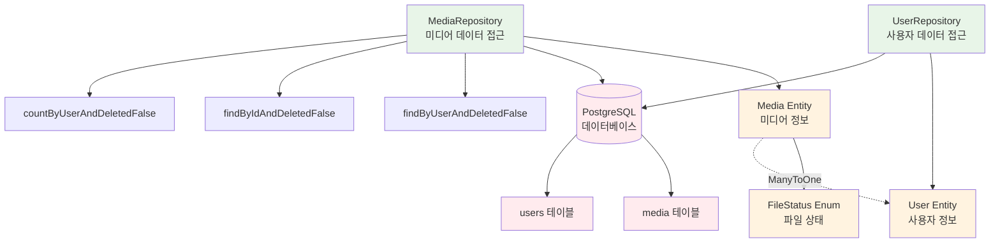

---

## 🔗 의존성 매트릭스

### 서비스 간 의존성

| 서비스 | MediaService | OCRService | S3Service | ThumbnailService | FileValidationService |
|--------|--------------|------------|-----------|------------------|-----------------------|
| **MediaService** | - | ✅ | ✅ | ✅ | ✅ |
| **OCRService** | ❌ | - | ❌ | ❌ | ❌ |
| **S3Service** | ❌ | ❌ | - | ❌ | ❌ |
| **ThumbnailService** | ❌ | ❌ | ❌ | - | ❌ |
| **FileValidationService** | ❌ | ❌ | ❌ | ❌ | - |

**범례**: ✅ 의존함, ❌ 의존하지 않음

### 외부 서비스 의존성

| 컴포넌트 | AWS S3 | Google Vision | PostgreSQL | JWT |
|----------|--------|---------------|------------|-----|
| **MediaController** | ❌ | ❌ | ❌ | ✅ |
| **MediaService** | ❌ | ❌ | ❌ | ❌ |
| **OCRService** | ❌ | ✅ | ❌ | ❌ |
| **S3Service** | ✅ | ❌ | ❌ | ❌ |
| **MediaRepository** | ❌ | ❌ | ✅ | ❌ |

---

## 📊 데이터 플로우 다이어그램

### 1. 파일 업로드 플로우

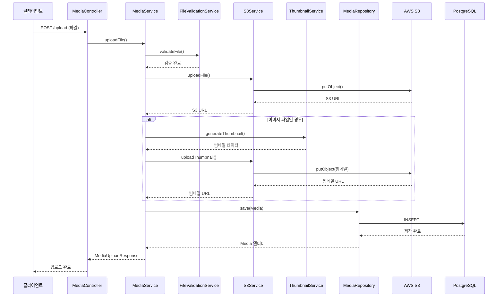

### 2. OCR 처리 플로우

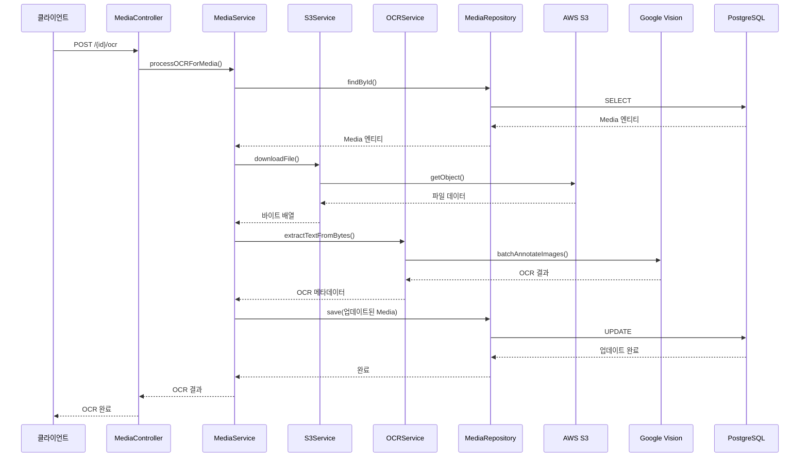

### 3. 파일 조회 플로우

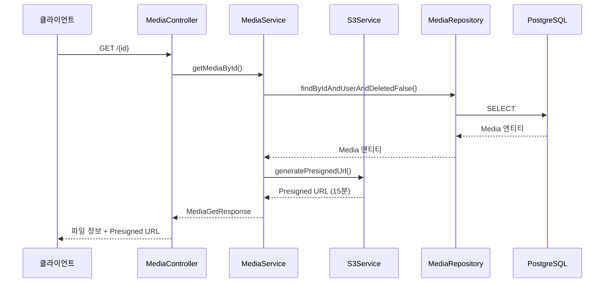

---

## 🔧 기술 스택 의존성

### 1. 핵심 프레임워크

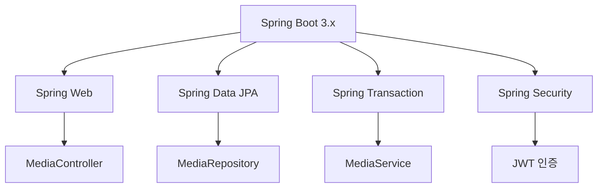

### 2. 외부 라이브러리

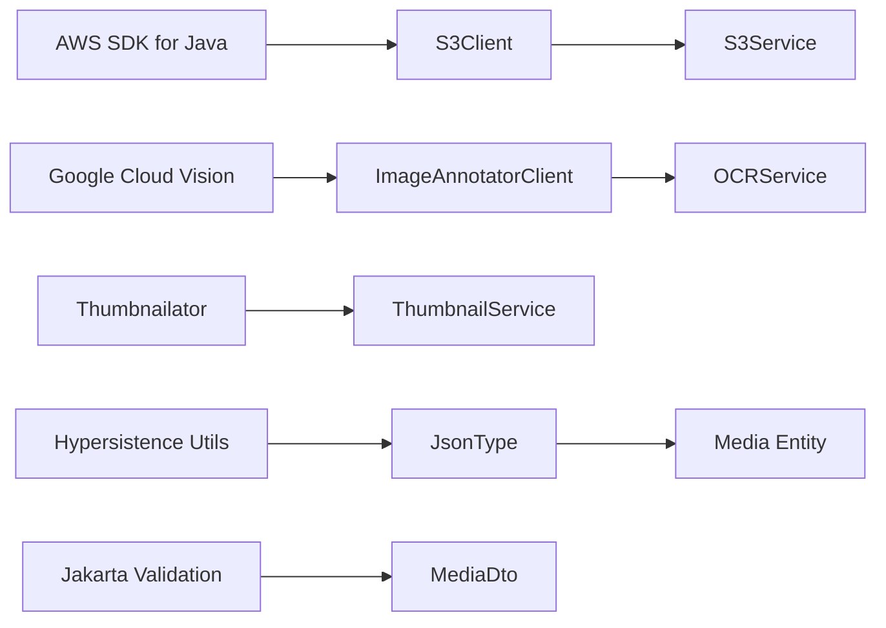

### 3. 데이터베이스 의존성

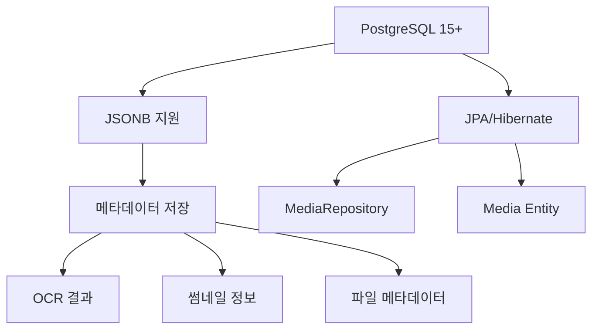

---

## 🚦 의존성 분석

### 1. 강한 결합 (Strong Coupling)

**MediaService ↔ 다른 서비스들**
- **위험도**: 🔴 높음
- **이유**: MediaService가 모든 서비스에 의존
- **개선 방안**: 이벤트 기반 아키텍처 도입

```java
// 현재 - 강한 결합
@Service
public class MediaService {
    private final OCRService ocrService;
    private final S3Service s3Service;
    private final ThumbnailService thumbnailService;
    private final FileValidationService fileValidationService;
    // ...
}

// 개선 - 이벤트 기반
@EventListener
public void handleFileUploaded(FileUploadedEvent event) {
    // 비동기 처리
}
```

### 2. 외부 서비스 의존성

**OCRService → Google Cloud Vision**
- **위험도**: 🟡 중간
- **이유**: 외부 API 장애 시 전체 OCR 기능 중단
- **개선 방안**: Circuit Breaker 패턴, 대체 서비스

**S3Service → AWS S3**
- **위험도**: 🟡 중간
- **이유**: S3 장애 시 파일 업로드/다운로드 불가
- **개선 방안**: 다중 스토리지 지원, 로컬 백업

### 3. 순환 의존성 검사

✅ **순환 의존성 없음** - 모든 의존성이 단방향으로 구성됨

```
Controller → Service → Repository → Entity
     ↓         ↓          ↓
   DTO    External   Database
```

---

## 📈 성능 영향 분석

### 1. 병목 지점 (Bottlenecks)

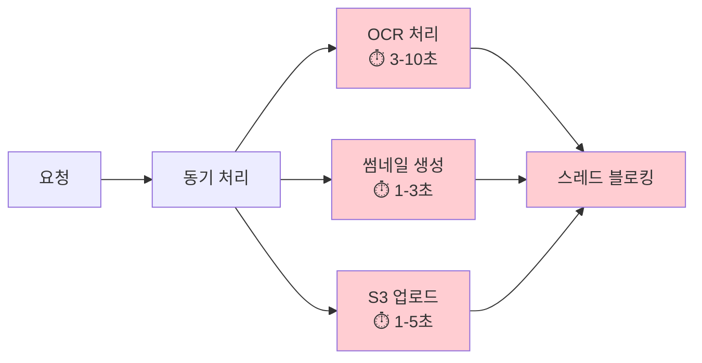

### 2. 리소스 사용량

| 컴포넌트 | CPU | 메모리 | 네트워크 | 디스크 |
|----------|-----|--------|----------|--------|
| **FileValidationService** | 🔴 높음 | 🟡 중간 | 🟢 낮음 | 🟢 낮음 |
| **OCRService** | 🟡 중간 | 🔴 높음 | 🔴 높음 | 🟢 낮음 |
| **ThumbnailService** | 🔴 높음 | 🔴 높음 | 🟢 낮음 | 🟢 낮음 |
| **S3Service** | 🟢 낮음 | 🟡 중간 | 🔴 높음 | 🟢 낮음 |

---

## 🔒 보안 아키텍처

### 1. 보안 계층

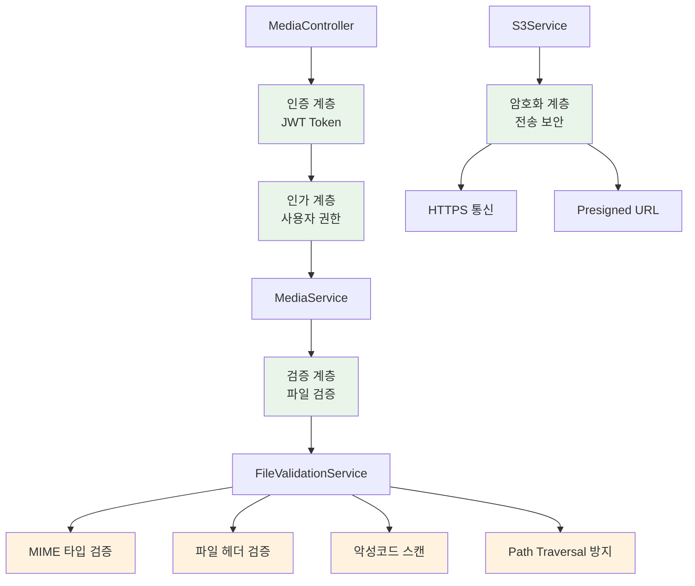

### 2. 보안 검증 플로우

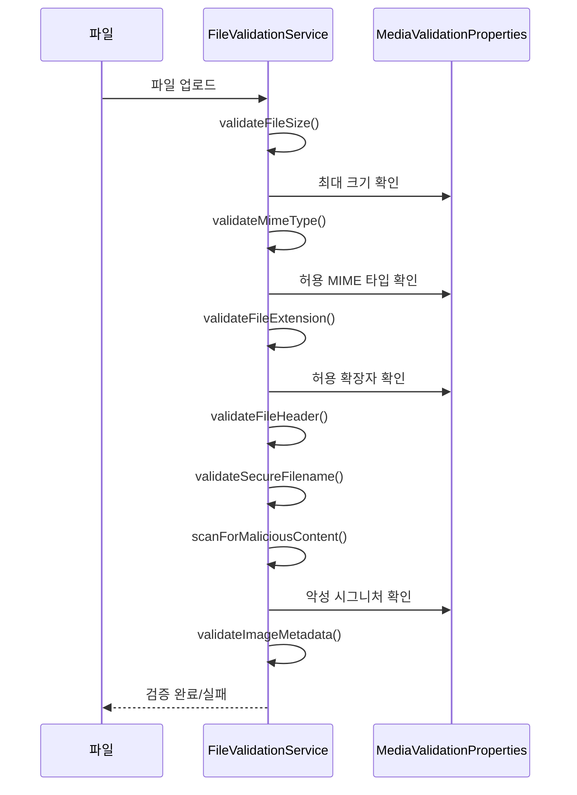

---

## 🔄 개선된 아키텍처 제안

### 1. 이벤트 기반 아키텍처

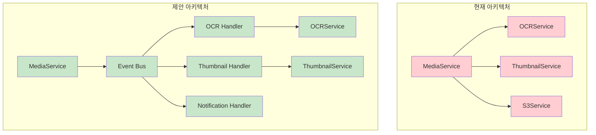

### 2. 마이크로서비스 분리 제안

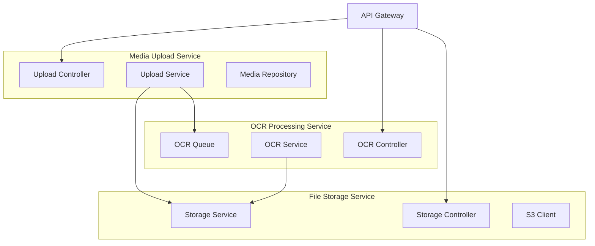

---

## 📊 메트릭 및 모니터링

### 1. 핵심 메트릭

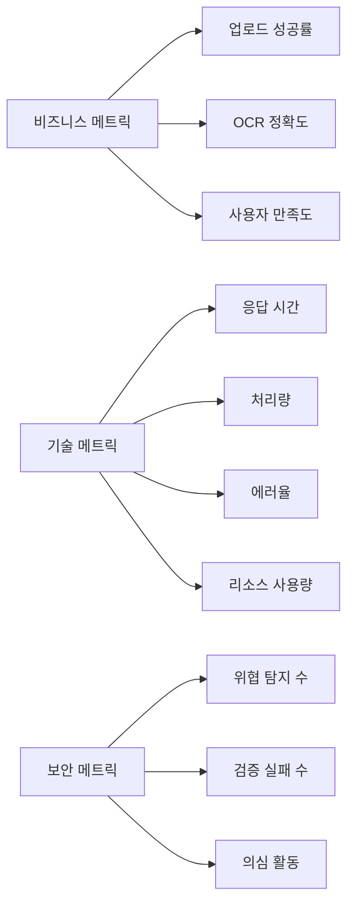

### 2. 알림 및 대시보드

| 메트릭 | 임계값 | 알림 레벨 | 대응 방안 |
|--------|--------|-----------|----------|
| **업로드 실패율** | > 5% | 🟡 경고 | 로그 분석, 서비스 상태 확인 |
| **OCR 처리 시간** | > 30초 | 🟡 경고 | Google Vision API 상태 확인 |
| **S3 업로드 실패** | > 1% | 🔴 심각 | AWS 상태 확인, 대체 스토리지 |
| **보안 위협 탐지** | > 10건/시간 | 🔴 심각 | 보안팀 알림, IP 차단 검토 |

---

## 🎯 아키텍처 개선 로드맵

### Phase 1: 성능 최적화 (1-2개월)
- [ ] 비동기 처리 도입 (`AsyncMediaService`)
- [ ] 연결 풀링 구현 (`GoogleVisionClientFactory`)
- [ ] 캐싱 전략 수립
- [ ] 데이터베이스 쿼리 최적화

### Phase 2: 아키텍처 개선 (2-3개월)
- [ ] 이벤트 기반 아키텍처 도입
- [ ] 서비스 분리 및 모듈화
- [ ] Circuit Breaker 패턴 적용
- [ ] 메트릭 수집 시스템 구축

### Phase 3: 확장성 강화 (3-4개월)
- [ ] 마이크로서비스 분리 검토
- [ ] 다중 스토리지 지원
- [ ] 글로벌 CDN 연동
- [ ] 자동 스케일링 구현

---

**문서 버전**: 1.0  
**최종 업데이트**: 2024년 1월  
**담당자**: 미디어 도메인 전담 개발자  
**검토 주기**: 분기별 1회