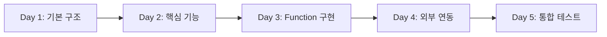

# 🏗️ 오케스트레이터 스켈레톤 프로젝트 셋업 가이드

## 📋 개요
완전히 새로운 브랜치에서 스켈레톤 구조를 만들고, 팀원들이 역할 분담하여 개발할 수 있도록 준비

---

## 🚀 Step 1: 새 브랜치 생성 및 초기화

```bash
# 1. 현재 브랜치 백업
git checkout main
git pull origin main

# 2. 새로운 빈 브랜치 생성 (--orphan 옵션으로 히스토리 없는 브랜치)
git checkout --orphan feat/orchestrator-clean

# 3. 모든 파일 제거 (완전히 빈 상태로 만들기)
git rm -rf .
rm -rf *

# 4. 기본 프로젝트 구조만 생성
mkdir -p src/main/java
mkdir -p src/main/resources
mkdir -p src/test/java
```

---

## 📁 Step 2: 스켈레톤 디렉토리 생성 스크립트

`create_skeleton.sh` 파일을 생성하고 실행:

```bash
#!/bin/bash

# 프로젝트 루트 설정
PROJECT_ROOT="/Users/kmj/Documents/GitHub/AIBE2_FinalProject_Compass_BE"
SRC_ROOT="$PROJECT_ROOT/src/main/java/com/compass"

echo "🏗️ Creating Skeleton Structure..."

# ========== CONFIG 디렉토리 ==========
echo "📁 Creating config directories..."
mkdir -p $SRC_ROOT/config/jwt
mkdir -p $SRC_ROOT/config/oauth
mkdir -p $SRC_ROOT/config/security

# ========== DOMAIN/AUTH 디렉토리 ==========
echo "📁 Creating auth domain directories..."
mkdir -p $SRC_ROOT/domain/auth/controller
mkdir -p $SRC_ROOT/domain/auth/service
mkdir -p $SRC_ROOT/domain/auth/entity
mkdir -p $SRC_ROOT/domain/auth/repository
mkdir -p $SRC_ROOT/domain/auth/dto

# ========== DOMAIN/CHAT 디렉토리 ==========
echo "📁 Creating chat domain directories..."
mkdir -p $SRC_ROOT/domain/chat/controller
mkdir -p $SRC_ROOT/domain/chat/orchestrator
mkdir -p $SRC_ROOT/domain/chat/function/config
mkdir -p $SRC_ROOT/domain/chat/function/collection
mkdir -p $SRC_ROOT/domain/chat/function/processing
mkdir -p $SRC_ROOT/domain/chat/function/planning
mkdir -p $SRC_ROOT/domain/chat/function/external
mkdir -p $SRC_ROOT/domain/chat/function/refinement
mkdir -p $SRC_ROOT/domain/chat/service/internal
mkdir -p $SRC_ROOT/domain/chat/service/external
mkdir -p $SRC_ROOT/domain/chat/model/enums
mkdir -p $SRC_ROOT/domain/chat/model/request
mkdir -p $SRC_ROOT/domain/chat/model/response
mkdir -p $SRC_ROOT/domain/chat/model/context
mkdir -p $SRC_ROOT/domain/chat/entity
mkdir -p $SRC_ROOT/domain/chat/repository

# ========== COMMON 디렉토리 ==========
echo "📁 Creating common directories..."
mkdir -p $SRC_ROOT/common/entity
mkdir -p $SRC_ROOT/common/exception
mkdir -p $SRC_ROOT/common/util

# ========== RESOURCES 디렉토리 ==========
echo "📁 Creating resources..."
mkdir -p $PROJECT_ROOT/src/main/resources
mkdir -p $PROJECT_ROOT/src/test/java/com/compass

echo "✅ Directory structure created successfully!"
```

---

## 📄 Step 3: 파일 생성 및 분류

### 🟢 A. 그대로 복사할 파일 (기존 코드 100% 사용)

```bash
#!/bin/bash

OLD_PROJECT="/path/to/current/project"
NEW_PROJECT="/Users/kmj/Documents/GitHub/AIBE2_FinalProject_Compass_BE"

echo "📋 Copying existing files..."

# ========== CONFIG - JWT/OAuth (그대로 복사) ==========
cp $OLD_PROJECT/src/main/java/com/compass/config/jwt/JwtTokenProvider.java \
   $NEW_PROJECT/src/main/java/com/compass/config/jwt/

cp $OLD_PROJECT/src/main/java/com/compass/config/jwt/JwtAuthenticationFilter.java \
   $NEW_PROJECT/src/main/java/com/compass/config/jwt/

cp $OLD_PROJECT/src/main/java/com/compass/config/oauth/*.java \
   $NEW_PROJECT/src/main/java/com/compass/config/oauth/

cp $OLD_PROJECT/src/main/java/com/compass/config/SecurityConfig.java \
   $NEW_PROJECT/src/main/java/com/compass/config/

cp $OLD_PROJECT/src/main/java/com/compass/config/AiConfig.java \
   $NEW_PROJECT/src/main/java/com/compass/config/

cp $OLD_PROJECT/src/main/java/com/compass/config/RedisConfig.java \
   $NEW_PROJECT/src/main/java/com/compass/config/

# ========== ENTITY (그대로 복사) ==========
cp $OLD_PROJECT/src/main/java/com/compass/domain/user/entity/User.java \
   $NEW_PROJECT/src/main/java/com/compass/domain/auth/entity/

cp $OLD_PROJECT/src/main/java/com/compass/domain/chat/entity/ChatThread.java \
   $NEW_PROJECT/src/main/java/com/compass/domain/chat/entity/

cp $OLD_PROJECT/src/main/java/com/compass/domain/chat/entity/ChatMessage.java \
   $NEW_PROJECT/src/main/java/com/compass/domain/chat/entity/

# ========== REPOSITORY (그대로 복사) ==========
cp $OLD_PROJECT/src/main/java/com/compass/domain/user/repository/UserRepository.java \
   $NEW_PROJECT/src/main/java/com/compass/domain/auth/repository/

cp $OLD_PROJECT/src/main/java/com/compass/domain/chat/repository/ChatThreadRepository.java \
   $NEW_PROJECT/src/main/java/com/compass/domain/chat/repository/

cp $OLD_PROJECT/src/main/java/com/compass/domain/chat/repository/ChatMessageRepository.java \
   $NEW_PROJECT/src/main/java/com/compass/domain/chat/repository/

# ========== COMMON (그대로 복사) ==========
cp $OLD_PROJECT/src/main/java/com/compass/common/entity/BaseTimeEntity.java \
   $NEW_PROJECT/src/main/java/com/compass/common/entity/

# ========== APPLICATION.YML (그대로 복사) ==========
cp $OLD_PROJECT/src/main/resources/application*.yml \
   $NEW_PROJECT/src/main/resources/

# ========== BUILD FILES (그대로 복사) ==========
cp $OLD_PROJECT/build.gradle $NEW_PROJECT/
cp $OLD_PROJECT/settings.gradle $NEW_PROJECT/
cp $OLD_PROJECT/.gitignore $NEW_PROJECT/
cp $OLD_PROJECT/.env.example $NEW_PROJECT/

echo "✅ Files copied successfully!"
```

### 🟡 B. 빈 파일로 생성할 목록 (새로 작성 필요)

```bash
#!/bin/bash

SRC_ROOT="/Users/kmj/Documents/GitHub/AIBE2_FinalProject_Compass_BE/src/main/java/com/compass"

echo "📄 Creating empty skeleton files..."

# ========== ORCHESTRATOR (핵심 - 새로 작성) ==========
cat > $SRC_ROOT/domain/chat/orchestrator/MainLLMOrchestrator.java << 'EOF'
package com.compass.domain.chat.orchestrator;

import org.springframework.stereotype.Service;
import lombok.RequiredArgsConstructor;
import lombok.extern.slf4j.Slf4j;

/**
 * TODO: 구현 필요
 * 담당: [팀원명]
 *
 * 주요 기능:
 * 1. Intent 분류
 * 2. Phase 관리
 * 3. Function 선택 및 실행
 * 4. LLM 호출
 */
@Slf4j
@Service
@RequiredArgsConstructor
public class MainLLMOrchestrator {
    // TODO: 구현
}
EOF

cat > $SRC_ROOT/domain/chat/orchestrator/IntentClassifier.java << 'EOF'
package com.compass.domain.chat.orchestrator;

import org.springframework.stereotype.Component;

/**
 * TODO: 구현 필요
 * 담당: [팀원명]
 */
@Component
public class IntentClassifier {
    // TODO: 구현
}
EOF

cat > $SRC_ROOT/domain/chat/orchestrator/PhaseManager.java << 'EOF'
package com.compass.domain.chat.orchestrator;

import org.springframework.stereotype.Component;

/**
 * TODO: 구현 필요
 * 담당: [팀원명]
 */
@Component
public class PhaseManager {
    // TODO: 구현
}
EOF

# ========== CONTROLLER (새로 작성) ==========
cat > $SRC_ROOT/domain/chat/controller/UnifiedChatController.java << 'EOF'
package com.compass.domain.chat.controller;

import org.springframework.web.bind.annotation.*;
import lombok.RequiredArgsConstructor;

/**
 * TODO: 구현 필요
 * 담당: [팀원명]
 *
 * 엔드포인트: POST /api/chat/unified
 */
@RestController
@RequestMapping("/api/chat")
@RequiredArgsConstructor
public class UnifiedChatController {
    // TODO: 구현
}
EOF

# ========== FUNCTIONS (새로 작성) ==========
cat > $SRC_ROOT/domain/chat/function/config/FunctionConfiguration.java << 'EOF'
package com.compass.domain.chat.function.config;

import org.springframework.context.annotation.Configuration;

/**
 * TODO: 구현 필요
 * 담당: [팀원명]
 *
 * Function Bean 등록
 */
@Configuration
public class FunctionConfiguration {
    // TODO: @Bean 메서드들 구현
}
EOF

cat > $SRC_ROOT/domain/chat/function/collection/ShowQuickInputFormFunction.java << 'EOF'
package com.compass.domain.chat.function.collection;

/**
 * TODO: 구현 필요
 * 담당: [팀원명]
 *
 * 빠른 입력 폼 표시 Function
 */
public class ShowQuickInputFormFunction {
    // TODO: 구현
}
EOF

cat > $SRC_ROOT/domain/chat/function/processing/ProcessImageFunction.java << 'EOF'
package com.compass.domain.chat.function.processing;

/**
 * TODO: 구현 필요
 * 담당: [팀원명]
 *
 * 이미지 OCR 처리 Function
 */
public class ProcessImageFunction {
    // TODO: 구현
}
EOF

# ========== MODELS (새로 작성) ==========
cat > $SRC_ROOT/domain/chat/model/enums/Intent.java << 'EOF'
package com.compass.domain.chat.model.enums;

/**
 * TODO: 구현 필요
 * 담당: [팀원명]
 */
public enum Intent {
    TRAVEL_PLANNING,
    INFORMATION_COLLECTION,
    IMAGE_UPLOAD,
    GENERAL_QUESTION,
    UNKNOWN
}
EOF

cat > $SRC_ROOT/domain/chat/model/enums/TravelPhase.java << 'EOF'
package com.compass.domain.chat.model.enums;

/**
 * TODO: 구현 필요
 * 담당: [팀원명]
 */
public enum TravelPhase {
    INITIALIZATION,
    INFORMATION_COLLECTION,
    PLAN_GENERATION,
    FEEDBACK_REFINEMENT,
    COMPLETION
}
EOF

# ========== SERVICES (새로 작성) ==========
cat > $SRC_ROOT/domain/chat/service/internal/ChatThreadService.java << 'EOF'
package com.compass.domain.chat.service.internal;

import org.springframework.stereotype.Service;
import lombok.RequiredArgsConstructor;

/**
 * TODO: 구현 필요
 * 담당: [팀원명]
 *
 * ChatThread CRUD 담당
 */
@Service
@RequiredArgsConstructor
public class ChatThreadService {
    // TODO: 구현
}
EOF

cat > $SRC_ROOT/domain/chat/service/external/PerplexityClient.java << 'EOF'
package com.compass.domain.chat.service.external;

import org.springframework.stereotype.Component;

/**
 * TODO: 구현 필요
 * 담당: [팀원명]
 *
 * Perplexity API 클라이언트
 */
@Component
public class PerplexityClient {
    // TODO: 구현
}
EOF

echo "✅ Skeleton files created successfully!"
```

---

## 👥 Step 4: 팀 역할 분담 가이드 (5명)

### 역할별 담당 파일 및 우선순위

| 담당자 | 역할 | 담당 파일 | 우선순위 | 예상 시간 |
|--------|------|----------|----------|-----------|
| **Chat2 개발자** | **LLM 오케스트레이터** | | | |
| | | `orchestrator/MainLLMOrchestrator.java` | 🔴 최우선 | 1일 |
| | | `orchestrator/IntentClassifier.java` | 🔴 최우선 | 0.5일 |
| | | `orchestrator/PhaseManager.java` | 🔴 최우선 | 0.5일 |
| | | `controller/UnifiedChatController.java` | 🔴 최우선 | 0.5일 |
| | | `model/enums/Intent.java` | 🟡 높음 | 0.5일 |
| | | `model/enums/TravelPhase.java` | 🟡 높음 | 0.5일 |
| | | | | |
| **User 개발자** | **빠른입력폼 & 스타일** | | | |
| | | `function/collection/ShowQuickInputFormFunction.java` | 🔴 최우선 | 1일 |
| | | `function/collection/SubmitTravelFormFunction.java` | 🟡 높음 | 0.5일 |
| | | `function/planning/RecommendDestinationsFunction.java` | 🟡 높음 | 1일 |
| | | | | |
| **Chat 개발자** | **일반대화 & CRUD** | | | |
| | | `service/internal/ChatThreadService.java` | 🔴 최우선 | 0.5일 |
| | | `service/internal/ChatMessageService.java` | 🟡 높음 | 0.5일 |
| | | `function/processing/HandleGeneralQuestionFunction.java` | 🟡 높음 | 0.5일 |
| | | `controller/AuthController.java` | 🟢 보통 | 0.5일 |
| | | | | |
| **Media 개발자** | **이미지/OCR 처리** | | | |
| | | `function/processing/ProcessImageFunction.java` | 🔴 최우선 | 1일 |
| | | `service/external/S3Client.java` | 🟡 높음 | 0.5일 |
| | | `service/external/OCRClient.java` | 🟡 높음 | 0.5일 |
| | | | | |
| **Trip 개발자** | **여행계획 생성** | | | |
| | | `function/planning/GenerateTravelPlanFunction.java` | 🔴 최우선 | 1일 |
| | | `service/external/PerplexityClient.java` | 🟡 높음 | 0.5일 |
| | | `model/request/TravelPlanRequest.java` | 🟡 높음 | 0.5일 |
| | | `model/response/TravelPlanResponse.java` | 🟢 보통 | 0.5일 |

### 개발 순서



1. **Day 1**: 오케스트레이터 기본 구조 (Chat2) + 데이터 모델 정의 (전체)
2. **Day 2**: 입력폼 (User) + CRUD (Chat) + 이미지처리 (Media)
3. **Day 3**: 여행계획 생성 (Trip) + Function 통합 (전체)
4. **Day 4**: 외부 API 연동 완성 + 단위 테스트
5. **Day 5**: 통합 테스트 + 버그 수정

---

## 🔧 Step 5: 실행 명령어

```bash
# 1. 스켈레톤 생성 스크립트 실행
chmod +x create_skeleton.sh
./create_skeleton.sh

# 2. 기존 파일 복사 스크립트 실행
chmod +x copy_existing_files.sh
./copy_existing_files.sh

# 3. 빈 파일 생성 스크립트 실행
chmod +x create_empty_files.sh
./create_empty_files.sh

# 4. Git 초기 커밋
git add .
git commit -m "feat: 오케스트레이터 스켈레톤 구조 생성

- 디렉토리 구조 생성
- 기존 인증/Entity/Repository 복사
- 새로 작성할 파일 스켈레톤 생성
- 팀 역할 분담 준비 완료"

# 5. 브랜치 푸시
git push origin feat/orchestrator-clean
```

---

## ✅ 체크리스트

### 복사 완료 확인
- [ ] JWT/OAuth 설정 파일
- [ ] SecurityConfig
- [ ] User, ChatThread, ChatMessage Entity
- [ ] Repository 인터페이스
- [ ] application.yml
- [ ] build.gradle

### 스켈레톤 생성 확인
- [ ] 오케스트레이터 클래스
- [ ] Function 클래스들
- [ ] Model/Enum 클래스
- [ ] Service 클래스

### 팀 준비사항
- [ ] 각자 브랜치 체크아웃
- [ ] 담당 파일 확인
- [ ] 개발 환경 설정
- [ ] 일정 조율

---

## 📝 참고사항

1. **브랜치 규칙**
   - 각자 `feat/orchestrator-clean-{name}` 브랜치 생성
   - 매일 메인 브랜치에 머지

2. **코드 스타일**
   - 한국어 주석 사용 (// 만)
   - AI 티나는 코드 금지
   - 간결하고 명확한 코드

3. **커밋 메시지**
   - `feat: [담당영역] 구현 내용`
   - 예: `feat: 오케스트레이터 Intent 분류 구현`

---

작성일: 2024-12-30
버전: 1.0.0