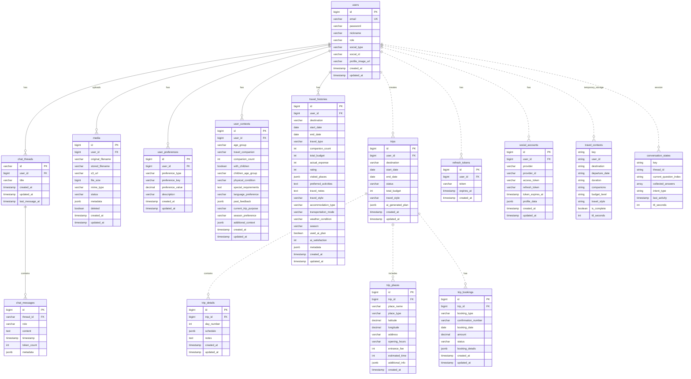

# 🗄️ Compass 데이터베이스 ERD (Entity Relationship Diagram)

## 📊 전체 ERD 다이어그램



## 📝 테이블 상세 명세

### 🔐 USER 도메인

#### 1. users (구현 완료)
| 컬럼명 | 타입 | 제약조건 | 설명 |
|--------|------|----------|------|
| id | BIGINT | PK, AUTO_INCREMENT | 사용자 고유 ID |
| email | VARCHAR(255) | UNIQUE, NOT NULL | 이메일 (로그인 ID) |
| password | VARCHAR(255) | NULLABLE | 비밀번호 (소셜 로그인시 NULL) |
| nickname | VARCHAR(100) | NOT NULL | 닉네임 |
| role | VARCHAR(50) | NOT NULL | 권한 (USER, ADMIN) |
| social_type | VARCHAR(50) | NULLABLE | 소셜 로그인 타입 (KAKAO, GOOGLE) |
| social_id | VARCHAR(255) | NULLABLE | 소셜 로그인 고유 ID |
| profile_image_url | VARCHAR(500) | NULLABLE | 프로필 이미지 URL |
| created_at | TIMESTAMP | NOT NULL | 생성일시 |
| updated_at | TIMESTAMP | NOT NULL | 수정일시 |

#### 2. refresh_tokens (계획)
| 컬럼명 | 타입 | 제약조건 | 설명 |
|--------|------|----------|------|
| id | BIGINT | PK, AUTO_INCREMENT | 토큰 ID |
| user_id | BIGINT | FK(users), NOT NULL | 사용자 ID |
| token | VARCHAR(500) | UNIQUE, NOT NULL | 리프레시 토큰 |
| expires_at | TIMESTAMP | NOT NULL | 만료일시 |
| created_at | TIMESTAMP | NOT NULL | 생성일시 |

#### 3. social_accounts (계획)
| 컬럼명 | 타입 | 제약조건 | 설명 |
|--------|------|----------|------|
| id | BIGINT | PK, AUTO_INCREMENT | 계정 ID |
| user_id | BIGINT | FK(users), NOT NULL | 사용자 ID |
| provider | VARCHAR(50) | NOT NULL | 제공자 (KAKAO, GOOGLE, NAVER) |
| provider_id | VARCHAR(255) | NOT NULL | 제공자측 사용자 ID |
| access_token | VARCHAR(1000) | NULLABLE | 액세스 토큰 |
| refresh_token | VARCHAR(1000) | NULLABLE | 리프레시 토큰 |
| token_expires_at | TIMESTAMP | NULLABLE | 토큰 만료일시 |
| profile_data | JSONB | NULLABLE | 프로필 추가 정보 |
| created_at | TIMESTAMP | NOT NULL | 연동일시 |
| updated_at | TIMESTAMP | NOT NULL | 수정일시 |

### 💬 CHAT 도메인

#### 4. chat_threads (구현 완료)
| 컬럼명 | 타입 | 제약조건 | 설명 |
|--------|------|----------|------|
| id | VARCHAR(36) | PK, UUID | 채팅 스레드 ID |
| user_id | BIGINT | FK(users), NOT NULL | 사용자 ID |
| title | VARCHAR(255) | NULLABLE | 채팅방 제목 |
| created_at | TIMESTAMP | NOT NULL | 생성일시 |
| updated_at | TIMESTAMP | NOT NULL | 수정일시 |
| last_message_at | TIMESTAMP | NULLABLE | 마지막 메시지 시간 |

**인덱스**:
- idx_chat_thread_user_id (user_id)
- idx_chat_thread_last_message (last_message_at DESC)

#### 5. chat_messages (구현 완료)
| 컬럼명 | 타입 | 제약조건 | 설명 |
|--------|------|----------|------|
| id | BIGINT | PK, AUTO_INCREMENT | 메시지 ID |
| thread_id | VARCHAR(36) | FK(chat_threads), NOT NULL | 스레드 ID |
| role | VARCHAR(20) | NOT NULL | 역할 (user, assistant, system) |
| content | TEXT | NOT NULL | 메시지 내용 |
| timestamp | TIMESTAMP | NOT NULL | 전송시간 |
| token_count | INT | NULLABLE | 토큰 수 |
| metadata | JSONB | NULLABLE | 추가 메타데이터 |

**인덱스**:
- idx_chat_message_thread_id (thread_id)
- idx_chat_message_timestamp (timestamp DESC)

### 🗺️ TRIP 도메인

#### 6. user_preferences (구현 완료)
| 컬럼명 | 타입 | 제약조건 | 설명 |
|--------|------|----------|------|
| id | BIGINT | PK, AUTO_INCREMENT | 선호도 ID |
| user_id | BIGINT | FK(users), NOT NULL | 사용자 ID |
| preference_type | VARCHAR(50) | NOT NULL | 선호도 타입 (TRAVEL_STYLE, BUDGET_LEVEL) |
| preference_key | VARCHAR(50) | NOT NULL | 선호도 키 (RELAXATION, SIGHTSEEING 등) |
| preference_value | DECIMAL(3,2) | NOT NULL | 선호도 값 (0.00 ~ 1.00) |
| description | VARCHAR(255) | NULLABLE | 설명 |
| created_at | TIMESTAMP | NOT NULL | 생성일시 |
| updated_at | TIMESTAMP | NOT NULL | 수정일시 |

**유니크 제약**:
- uk_user_preference_type_key (user_id, preference_type, preference_key)

#### 7. user_contexts (구현 완료)
| 컬럼명 | 타입 | 제약조건 | 설명 |
|--------|------|----------|------|
| id | BIGINT | PK, AUTO_INCREMENT | 컨텍스트 ID |
| user_id | BIGINT | UNIQUE, NOT NULL | 사용자 ID |
| age_group | VARCHAR(20) | NULLABLE | 나이대 (20대, 30대, 40대, 50대+) |
| travel_companion | VARCHAR(50) | NULLABLE | 동행 유형 (SOLO, COUPLE, FAMILY 등) |
| companion_count | INT | NULLABLE | 동행 인원수 |
| with_children | BOOLEAN | NULLABLE | 아이 동반 여부 |
| children_age_group | VARCHAR(50) | NULLABLE | 아이 연령대 |
| physical_condition | VARCHAR(100) | NULLABLE | 신체 조건 |
| special_requirements | TEXT | NULLABLE | 특별 요구사항 |
| language_preference | VARCHAR(50) | NULLABLE | 언어 선호도 |
| past_feedback | JSONB | NULLABLE | 과거 피드백 |
| current_trip_purpose | VARCHAR(50) | NULLABLE | 현재 여행 목적 |
| season_preference | VARCHAR(20) | NULLABLE | 계절 선호도 |
| additional_context | JSONB | NULLABLE | 추가 컨텍스트 |
| created_at | TIMESTAMP | NOT NULL | 생성일시 |
| updated_at | TIMESTAMP | NOT NULL | 수정일시 |

#### 8. travel_histories (구현 완료)
| 컬럼명 | 타입 | 제약조건 | 설명 |
|--------|------|----------|------|
| id | BIGINT | PK, AUTO_INCREMENT | 히스토리 ID |
| user_id | BIGINT | FK(users), NOT NULL | 사용자 ID |
| destination | VARCHAR(100) | NOT NULL | 여행 목적지 |
| start_date | DATE | NOT NULL | 출발일 |
| end_date | DATE | NOT NULL | 도착일 |
| travel_type | VARCHAR(50) | NULLABLE | 여행 유형 |
| companion_count | INT | NULLABLE | 동행 인원수 |
| total_budget | INT | NULLABLE | 총 예산 |
| actual_expense | INT | NULLABLE | 실제 지출 |
| rating | INT | NULLABLE | 평점 (1-5) |
| visited_places | JSONB | NULLABLE | 방문 장소 |
| preferred_activities | TEXT | NULLABLE | 선호 활동 |
| travel_notes | TEXT | NULLABLE | 여행 메모 |
| travel_style | VARCHAR(100) | NULLABLE | 여행 스타일 |
| accommodation_type | VARCHAR(50) | NULLABLE | 숙박 유형 |
| transportation_mode | VARCHAR(50) | NULLABLE | 교통수단 |
| weather_condition | VARCHAR(50) | NULLABLE | 날씨 상태 |
| season | VARCHAR(20) | NULLABLE | 계절 |
| used_ai_plan | BOOLEAN | NULLABLE | AI 계획 사용 여부 |
| ai_satisfaction | INT | NULLABLE | AI 만족도 (1-5) |
| metadata | JSONB | NULLABLE | 메타데이터 |
| created_at | TIMESTAMP | NOT NULL | 생성일시 |
| updated_at | TIMESTAMP | NOT NULL | 수정일시 |

#### 9. trips (계획)
| 컬럼명 | 타입 | 제약조건 | 설명 |
|--------|------|----------|------|
| id | BIGINT | PK, AUTO_INCREMENT | 여행 ID |
| user_id | BIGINT | FK(users), NOT NULL | 사용자 ID |
| destination | VARCHAR(255) | NOT NULL | 목적지 |
| start_date | DATE | NOT NULL | 출발일 |
| end_date | DATE | NOT NULL | 도착일 |
| status | VARCHAR(50) | NOT NULL | 상태 (PLANNING, CONFIRMED, COMPLETED) |
| total_budget | INT | NULLABLE | 총 예산 |
| travel_style | VARCHAR(100) | NULLABLE | 여행 스타일 |
| ai_generated_plan | JSONB | NULLABLE | AI 생성 계획 |
| created_at | TIMESTAMP | NOT NULL | 생성일시 |
| updated_at | TIMESTAMP | NOT NULL | 수정일시 |

#### 10. trip_details (계획)
| 컬럼명 | 타입 | 제약조건 | 설명 |
|--------|------|----------|------|
| id | BIGINT | PK, AUTO_INCREMENT | 상세 ID |
| trip_id | BIGINT | FK(trips), NOT NULL | 여행 ID |
| day_number | INT | NOT NULL | 일차 |
| schedule | JSONB | NULLABLE | 일정 (시간별) |
| notes | TEXT | NULLABLE | 메모 |
| created_at | TIMESTAMP | NOT NULL | 생성일시 |
| updated_at | TIMESTAMP | NOT NULL | 수정일시 |

#### 11. trip_places (계획)
| 컬럼명 | 타입 | 제약조건 | 설명 |
|--------|------|----------|------|
| id | BIGINT | PK, AUTO_INCREMENT | 장소 ID |
| trip_id | BIGINT | FK(trips), NOT NULL | 여행 ID |
| place_name | VARCHAR(255) | NOT NULL | 장소명 |
| place_type | VARCHAR(50) | NULLABLE | 장소 유형 |
| latitude | DECIMAL(10,8) | NULLABLE | 위도 |
| longitude | DECIMAL(11,8) | NULLABLE | 경도 |
| address | VARCHAR(500) | NULLABLE | 주소 |
| opening_hours | VARCHAR(255) | NULLABLE | 영업시간 |
| entrance_fee | INT | NULLABLE | 입장료 |
| estimated_time | INT | NULLABLE | 예상 소요시간(분) |
| additional_info | JSONB | NULLABLE | 추가 정보 |
| created_at | TIMESTAMP | NOT NULL | 생성일시 |

#### 12. trip_bookings (계획)
| 컬럼명 | 타입 | 제약조건 | 설명 |
|--------|------|----------|------|
| id | BIGINT | PK, AUTO_INCREMENT | 예약 ID |
| trip_id | BIGINT | FK(trips), NOT NULL | 여행 ID |
| booking_type | VARCHAR(50) | NOT NULL | 예약 유형 (FLIGHT, HOTEL, RESTAURANT) |
| confirmation_number | VARCHAR(100) | NULLABLE | 예약 번호 |
| booking_date | DATE | NOT NULL | 예약일 |
| amount | DECIMAL(10,2) | NULLABLE | 금액 |
| status | VARCHAR(50) | NOT NULL | 상태 (PENDING, CONFIRMED, CANCELLED) |
| booking_details | JSONB | NULLABLE | 예약 상세 |
| created_at | TIMESTAMP | NOT NULL | 생성일시 |
| updated_at | TIMESTAMP | NOT NULL | 수정일시 |

### 🖼️ MEDIA 도메인

#### 13. media (구현 완료)
| 컬럼명 | 타입 | 제약조건 | 설명 |
|--------|------|----------|------|
| id | BIGINT | PK, AUTO_INCREMENT | 미디어 ID |
| user_id | BIGINT | FK(users), NOT NULL | 사용자 ID |
| original_filename | VARCHAR(500) | NOT NULL | 원본 파일명 |
| stored_filename | VARCHAR(500) | NOT NULL | 저장 파일명 |
| s3_url | VARCHAR(1000) | NULLABLE | S3 URL |
| file_size | BIGINT | NOT NULL | 파일 크기 (bytes) |
| mime_type | VARCHAR(100) | NOT NULL | MIME 타입 |
| status | VARCHAR(50) | NOT NULL | 상태 (UPLOADED, PROCESSING, DELETED) |
| metadata | JSONB | NULLABLE | 메타데이터 |
| deleted | BOOLEAN | NOT NULL DEFAULT FALSE | 삭제 여부 |
| created_at | TIMESTAMP | NOT NULL | 생성일시 |
| updated_at | TIMESTAMP | NOT NULL | 수정일시 |

## 🔄 Redis 저장소 (NoSQL)

### 14. travel_contexts (Redis - 계획)
| 필드명 | 타입 | 설명 |
|--------|------|------|
| key | STRING | "travel-context:{user_id}" |
| user_id | STRING | 사용자 ID |
| destination | STRING | 목적지 |
| departure_date | STRING | 출발일 |
| duration | STRING | 여행 기간 |
| companions | STRING | 동행자 |
| budget_level | STRING | 예산 수준 |
| travel_style | STRING | 여행 스타일 |
| is_complete | BOOLEAN | 정보 수집 완료 여부 |
| ttl | INT | 1800 (30분) |

### 15. conversation_states (Redis - 계획)
| 필드명 | 타입 | 설명 |
|--------|------|------|
| key | STRING | "conv-state:{thread_id}" |
| thread_id | STRING | 채팅 스레드 ID |
| current_question_index | INT | 현재 질문 인덱스 |
| collected_answers | ARRAY | 수집된 답변 배열 |
| intent_type | STRING | 인텐트 타입 |
| last_activity | TIMESTAMP | 마지막 활동 시간 |
| ttl | INT | 3600 (1시간) |

## 🔑 관계 설명

### 1:N 관계
- **users → chat_threads**: 한 사용자는 여러 채팅 스레드를 가질 수 있음
- **users → media**: 한 사용자는 여러 미디어 파일을 업로드할 수 있음
- **users → user_preferences**: 한 사용자는 여러 선호도를 가질 수 있음
- **users → travel_histories**: 한 사용자는 여러 여행 기록을 가질 수 있음
- **users → trips**: 한 사용자는 여러 여행 계획을 생성할 수 있음
- **chat_threads → chat_messages**: 한 스레드는 여러 메시지를 포함함
- **trips → trip_details**: 한 여행은 여러 일차별 상세 정보를 가짐
- **trips → trip_places**: 한 여행은 여러 장소를 포함함
- **trips → trip_bookings**: 한 여행은 여러 예약을 포함함

### 1:1 관계
- **users ↔ user_contexts**: 한 사용자는 하나의 컨텍스트를 가짐

## 🚀 구현 우선순위

### Phase 1 (MVP - 구현 완료)
✅ users
✅ chat_threads
✅ chat_messages
✅ user_preferences
✅ user_contexts
✅ travel_histories
✅ media

### Phase 2 (개발 중)
🔄 trips
🔄 trip_details
📋 travel_contexts (Redis)
📋 conversation_states (Redis)

### Phase 3 (계획)
📋 trip_places
📋 trip_bookings
📋 refresh_tokens
📋 social_accounts

## 📊 데이터베이스 인덱스 전략

### 성능 최적화 인덱스
1. **users**
   - idx_users_email (email) - 로그인 성능
   - idx_users_social (social_type, social_id) - 소셜 로그인

2. **chat_threads**
   - idx_chat_thread_user_id (user_id) - 사용자별 조회
   - idx_chat_thread_last_message (last_message_at DESC) - 최근 대화 정렬

3. **chat_messages**
   - idx_chat_message_thread_id (thread_id) - 스레드별 메시지 조회
   - idx_chat_message_timestamp (timestamp DESC) - 시간순 정렬

4. **trips**
   - idx_trips_user_id (user_id) - 사용자별 여행 조회
   - idx_trips_dates (start_date, end_date) - 날짜 범위 검색

5. **travel_histories**
   - idx_travel_history_user_id (user_id) - 사용자별 이력
   - idx_travel_history_destination (destination) - 목적지 검색

## 🔒 보안 및 제약사항

1. **개인정보 보호**
   - 비밀번호는 BCrypt 해싱
   - 민감한 정보는 암호화 저장
   - PII 데이터 최소 수집 원칙

2. **데이터 무결성**
   - 외래키 제약조건 설정
   - CASCADE DELETE 신중히 사용
   - 트랜잭션 관리 철저

3. **성능 고려사항**
   - JSONB 필드는 적절히 인덱싱
   - 대용량 TEXT 필드는 별도 테이블 고려
   - Redis 캐싱 적극 활용

## 📝 마이그레이션 전략

### Flyway 마이그레이션 파일 구조
```
src/main/resources/db/migration/
├── V1__Create_users_table.sql
├── V2__Create_chat_tables.sql
├── V3__Create_trip_tables.sql
├── V4__Create_media_table.sql
├── V5__Add_user_preferences.sql
├── V6__Add_user_contexts.sql
├── V7__Add_travel_histories.sql
└── V8__Create_trips_tables.sql (계획)
```

### 롤백 전략
- 각 마이그레이션은 독립적으로 롤백 가능
- 데이터 마이그레이션 전 백업 필수
- 스테이징 환경에서 테스트 후 프로덕션 적용