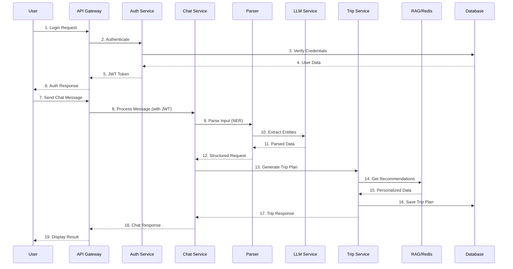
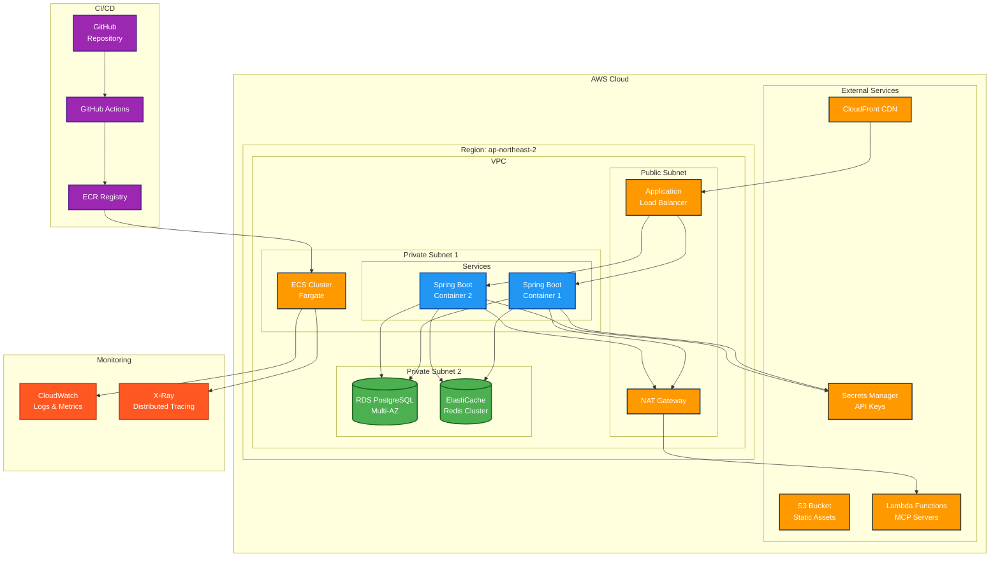
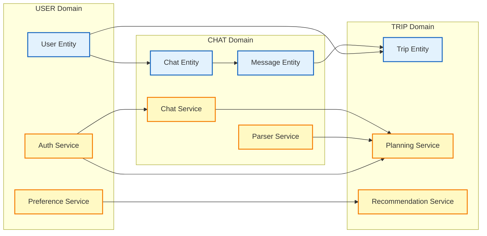
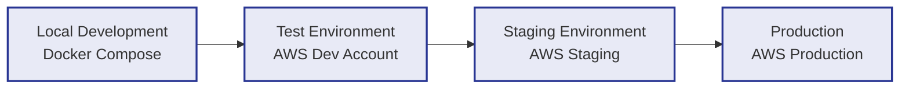

# Compass System Architecture

## Overview
Compass는 AI 기반 맞춤형 여행 계획 서비스로, Spring Boot, Spring AI, 그리고 RAG 기술을 활용한 마이크로서비스 아키텍처입니다.

## 전체 시스템 아키텍처

```mermaid
graph TB
    subgraph "Client Layer"
        WEB[Web Client<br/>React/Next.js]
        MOBILE[Mobile App<br/>React Native]
    end

    subgraph "API Gateway"
        GATEWAY[Spring Cloud Gateway<br/>- JWT Validation<br/>- Rate Limiting<br/>- Request Routing]
    end

    subgraph "Application Layer"
        subgraph "USER Domain"
            AUTH[Authentication Service<br/>- JWT Token<br/>- OAuth2<br/>- User Profile]
            PREF[Preference Service<br/>- User Preferences<br/>- Travel History]
        end

        subgraph "CHAT Domain"
            CHAT_SVC[Chat Service<br/>- Thread Management<br/>- Message CRUD]
            PARSER[Chat Parser<br/>- NER Processing<br/>- Intent Detection]
            LLM_ORCH[LLM Orchestrator<br/>- Model Selection<br/>- Function Calling]
        end

        subgraph "TRIP Domain"
            TRIP_PLAN[Trip Planning Service<br/>- Itinerary Generation<br/>- Budget Calculation]
            REC[Recommendation Service<br/>- RAG Processing<br/>- Personalization]
            WEATHER[Weather Service<br/>- Weather API Integration]
        end
    end

    subgraph "AI/ML Layer"
        subgraph "LLM Services"
            GEMINI[Gemini 2.0 Flash<br/>Primary Model]
            GPT[GPT-4o-mini<br/>Fallback Model]
        end
        
        subgraph "Spring AI"
            SPRING_AI[Spring AI Framework<br/>- Prompt Templates<br/>- Model Abstraction<br/>- Function Calling]
        end
        
        OCR[OCR Service<br/>Document Processing]
    end

    subgraph "Data Layer"
        subgraph "Primary Storage"
            POSTGRES[(PostgreSQL<br/>- Users<br/>- Chats<br/>- Trips<br/>- Preferences)]
        end

        subgraph "Vector Store"
            REDIS_VECTOR[(Redis Vector<br/>- Embeddings<br/>- RAG Data)]
        end

        subgraph "Cache"
            REDIS_CACHE[(Redis Cache<br/>- Session<br/>- API Cache)]
        end
    end

    subgraph "External Services"
        GOOGLE_API[Google APIs<br/>- Maps<br/>- Places]
        WEATHER_API[Weather API<br/>- OpenWeather]
        FLIGHT_API[Flight APIs<br/>- Amadeus]
        HOTEL_API[Hotel APIs<br/>- Booking.com]
    end

    subgraph "Infrastructure"
        subgraph "Monitoring"
            PROMETHEUS[Prometheus<br/>Metrics Collection]
            GRAFANA[Grafana<br/>Visualization]
            LOKI[Loki<br/>Log Aggregation]
        end

        subgraph "Message Queue"
            KAFKA[Kafka<br/>Event Streaming]
        end
    end

    %% Client connections
    WEB --> GATEWAY
    MOBILE --> GATEWAY

    %% Gateway to services
    GATEWAY --> AUTH
    GATEWAY --> CHAT_SVC
    GATEWAY --> TRIP_PLAN

    %% Internal service connections
    AUTH --> PREF
    CHAT_SVC --> PARSER
    PARSER --> LLM_ORCH
    LLM_ORCH --> SPRING_AI
    SPRING_AI --> GEMINI
    SPRING_AI --> GPT
    CHAT_SVC --> OCR
    
    TRIP_PLAN --> REC
    REC --> REDIS_VECTOR
    TRIP_PLAN --> WEATHER
    
    %% Data connections
    AUTH --> POSTGRES
    PREF --> POSTGRES
    CHAT_SVC --> POSTGRES
    TRIP_PLAN --> POSTGRES
    
    AUTH --> REDIS_CACHE
    CHAT_SVC --> REDIS_CACHE
    
    %% External API connections
    TRIP_PLAN --> GOOGLE_API
    WEATHER --> WEATHER_API
    TRIP_PLAN --> FLIGHT_API
    TRIP_PLAN --> HOTEL_API
    
    %% Monitoring
    AUTH -.-> PROMETHEUS
    CHAT_SVC -.-> PROMETHEUS
    TRIP_PLAN -.-> PROMETHEUS
    PROMETHEUS --> GRAFANA
    
    %% Event streaming
    CHAT_SVC --> KAFKA
    TRIP_PLAN --> KAFKA

    classDef client fill:#e1f5fe,stroke:#01579b,stroke-width:2px
    classDef service fill:#fff3e0,stroke:#e65100,stroke-width:2px
    classDef ai fill:#f3e5f5,stroke:#4a148c,stroke-width:2px
    classDef data fill:#e8f5e9,stroke:#1b5e20,stroke-width:2px
    classDef external fill:#fce4ec,stroke:#880e4f,stroke-width:2px
    classDef infra fill:#f5f5f5,stroke:#424242,stroke-width:2px

    class WEB,MOBILE client
    class AUTH,PREF,CHAT_SVC,PARSER,LLM_ORCH,TRIP_PLAN,REC,WEATHER,GATEWAY service
    class GEMINI,GPT,SPRING_AI,OCR ai
    class POSTGRES,REDIS_VECTOR,REDIS_CACHE data
    class GOOGLE_API,WEATHER_API,FLIGHT_API,HOTEL_API external
    class PROMETHEUS,GRAFANA,LOKI,KAFKA infra
```

## 데이터 플로우

## 배포 아키텍처

## 도메인 간 상호작용

## 보안 아키텍처

```mermaid
graph TB
    subgraph "Security Layers"
        subgraph "Network Security"
            WAF[AWS WAF<br/>- DDoS Protection<br/>- SQL Injection Prevention]
            SG[Security Groups<br/>- Port Control<br/>- IP Whitelisting]
        end

        subgraph "Application Security"
            JWT[JWT Authentication<br/>- Token Validation<br/>- Refresh Tokens]
            OAUTH[OAuth 2.0<br/>- Social Login<br/>- SSO]
            RBAC[RBAC<br/>- Role-Based Access<br/>- Permission Control]
        end

        subgraph "Data Security"
            ENCRYPT[Encryption<br/>- At Rest: AES-256<br/>- In Transit: TLS 1.3]
            VAULT[Secret Management<br/>- AWS Secrets Manager<br/>- Environment Variables]
        end

        subgraph "Compliance"
            GDPR[GDPR Compliance<br/>- Data Privacy<br/>- Right to Delete]
            AUDIT[Audit Logging<br/>- Access Logs<br/>- Change Tracking]
        end
    end

    WAF --> SG
    SG --> JWT
    JWT --> OAUTH
    OAUTH --> RBAC
    RBAC --> ENCRYPT
    ENCRYPT --> VAULT
    VAULT --> GDPR
    GDPR --> AUDIT

    classDef security fill:#ffebee,stroke:#c62828,stroke-width:2px

    class WAF,SG,JWT,OAUTH,RBAC,ENCRYPT,VAULT,GDPR,AUDIT security
```

## 기술 스택 상세

| Layer | Technology | Purpose |
|-------|------------|---------|
| **Frontend** | React/Next.js | Web Application |
| **Mobile** | React Native | Cross-platform Mobile App |
| **Backend** | Spring Boot 3.3 | REST API Server |
| **AI/ML** | Spring AI 1.0.0-M5 | LLM Integration Framework |
| **Primary LLM** | Gemini 2.0 Flash | Main Chat & Function Calling |
| **Secondary LLM** | GPT-4o-mini | Fallback & OpenAI Features |
| **Database** | PostgreSQL 15 | Primary Data Storage |
| **Vector Store** | Redis 7 | Embeddings & RAG Data |
| **Cache** | Redis 7 | Session & API Cache |
| **Message Queue** | Apache Kafka | Event Streaming |
| **Container** | Docker | Containerization |
| **Orchestration** | AWS ECS Fargate | Container Management |
| **CI/CD** | GitHub Actions | Automated Deployment |
| **Monitoring** | Prometheus + Grafana | Metrics & Visualization |
| **Logging** | Loki + CloudWatch | Log Aggregation |
| **CDN** | CloudFront | Content Delivery |
| **Storage** | S3 | Static Assets |

## 확장성 전략

1. **Horizontal Scaling**: ECS Fargate를 통한 자동 스케일링
2. **Database Scaling**: RDS Read Replica 및 Connection Pooling
3. **Caching Strategy**: Redis를 활용한 다층 캐싱
4. **Async Processing**: Kafka를 통한 비동기 처리
5. **CDN Distribution**: CloudFront를 통한 글로벌 분산
6. **Microservices**: 도메인별 독립적 확장 가능

## 성능 목표

- **Response Time**: < 200ms (P95)
- **Throughput**: 10,000 req/sec
- **Availability**: 99.9% SLA
- **Error Rate**: < 0.1%
- **LLM Response**: < 2s (P90)

## 개발 환경

