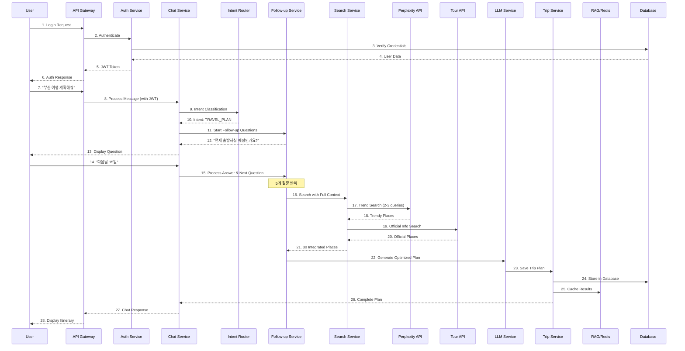
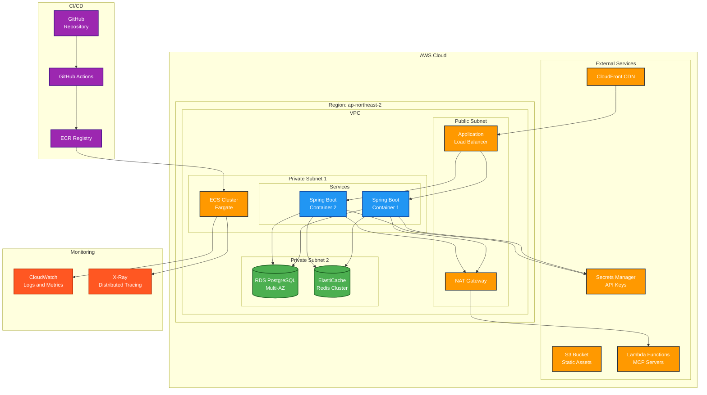
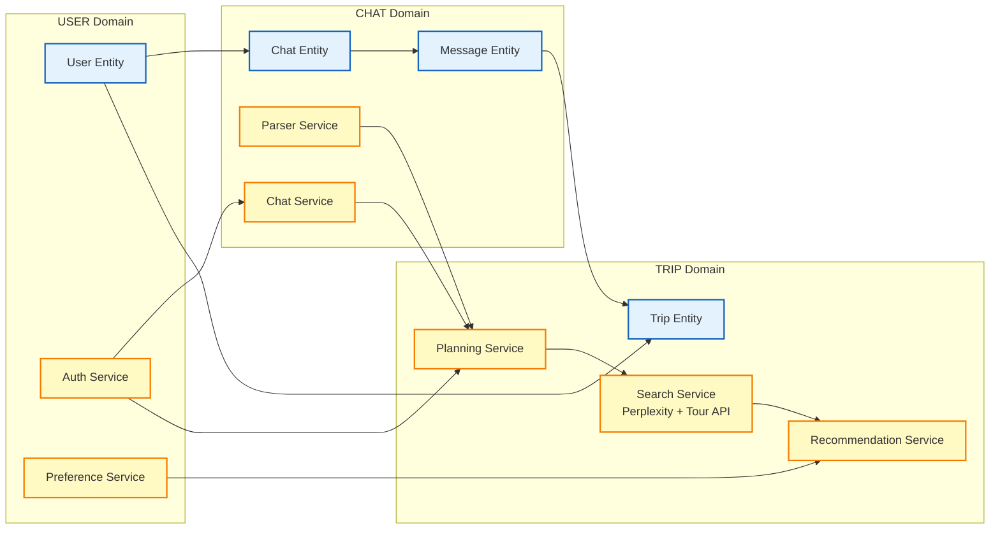

# Compass System Architecture

## Overview
Compass는 AI 기반 맞춤형 여행 계획 서비스로, Spring Boot, Spring AI, 그리고 RAG 기술을 활용한 마이크로서비스 아키텍처입니다. 

### 핵심 기능
- **인텐트 라우팅**: 사용자 의도를 파악하여 적절한 서비스로 분기
- **꼬리질문 시스템**: 5개 필수 정보 수집을 위한 대화형 인터페이스
- **통합 검색**: Perplexity API(트렌드)와 Tour API(공식 정보) 결합
- **경로 최적화**: Gemini를 활용한 여행 동선 최적화
- **개인화**: 사용자 선호도 기반 맞춤형 추천

## 전체 시스템 아키텍처

```mermaid
graph TB
    subgraph "Client Layer"
        WEB[Web Client<br/>React/Next.js]
        MOBILE[Mobile App<br/>React Native]
    end

    subgraph "API Gateway"
        GATEWAY[Spring Cloud Gateway<br/>JWT Validation<br/>Rate Limiting<br/>Request Routing]
    end

    subgraph "Application Layer"
        subgraph "USER Domain"
            AUTH[Authentication Service<br/>JWT Token<br/>OAuth2<br/>User Profile]
            PREF[Preference Service<br/>User Preferences<br/>Travel History]
        end

        subgraph "CHAT Domain"
            CHAT_SVC[Chat Service<br/>Thread Management<br/>Message CRUD]
            PARSER[Chat Parser<br/>NER Processing<br/>Intent Detection]
            LLM_ORCH[LLM Orchestrator<br/>Model Selection<br/>Function Calling]
        end

        subgraph "TRIP Domain"
            TRIP_PLAN[Trip Planning Service<br/>Itinerary Generation<br/>Budget Calculation<br/>Route Optimization]
            REC[Recommendation Service<br/>RAG Processing<br/>Personalization]
            SEARCH[Search Integration<br/>Perplexity API<br/>Tour API<br/>Data Fusion]
            WEATHER[Weather Service<br/>Weather API Integration]
        end
    end

    subgraph "AI/ML Layer"
        subgraph "LLM Services"
            GEMINI[Gemini 2.0 Flash<br/>Primary Model]
            GPT[GPT-4o-mini<br/>Fallback Model]
        end
        
        subgraph "Spring AI"
            SPRING_AI[Spring AI Framework<br/>Prompt Templates<br/>Model Abstraction<br/>Function Calling]
        end
        
        OCR[OCR Service<br/>Document Processing]
    end

    subgraph "Data Layer"
        subgraph "Primary Storage"
            POSTGRES[(PostgreSQL<br/>Users<br/>Chats<br/>Trips<br/>Preferences)]
        end

        subgraph "Vector Store"
            REDIS_VECTOR[(Redis Vector<br/>Embeddings<br/>RAG Data)]
        end

        subgraph "Cache"
            REDIS_CACHE[(Redis Cache<br/>Session<br/>API Cache)]
        end
    end

    subgraph "External Services"
        GOOGLE_API[Google APIs<br/>Maps<br/>Places<br/>Directions]
        WEATHER_API[Weather API<br/>OpenWeather]
        FLIGHT_API[Flight APIs<br/>Amadeus]
        HOTEL_API[Hotel APIs<br/>Booking.com]
        PERPLEXITY[Perplexity API<br/>Trend Search<br/>Hidden Gems]
        TOUR_API[Tour API<br/>Korea Tourism<br/>Official Info]
    end

    subgraph "Infrastructure"
        subgraph "Monitoring"
            PROMETHEUS[Prometheus<br/>Metrics Collection]
            GRAFANA[Grafana<br/>Visualization]
            LOKI[Loki<br/>Log Aggregation]
        end

        subgraph "Message Queue"
            KAFKA[Kafka<br/>Event Streaming]
        end
    end

    %% Client connections
    WEB --> GATEWAY
    MOBILE --> GATEWAY

    %% Gateway to services
    GATEWAY --> AUTH
    GATEWAY --> CHAT_SVC
    GATEWAY --> TRIP_PLAN

    %% Internal service connections
    AUTH --> PREF
    CHAT_SVC --> PARSER
    PARSER --> LLM_ORCH
    LLM_ORCH --> SPRING_AI
    SPRING_AI --> GEMINI
    SPRING_AI --> GPT
    CHAT_SVC --> OCR
    
    TRIP_PLAN --> REC
    REC --> REDIS_VECTOR
    TRIP_PLAN --> WEATHER
    TRIP_PLAN --> SEARCH
    SEARCH --> PERPLEXITY
    SEARCH --> TOUR_API
    
    %% Data connections
    AUTH --> POSTGRES
    PREF --> POSTGRES
    CHAT_SVC --> POSTGRES
    TRIP_PLAN --> POSTGRES
    
    AUTH --> REDIS_CACHE
    CHAT_SVC --> REDIS_CACHE
    
    %% External API connections
    TRIP_PLAN --> GOOGLE_API
    WEATHER --> WEATHER_API
    TRIP_PLAN --> FLIGHT_API
    TRIP_PLAN --> HOTEL_API
    
    %% Monitoring
    AUTH -.-> PROMETHEUS
    CHAT_SVC -.-> PROMETHEUS
    TRIP_PLAN -.-> PROMETHEUS
    PROMETHEUS --> GRAFANA
    
    %% Event streaming
    CHAT_SVC --> KAFKA
    TRIP_PLAN --> KAFKA

    classDef client fill:#e1f5fe,stroke:#01579b,stroke-width:2px
    classDef service fill:#fff3e0,stroke:#e65100,stroke-width:2px
    classDef ai fill:#f3e5f5,stroke:#4a148c,stroke-width:2px
    classDef data fill:#e8f5e9,stroke:#1b5e20,stroke-width:2px
    classDef external fill:#fce4ec,stroke:#880e4f,stroke-width:2px
    classDef infra fill:#f5f5f5,stroke:#424242,stroke-width:2px

    class WEB,MOBILE client
    class AUTH,PREF,CHAT_SVC,PARSER,LLM_ORCH,TRIP_PLAN,REC,SEARCH,WEATHER,GATEWAY service
    class GEMINI,GPT,SPRING_AI,OCR ai
    class POSTGRES,REDIS_VECTOR,REDIS_CACHE data
    class GOOGLE_API,WEATHER_API,FLIGHT_API,HOTEL_API,PERPLEXITY,TOUR_API external
    class PROMETHEUS,GRAFANA,LOKI,KAFKA infra
```

## 데이터 플로우

## 배포 아키텍처

## 도메인 간 상호작용

## 보안 아키텍처

```mermaid
graph TB
    subgraph "Security Layers"
        subgraph "Network Security"
            WAF[AWS WAF<br/>DDoS Protection<br/>SQL Injection Prevention]
            SG[Security Groups<br/>Port Control<br/>IP Whitelisting]
        end

        subgraph "Application Security"
            JWT[JWT Authentication<br/>Token Validation<br/>Refresh Tokens]
            OAUTH[OAuth 2.0<br/>Social Login<br/>SSO]
            RBAC[RBAC<br/>Role-Based Access<br/>Permission Control]
        end

        subgraph "Data Security"
            ENCRYPT[Encryption<br/>At Rest: AES-256<br/>In Transit: TLS 1.3]
            VAULT[Secret Management<br/>AWS Secrets Manager<br/>Environment Variables]
        end

        subgraph "Compliance"
            GDPR[GDPR Compliance<br/>Data Privacy<br/>Right to Delete]
            AUDIT[Audit Logging<br/>Access Logs<br/>Change Tracking]
        end
    end

    WAF --> SG
    SG --> JWT
    JWT --> OAUTH
    OAUTH --> RBAC
    RBAC --> ENCRYPT
    ENCRYPT --> VAULT
    VAULT --> GDPR
    GDPR --> AUDIT

    classDef security fill:#ffebee,stroke:#c62828,stroke-width:2px

    class WAF,SG,JWT,OAUTH,RBAC,ENCRYPT,VAULT,GDPR,AUDIT security
```

## 기술 스택 상세

| Layer | Technology | Purpose |
|-------|------------|---------|
| **Frontend** | React/Next.js | Web Application |
| **Mobile** | React Native | Cross-platform Mobile App |
| **Backend** | Spring Boot 3.3 | REST API Server |
| **AI/ML** | Spring AI 1.0.0-M5 | LLM Integration Framework |
| **Primary LLM** | Gemini 2.0 Flash | Main Chat & Function Calling |
| **Secondary LLM** | GPT-4o-mini | Fallback & OpenAI Features |
| **Search API** | Perplexity API | Trend Search & Hidden Gems |
| **Tourism API** | Korea Tourism API | Official Place Information |
| **Database** | PostgreSQL 15 | Primary Data Storage |
| **Vector Store** | Redis 7 | Embeddings & RAG Data |
| **Cache** | Redis 7 | Session & API Cache (30min TTL) |
| **Message Queue** | Apache Kafka | Event Streaming |
| **Container** | Docker | Containerization |
| **Orchestration** | AWS ECS Fargate | Container Management |
| **CI/CD** | GitHub Actions | Automated Deployment |
| **Monitoring** | Prometheus + Grafana | Metrics & Visualization |
| **Logging** | Loki + CloudWatch | Log Aggregation |
| **CDN** | CloudFront | Content Delivery |
| **Storage** | S3 | Static Assets |

## 확장성 전략

1. **Horizontal Scaling**: ECS Fargate를 통한 자동 스케일링
2. **Database Scaling**: RDS Read Replica 및 Connection Pooling
3. **Caching Strategy**: Redis를 활용한 다층 캐싱 (30분 TTL)
4. **API Rate Limiting**: Perplexity 2-3회, Tour API 배치 호출 제한
5. **Async Processing**: Kafka를 통한 비동기 처리
6. **CDN Distribution**: CloudFront를 통한 글로벌 분산
7. **Microservices**: 도메인별 독립적 확장 가능

## 성능 목표

- **Response Time**: < 200ms (P95)
- **Throughput**: 10,000 req/sec
- **Availability**: 99.9% SLA
- **Error Rate**: < 0.1%
- **LLM Response**: < 2s (P90)
- **Search Integration**: < 3s (Perplexity + Tour API)
- **Cache Hit Rate**: > 70% (Redis)

## 개발 환경

