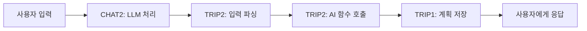

# 📋 팀원별 개발 계획서 (V2)

## 👥 팀 구성 (5명)
- **USER**: 인증/인가, 사용자 프로필 관리
- **TRIP1**: 여행 계획 기본 기능, 개인화 알고리즘
- **TRIP2**: AI 여행 계획 생성, Lambda MCP 구현
- **CHAT1**: 채팅 기본 기능, 인텐트 라우팅
- **CHAT2**: LLM 통합, 컨텍스트 관리, 개인화

---

## 🚀 MVP (Week 1) - AI 여행 계획 채팅 서비스

### 🔐 USER - 인증 및 사용자 기본 (6개)
| 요구사항ID | 기능명 | 설명 | 우선순위 |
|------------|--------|------|---------|
| REQ-SYS-001 | Spring Boot 프로젝트 초기 설정 | PostgreSQL, JPA 설정, 패키지 구조 | 1 |
| REQ-SYS-002 | 핵심 테이블 생성 | users, chat_threads, messages 테이블 | 1 |
| REQ-AUTH-001 | 회원가입 API | POST /api/auth/signup, BCrypt 암호화 | 2 |
| REQ-AUTH-002 | 로그인 API | POST /api/auth/login, JWT 토큰 발급 | 2 |
| REQ-AUTH-003 | JWT 인증 필터 | Spring Security 토큰 검증 | 3 |
| REQ-USER-001 | 프로필 조회 API | GET /api/users/profile | 3 |

### 🗺️ TRIP1 - 여행 계획 기본 기능 (5개)
| 요구사항ID | 기능명 | 설명 | 우선순위 |
|------------|--------|------|---------|
| REQ-TRIP-000 | Trip 테이블 설계 | trips, trip_details 테이블 생성 | 1 |
| REQ-TRIP-001 | 여행 계획 생성 API | POST /api/trips - AI 기반 여행 계획 생성 | 1 |
| REQ-TRIP-002 | 여행 계획 조회 API | GET /api/trips/{id} | 2 |
| REQ-USER-003 | 여행 스타일 설정 | 휴양/관광/액티비티 선호도 저장 | 2 |
| REQ-USER-004 | 예산 수준 설정 | BUDGET/STANDARD/LUXURY 설정 | 3 |

### 🤖 TRIP2 - AI 여행 계획 생성 로직 (5개)
| 요구사항ID | 기능명 | 설명 | 우선순위 |
|------------|--------|------|---------|
| REQ-AI-001 | AI 여행 계획 Function | Spring AI Function Calling 여행 계획 함수 | 1 |
| REQ-AI-002 | 사용자 입력 파싱 | 목적지, 날짜, 예산, 인원 추출 | 1 |
| REQ-AI-003 | 기본 일정 템플릿 | 당일치기, 2박 3일, 3박 4일 기본 템플릿 | 2 |
| REQ-MON-001 | API 호출 로깅 | Logback 설정, 요청/응답 로깅 | 3 |
| REQ-MON-002 | 에러 로깅 | 예외 처리 및 스택 트레이스 로깅 | 3 |

### 💬 CHAT1 - 채팅 기본 CRUD (5개)
| 요구사항ID | 기능명 | 설명 | 우선순위 |
|------------|--------|------|---------|
| REQ-CHAT-001 | 채팅방 생성 API | POST /api/chat/threads, UUID 생성 | 1 |
| REQ-CHAT-002 | 채팅 목록 조회 | GET /api/chat/threads, 페이징 처리 | 2 |
| REQ-CHAT-003 | 메시지 전송 API | POST /api/chat/threads/{id}/messages | 1 |
| REQ-CHAT-004 | 대화 조회 API | GET /api/chat/threads/{id}/messages | 2 |
| REQ-CHAT-006 | 메시지 입력 검증 | @Valid, 최대 1000자 제한 | 3 |

### 🤖 CHAT2 - LLM 및 여행 계획 통합 (6개)
| 요구사항ID | 기능명 | 설명 | 우선순위 |
|------------|--------|------|---------|
| REQ-LLM-001 | Spring AI 설정 | dependency 추가, 기본 설정 | 1 |
| REQ-LLM-002 | Gemini 연동 | Vertex AI Gemini 연결 | 1 |
| REQ-LLM-004 | 프롬프트 템플릿 | 여행 계획 프롬프트 포함 | 2 |
| REQ-LLM-005 | Function Calling 설정 | 여행 계획 생성 함수 등록 | 1 |
| REQ-LLM-006 | 대화 컨텍스트 관리 | 최근 10개 메시지 유지 | 2 |
| REQ-PERS-007 | 콜드 스타트 해결 | 신규 사용자 온보딩 메시지 | 3 |

### 🔧 공통 작업 (전체 팀원)
- REQ-SYS-003: GlobalExceptionHandler 구현
- REQ-SYS-004: application-dev.yml, application-prod.yml 분리
- REQ-NFR-001: 5초 이내 응답 목표
- REQ-NFR-004: BCrypt 암호화, 환경변수 관리
- REQ-NFR-008: Google Java Style 컨벤션

---

## 🔄 1차 고도화 (Week 2) - Multi-LLM + Lambda MCP

### 🔐 USER - 고급 인증 및 선호도 (6개)
| 요구사항ID | 기능명 | 설명 | 우선순위 |
|------------|--------|------|---------|
| REQ-AUTH-004 | 토큰 갱신 API | POST /api/auth/refresh, rotation | 1 |
| REQ-AUTH-005 | 로그아웃 API | Redis 블랙리스트 관리 | 2 |
| REQ-USER-002 | 프로필 수정 API | PUT /api/users/profile | 2 |
| REQ-USER-005 | 관심 카테고리 설정 | 최대 3개 카테고리 선택 | 3 |
| REQ-USER-008 | 선호도 조회 API | GET /api/users/preferences | 1 |
| REQ-USER-009 | 선호도 업데이트 API | PUT /api/users/preferences | 2 |

### 🗺️ TRIP1 - 여행 계획 고도화 (4개)
| 요구사항ID | 기능명 | 설명 | 우선순위 |
|------------|--------|------|---------|
| REQ-TRIP-003 | 내 여행 목록 조회 | GET /api/trips, 페이징 | 1 |
| REQ-TRIP-004 | 여행 계획 수정 API | PUT /api/trips/{id} | 2 |
| REQ-TRIP-014 | 상세 일정 추가 | 관광지, 식당, 숙박 상세 정보 | 2 |
| REQ-TRIP-015 | 일정 최적화 | 이동 경로, 시간 최적화 | 3 |

### 🌐 TRIP2 - Lambda MCP 구현 (6개)
| 요구사항ID | 기능명 | 설명 | 우선순위 |
|------------|--------|------|---------|
| REQ-MCP-001 | Lambda 프로젝트 설정 | Serverless Framework 설정 | 1 |
| REQ-MCP-002 | Tour API MCP | 5개 함수 (관광지/맛집/숙박) | 1 |
| REQ-MCP-003 | Weather API MCP | 3개 함수 (현재/예보/경보) | 2 |
| REQ-MCP-004 | Hotel API MCP | 4개 함수 (검색/예약/가격/리뷰) | 2 |
| REQ-MCP-005 | DynamoDB 캐싱 | TTL 기반 캐싱 설정 | 3 |
| REQ-MCP-006 | Spring AI 통합 | Function Calling 연동 | 1 |

### 💬 CHAT1 - 인텐트 라우팅 (5개)
| 요구사항ID | 기능명 | 설명 | 우선순위 |
|------------|--------|------|---------|
| REQ-CHAT-005 | 채팅 삭제 API | DELETE /api/chat/threads/{id} | 3 |
| REQ-CHAT-007 | 채팅 제목 자동 생성 | 첫 메시지 기반 제목 | 2 |
| REQ-INTENT-001 | 의도 분류 기능 | 여행계획/추천/정보 분류 | 1 |
| REQ-INTENT-002 | 키워드 매칭 | 키워드 사전 관리 | 2 |
| REQ-INTENT-003 | 의도별 프롬프트 | 템플릿 선택 로직 | 2 |

### 🤖 CHAT2 - LLM 고도화 + 컨텍스트 (9개)
| 요구사항ID | 기능명 | 설명 | 우선순위 |
|------------|--------|------|---------|
| REQ-LLM-003 | OpenAI 연동 | GPT-4 모델 연결 | 1 |
| REQ-LLM-007 | 토큰 사용량 추적 | API 사용량 DB 기록 | 2 |
| REQ-LLM-008 | LLM 폴백 처리 | 실패 시 대체 모델 | 2 |
| REQ-CTX-001 | 사용자 프로필 로드 | USER 도메인 연동 | 1 |
| REQ-CTX-002 | 대화 컨텍스트 저장 | HttpSession 활용 | 2 |
| REQ-CTX-003 | Redis 캐싱 | 컨텍스트 30분 캐싱 | 1 |
| REQ-CTX-004 | 컨텍스트 병합 | 프로필 + 대화 통합 | 2 |
| REQ-PERS-008 | 암묵적 선호도 수집 | 대화 기반 선호도 추출 | 3 |
| REQ-AI-004 | Lambda MCP 호출 통합 | Tour/Weather/Hotel API 호출 | 1 |

### 🔧 공통 작업
- REQ-NFR-002: 10명 동시 사용자 처리
- REQ-NFR-003: LLM 장애 시 폴백
- REQ-NFR-007: Swagger API 문서화

---

## 🎯 2차 고도화 (Week 3) - 개인화 + 에이전트 패턴

### 🔐 USER - 고급 기능 (5개)
| 요구사항ID | 기능명 | 설명 | 우선순위 |
|------------|--------|------|---------|
| REQ-USER-006 | 비밀번호 변경 | POST /api/users/password | 3 |
| REQ-USER-007 | 탈퇴 처리 | DELETE /api/users/account | 3 |
| REQ-USER-010 | 여행 히스토리 저장 | Trip 도메인 연동 | 2 |
| REQ-USER-011 | 즐겨찾기 관리 | 여행지 즐겨찾기 | 3 |
| REQ-USER-012 | 알림 설정 관리 | 알림 on/off 설정 | 3 |

### 🗺️ TRIP1 - 개인화 알고리즘 (7개)
| 요구사항ID | 기능명 | 설명 | 우선순위 |
|------------|--------|------|---------|
| REQ-TRIP-016 | 사용자 선호도 반영 | Spring AI RAG 활용 개인화 | 1 |
| REQ-TRIP-017 | 선호 활동 매칭 | 시간대별 최적화 | 1 |
| REQ-TRIP-013 | 예산 기반 최적화 | 예산별 조정 | 2 |
| REQ-TRIP-018 | 시간대별 선호 반영 | 아침/저녁형 반영 | 3 |
| REQ-TRIP-021 | 음식 선호 반영 | 맛집 추천 통합 | 3 |
| REQ-TRIP-024 | 계절별 최적화 | 시즌 활동 추천 | 3 |
| REQ-TRIP-029 | 꼬리질문 생성 | 정보 수집 질문 | 2 |

### 🌐 TRIP2 - 여행 관리 + Lambda 최적화 (13개)

#### 여행 관리 기능 (7개)
| 요구사항ID | 기능명 | 설명 | 우선순위 |
|------------|--------|------|---------|
| REQ-TRIP-005 | 여행 계획 삭제 API | DELETE /api/trips/{id} | 2 |
| REQ-TRIP-006 | 일정별 상세 정보 | JSONB 구조 관리 | 1 |
| REQ-TRIP-007 | 여행 공유 기능 | UUID 공유 링크 | 3 |
| REQ-TRIP-008 | 여행 복사 기능 | 템플릿 활용 | 3 |
| REQ-TRIP-009 | 여행 상태 관리 | 계획/진행/완료 상태 | 2 |
| REQ-TRIP-010 | 여행 체크리스트 | 준비물 관리 | 3 |
| REQ-TRIP-030 | 개인화 템플릿 | 유형별 템플릿 | 3 |

#### Lambda MCP 최적화 (6개)
| 요구사항ID | 기능명 | 설명 | 우선순위 |
|------------|--------|------|---------|
| REQ-MCP-007 | Cold Start 최적화 | Provisioned Concurrency | 2 |
| REQ-MCP-008 | 에러 핸들링 | Exponential Backoff | 1 |
| REQ-MCP-009 | CloudWatch 모니터링 | 메트릭 및 알람 | 2 |
| REQ-MCP-010 | API Gateway 보안 | API Key, Rate Limiting | 1 |
| REQ-MCP-011 | 병렬 처리 최적화 | CompletableFuture | 3 |
| REQ-MCP-012 | 배포 자동화 | GitHub Actions 연동 | 3 |

### 💬 CHAT1 - 에이전트 패턴 (10개)
| 요구사항ID | 기능명 | 설명 | 우선순위 |
|------------|--------|------|---------|
| REQ-CHAT-008 | 채팅 제목 수정 API | PUT /api/chat/threads/{id}/title | 3 |
| REQ-CHAT-009 | 메시지 검색 기능 | 전문 검색 구현 | 3 |
| REQ-CHAT-010 | 채팅 내보내기 | CSV/JSON 다운로드 | 3 |
| REQ-INTENT-004 | 라우터 에이전트 | 에이전트 패턴 구현 | 1 |
| REQ-INTENT-005 | 라우터 꼬리질문 | 의도 명확화 질문 | 2 |
| REQ-INTENT-006 | 플래너 에이전트 | 여행 계획 전문 에이전트 | 1 |
| REQ-INTENT-007 | 플래너 꼬리질문 | 세부사항 수집 | 2 |
| REQ-INTENT-008 | 추천 에이전트 | 개인화 추천 에이전트 | 1 |
| REQ-INTENT-009 | 추천 꼬리질문 | 선호도 파악 질문 | 2 |
| REQ-INTENT-010 | 정보 알리미 에이전트 | 날씨/환율 정보 제공 | 2 |

### 🤖 CHAT2 - 개인화 추천 시스템 (14개)
| 요구사항ID | 기능명 | 설명 | 우선순위 |
|------------|--------|------|---------|
| REQ-LLM-009 | 응답 캐싱 | Redis FAQ 캐싱 | 2 |
| REQ-LLM-010 | 컨텍스트 요약 | 긴 대화 자동 요약 | 3 |
| REQ-LLM-011 | 이미지 텍스트 추출 | OpenAI Vision API OCR | 3 |
| REQ-CTX-005 | 키워드 추출 | 여행지/날짜 추출 | 2 |
| REQ-CTX-006 | 선호도 업데이트 | 백그라운드 처리 | 2 |
| REQ-CTX-007 | 컨텍스트 요약 | 토큰 제한 관리 | 3 |
| REQ-CTX-008 | 개인화 프롬프트 | 맞춤형 프롬프트 생성 | 2 |
| REQ-PERS-001 | 선호도 벡터 저장 | Redis Vector Store | 1 |
| REQ-PERS-002 | 키워드 빈도 계산 | 가중치 적용 | 1 |
| REQ-PERS-003 | RAG 기반 개인화 추천 | 3단계 파이프라인 | 1 |
| REQ-PERS-004 | 부정 선호 제외 | 블랙리스트 관리 | 2 |
| REQ-PERS-005 | 추천 카드 표시 | 시작 화면 추천 | 3 |
| REQ-PERS-006 | 추천 피드백 | 좋아요/싫어요 수집 | 3 |
| REQ-PERS-009 | Perplexity API 통합 | Spring AI 내부 통합 | 1 |

### 🔧 공통 작업
- REQ-NFR-005: 수평 확장 가능 구조
- REQ-NFR-006: PostgreSQL 일일 백업
- REQ-NFR-009: 테스트 커버리지 70%
- REQ-NFR-010: CI/CD 구축

---

## 📊 작업량 분배 요약

### MVP (Week 1) - 균형적 분배
| 팀원 | 작업 개수 | 핵심 역할 |
|------|----------|----------|
| USER | 6개 | 인증 시스템 구축 |
| TRIP1 | 5개 | 여행 계획 기본 API |
| TRIP2 | 5개 | AI 여행 계획 생성 |
| CHAT1 | 5개 | 채팅 CRUD |
| CHAT2 | 6개 | LLM 및 여행 통합 |

### 1차 고도화 (Week 2)
| 팀원 | 작업 개수 | 핵심 역할 |
|------|----------|----------|
| USER | 6개 | 고급 인증, 선호도 |
| TRIP1 | 4개 | 여행 계획 고도화 |
| TRIP2 | 6개 | Lambda MCP 구현 |
| CHAT1 | 5개 | 인텐트 라우팅 |
| CHAT2 | 9개 | LLM 고도화, 컨텍스트 |

### 2차 고도화 (Week 3)
| 팀원 | 작업 개수 | 핵심 역할 |
|------|----------|----------|
| USER | 5개 | 고급 기능 |
| TRIP1 | 7개 | 개인화 알고리즘 |
| TRIP2 | 13개 | 여행 관리, Lambda 최적화 |
| CHAT1 | 10개 | 에이전트 패턴 |
| CHAT2 | 14개 | 개인화 추천 시스템 |

### 전체 통계
| 팀원 | MVP | 1차 | 2차 | 총계 |
|------|-----|-----|-----|------|
| USER | 6 | 6 | 5 | **17개** |
| TRIP1 | 5 | 4 | 7 | **16개** |
| TRIP2 | 5 | 6 | 13 | **24개** |
| CHAT1 | 5 | 5 | 10 | **20개** |
| CHAT2 | 6 | 9 | 14 | **29개** |
| **합계** | **27** | **30** | **49** | **106개** |

---

## 🎯 주요 마일스톤

### MVP 완료 기준
- ✅ 사용자 로그인/회원가입 가능
- ✅ 채팅방 생성 및 메시지 전송
- ✅ Gemini를 통한 기본 대화 가능
- ✅ **AI 기반 여행 계획 생성 가능**
- ✅ **여행 계획 조회 및 저장**
- ✅ API 로깅 및 모니터링

### 1차 고도화 완료 기준
- ✅ Multi-LLM (Gemini + OpenAI) 라우팅
- ✅ Lambda MCP 3개 API (Tour/Weather/Hotel) 구현
- ✅ 의도 분류 및 프롬프트 템플릿
- ✅ Redis 캐싱 및 컨텍스트 관리
- ✅ 여행 계획 수정 및 상세 정보 추가

### 2차 고도화 완료 기준
- ✅ 3단계 개인화 파이프라인 구현
- ✅ Multi-Agent System (라우터/플래너/추천)
- ✅ 여행 계획 CRUD 완성
- ✅ Lambda MCP 최적화 및 모니터링
- ✅ 개인화 알고리즘 적용

---

## 📝 MVP 핵심 기능 상세

### 🎯 AI 여행 계획 생성 Flow (MVP)



### 주요 구현 사항

#### TRIP1 (MVP)
1. **여행 계획 테이블 설계**
   - trips: 여행 기본 정보
   - trip_details: 일정별 상세 정보
   
2. **여행 계획 생성 API**
   - POST /api/trips
   - AI가 생성한 계획을 DB에 저장
   
3. **여행 계획 조회 API**
   - GET /api/trips/{id}
   - 저장된 계획 조회

#### TRIP2 (MVP)
1. **AI 여행 계획 Function**
   - Spring AI Function Calling 구현
   - createTravelPlan() 함수
   
2. **사용자 입력 파싱**
   - 목적지: "서울", "부산" 등
   - 날짜: "3박 4일", "이번 주말"
   - 예산: "100만원", "저렴하게"
   - 인원: "2명", "가족여행"
   - 테마: "도시 여행", "KPOP 테마 여행"
   
3. **기본 일정 템플릿**
   - 2박 3일 템플릿
   - 3박 4일 템플릿
   - 일별 관광지 3-4개 추천

#### CHAT2 (MVP)
1. **Function Calling 설정**
   ```java
   @Bean
   @Description("사용자 입력을 기반으로 여행 계획 생성")
   public Function<TravelRequest, TravelPlan> createTravelPlan() {
       return request -> tripService.generatePlan(request);
   }
   ```

2. **프롬프트 템플릿**
   ```
   당신은 전문 여행 플래너입니다.
   사용자 요청: {userInput}
   
   다음 정보를 추출하여 여행 계획을 생성하세요:
   - 목적지
   - 여행 기간
   - 예산
   - 인원
   - 테마
   
   일정별로 추천 관광지와 활동을 포함하세요.
   ```

---

## 💻 TRIP2 - Spring AI Function Calling 구현 예시

### TravelPlanFunction.java
```java
package com.compass.trip.function;

import com.compass.trip.dto.TravelRequest;
import com.compass.trip.dto.TravelPlan;
import com.compass.trip.service.TripService;
import org.springframework.context.annotation.Bean;
import org.springframework.context.annotation.Configuration;
import org.springframework.context.annotation.Description;
import java.util.function.Function;

@Configuration
public class TravelPlanFunction {
    
    private final TripService tripService;
    
    public TravelPlanFunction(TripService tripService) {
        this.tripService = tripService;
    }
    
    @Bean
    @Description("사용자의 여행 요청을 분석하여 AI 기반 여행 계획을 생성합니다")
    public Function<TravelRequest, TravelPlan> createTravelPlan() {
        return request -> {
            // 1. 입력 파싱 및 검증
            validateRequest(request);
            
            // 2. AI를 통한 여행 계획 생성
            TravelPlan plan = generatePlanWithAI(request);
            
            // 3. 데이터베이스 저장 (TRIP1 협업)
            plan = tripService.saveTravelPlan(plan);
            
            return plan;
        };
    }
    
    @Bean
    @Description("여행 일정을 최적화하고 상세 정보를 추가합니다")
    public Function<TravelPlan, TravelPlan> optimizeTravelPlan() {
        return plan -> {
            // 이동 경로 최적화
            plan = optimizeRoute(plan);
            
            // 시간대별 일정 조정
            plan = adjustScheduleByTime(plan);
            
            // 예산 최적화
            plan = optimizeBudget(plan);
            
            return plan;
        };
    }
    
    @Bean
    @Description("사용자 선호도를 기반으로 여행지를 추천합니다")
    public Function<UserPreferenceRequest, RecommendationResponse> recommendDestinations() {
        return request -> {
            // 사용자 프로필 로드
            UserProfile profile = loadUserProfile(request.getUserId());
            
            // 선호도 기반 추천
            List<Destination> recommendations = generateRecommendations(
                profile,
                request.getTravelStyle(),
                request.getBudget()
            );
            
            return new RecommendationResponse(recommendations);
        };
    }
}
```

### TravelRequest.java (DTO)
```java
package com.compass.trip.dto;

import lombok.Data;
import java.time.LocalDate;

@Data
public class TravelRequest {
    private String destination;      // 목적지 (예: "서울", "부산")
    private LocalDate startDate;     // 출발일
    private LocalDate endDate;       // 도착일
    private Integer numberOfPeople;  // 인원수
    private Integer budget;          // 예산 (원)
    private String travelStyle;      // 여행 스타일 (휴양/관광/액티비티)
    private String specialRequests;  // 특별 요청사항
}
```

### TravelPlan.java (Response DTO)
```java
package com.compass.trip.dto;

import lombok.Data;
import java.time.LocalDate;
import java.util.List;

@Data
public class TravelPlan {
    private Long planId;
    private String userId;
    private String destination;
    private LocalDate startDate;
    private LocalDate endDate;
    private Integer totalBudget;
    private List<DailyItinerary> itineraries;
    
    @Data
    public static class DailyItinerary {
        private Integer day;
        private LocalDate date;
        private List<Activity> activities;
    }
    
    @Data
    public static class Activity {
        private String time;           // 시간 (예: "09:00")
        private String placeName;      // 장소명
        private String description;    // 설명
        private String category;       // 카테고리 (관광지/식당/숙박)
        private Integer estimatedCost; // 예상 비용
        private String address;        // 주소
        private String tips;          // 팁/주의사항
    }
}
```

### application.yml 설정 (CHAT2가 기본 설정)
```yaml
spring:
  ai:
    openai:
      api-key: ${OPENAI_API_KEY}
      chat:
        options:
          model: gpt-4
          temperature: 0.7
    
    vertex-ai:
      gemini:
        project-id: ${GCP_PROJECT_ID}
        location: asia-northeast3
        model: gemini-pro
    
    # Function Calling 설정
    function:
      calling:
        enabled: true
        packages:
          - com.compass.trip.function
          - com.compass.chat.function
```

### 실제 사용 예시 (CHAT2에서 호출)
```java
@Service
public class ChatService {
    
    private final ChatClient chatClient;
    
    public String processMessage(String userMessage) {
        // CHAT2가 LLM과 통신하면서 필요시 TRIP2의 Function을 자동 호출
        ChatResponse response = chatClient.call(
            new Prompt(
                userMessage,
                ChatOptionsBuilder.builder()
                    .withFunction("createTravelPlan")      // TRIP2 function
                    .withFunction("optimizeTravelPlan")    // TRIP2 function
                    .withFunction("recommendDestinations") // TRIP2 function
                    .build()
            )
        );
        
        return response.getResult().getOutput().getContent();
    }
}
```

### 협업 구조
```
CHAT2 (LLM 통합 담당)
  ├── Spring AI 기본 설정
  ├── Gemini/OpenAI 연동
  └── Function Calling 프레임워크 설정
      ↓
TRIP2 (여행 Function 구현)
  ├── createTravelPlan() - AI 여행 계획 생성
  ├── optimizeTravelPlan() - 일정 최적화
  └── recommendDestinations() - 여행지 추천
      ↓
TRIP1 (여행 API 구현)
  ├── POST /api/trips - 계획 저장
  ├── GET /api/trips/{id} - 계획 조회
  └── Trip 도메인 엔티티 관리
```

---

## 📚 Swagger 문서 설정 및 업데이트 가이드

### 1. 의존성 추가 (build.gradle)
```gradle
dependencies {
    // SpringDoc OpenAPI (Swagger 3)
    implementation 'org.springdoc:springdoc-openapi-starter-webmvc-ui:2.2.0'
}
```

### 2. Swagger 설정 클래스
```java
package com.compass.config;

import io.swagger.v3.oas.models.OpenAPI;
import io.swagger.v3.oas.models.info.Info;
import io.swagger.v3.oas.models.info.Contact;
import io.swagger.v3.oas.models.Components;
import io.swagger.v3.oas.models.security.SecurityScheme;
import io.swagger.v3.oas.models.security.SecurityRequirement;
import org.springframework.context.annotation.Bean;
import org.springframework.context.annotation.Configuration;

@Configuration
public class SwaggerConfig {
    
    @Bean
    public OpenAPI customOpenAPI() {
        return new OpenAPI()
            .info(new Info()
                .title("Compass AI Travel Assistant API")
                .version("1.0.0")
                .description("AI 기반 개인화 여행 계획 서비스 API 문서")
                .contact(new Contact()
                    .name("Team Compass")
                    .email("compass@example.com")))
            .addSecurityItem(new SecurityRequirement().addList("bearerAuth"))
            .components(new Components()
                .addSecuritySchemes("bearerAuth",
                    new SecurityScheme()
                        .name("bearerAuth")
                        .type(SecurityScheme.Type.HTTP)
                        .scheme("bearer")
                        .bearerFormat("JWT")));
    }
}
```

### 3. Controller에 Swagger 어노테이션 추가 예시
```java
package com.compass.trip.controller;

import io.swagger.v3.oas.annotations.Operation;
import io.swagger.v3.oas.annotations.Parameter;
import io.swagger.v3.oas.annotations.tags.Tag;
import io.swagger.v3.oas.annotations.responses.ApiResponse;
import io.swagger.v3.oas.annotations.responses.ApiResponses;
import io.swagger.v3.oas.annotations.media.Content;
import io.swagger.v3.oas.annotations.media.Schema;
import org.springframework.web.bind.annotation.*;

@RestController
@RequestMapping("/api/trips")
@Tag(name = "여행 계획", description = "여행 계획 생성 및 관리 API")
public class TripController {
    
    @PostMapping
    @Operation(
        summary = "여행 계획 생성",
        description = "AI를 활용하여 사용자 맞춤형 여행 계획을 생성합니다"
    )
    @ApiResponses(value = {
        @ApiResponse(
            responseCode = "200",
            description = "성공적으로 여행 계획이 생성됨",
            content = @Content(
                mediaType = "application/json",
                schema = @Schema(implementation = TravelPlanResponse.class)
            )
        ),
        @ApiResponse(
            responseCode = "400",
            description = "잘못된 요청 파라미터"
        ),
        @ApiResponse(
            responseCode = "401",
            description = "인증 실패"
        )
    })
    public ResponseEntity<TravelPlanResponse> createTravelPlan(
            @Parameter(description = "여행 계획 요청 정보", required = true)
            @RequestBody @Valid TravelPlanRequest request) {
        // 구현 내용
        return ResponseEntity.ok(tripService.createPlan(request));
    }
    
    @GetMapping("/{id}")
    @Operation(
        summary = "여행 계획 조회",
        description = "여행 계획 ID로 상세 정보를 조회합니다"
    )
    public ResponseEntity<TravelPlanResponse> getTravelPlan(
            @Parameter(description = "여행 계획 ID", example = "1")
            @PathVariable Long id) {
        return ResponseEntity.ok(tripService.getPlan(id));
    }
}
```

### 4. DTO에 Schema 어노테이션 추가
```java
package com.compass.trip.dto;

import io.swagger.v3.oas.annotations.media.Schema;
import lombok.Data;
import javax.validation.constraints.*;

@Data
@Schema(description = "여행 계획 요청 DTO")
public class TravelPlanRequest {
    
    @Schema(
        description = "목적지",
        example = "서울",
        required = true
    )
    @NotBlank(message = "목적지는 필수입니다")
    private String destination;
    
    @Schema(
        description = "출발일 (yyyy-MM-dd)",
        example = "2024-03-01",
        required = true
    )
    @NotNull(message = "출발일은 필수입니다")
    private LocalDate startDate;
    
    @Schema(
        description = "도착일 (yyyy-MM-dd)",
        example = "2024-03-04"
    )
    private LocalDate endDate;
    
    @Schema(
        description = "여행 인원",
        example = "2",
        minimum = "1",
        maximum = "10"
    )
    @Min(1) @Max(10)
    private Integer numberOfPeople;
    
    @Schema(
        description = "예산 (원)",
        example = "1000000"
    )
    @Min(0)
    private Integer budget;
    
    @Schema(
        description = "여행 스타일",
        example = "관광",
        allowableValues = {"휴양", "관광", "액티비티", "문화체험"}
    )
    private String travelStyle;
    
    @Schema(
        description = "여행 테마",
        example = "KPOP 테마 여행"
    )
    private String theme;
}
```

### 5. application.yml 설정
```yaml
springdoc:
  api-docs:
    path: /api-docs           # JSON 형식 API 문서 경로
  swagger-ui:
    path: /swagger-ui.html     # Swagger UI 경로
    operations-sorter: method  # HTTP 메소드로 정렬
    tags-sorter: alpha        # 태그 알파벳 순 정렬
    display-request-duration: true  # 요청 시간 표시
  default-consumes-media-type: application/json
  default-produces-media-type: application/json
```

### 6. 팀원별 Swagger 작성 규칙

#### USER 담당
```java
@Tag(name = "인증", description = "회원가입, 로그인, 토큰 관리")
@Tag(name = "사용자", description = "프로필, 선호도 관리")
```

#### TRIP1 담당
```java
@Tag(name = "여행 계획", description = "여행 계획 CRUD")
@Tag(name = "여행 추천", description = "개인화 추천")
```

#### TRIP2 담당
```java
@Tag(name = "AI Functions", description = "Spring AI Function Calling")
@Tag(name = "Lambda MCP", description = "외부 API 통합")
```

#### CHAT1 담당
```java
@Tag(name = "채팅", description = "채팅방 관리")
@Tag(name = "메시지", description = "메시지 전송 및 조회")
```

#### CHAT2 담당
```java
@Tag(name = "LLM", description = "AI 모델 통합")
@Tag(name = "컨텍스트", description = "대화 컨텍스트 관리")
```

### 7. Swagger UI 접속
```
개발 환경: http://localhost:8080/swagger-ui.html
운영 환경: https://api.compass.com/swagger-ui.html
```

### 8. 자동 문서화 Best Practices

1. **모든 API에 @Operation 추가**
   - summary: 간단한 설명 (10자 이내)
   - description: 상세 설명

2. **Response 코드별 설명 추가**
   - 200: 성공
   - 400: 잘못된 요청
   - 401: 인증 실패
   - 403: 권한 없음
   - 404: 리소스 없음
   - 500: 서버 오류

3. **DTO 필드 설명 추가**
   - description: 필드 설명
   - example: 예시 값
   - required: 필수 여부

4. **버전 관리**
   - API 버전 변경 시 Swagger 문서도 함께 업데이트
   - Breaking Change는 별도 표시

5. **Git Commit 규칙**
   ```bash
   docs: Swagger 문서 업데이트 - 여행 계획 API 추가
   docs: API 문서 수정 - 응답 코드 설명 보완
   ```

---

## 📝 개발 가이드라인

### 브랜치 전략
```
main
├── develop
│   ├── feature/auth-{기능명}     (USER)
│   ├── feature/trip-{기능명}     (TRIP1/TRIP2)
│   ├── feature/chat-{기능명}     (CHAT1/CHAT2)
│   └── feature/mcp-{기능명}      (TRIP2)
```

### 커밋 컨벤션
- `feat:` 새로운 기능 추가
- `fix:` 버그 수정
- `refactor:` 코드 리팩토링
- `docs:` 문서 수정
- `test:` 테스트 코드 추가
- `chore:` 빌드, 설정 변경

### 코드 리뷰 규칙
1. PR은 최소 1명 이상 리뷰 필수
2. 테스트 코드 포함 권장
3. Swagger 문서 업데이트 필수
4. 충돌 해결 후 머지

### 일일 스탠드업 아젠다
1. 어제 완료한 작업
2. 오늘 진행할 작업  
3. 블로커 공유
4. API 변경사항 공유