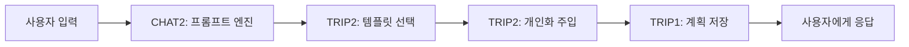

# 📋 팀원별 개발 계획서 (V3 - 통합)

## 👥 팀 구성 (5명)
- **USER**: 인증/인가, 사용자 프로필 관리
- **TRIP1**: 여행 계획 기본 기능, 개인화 알고리즘
- **CHAT1**: 채팅 기본 기능, 인텐트 라우팅
- **CHAT2+TRIP2** (통합 담당): LLM 통합, 프롬프트 엔지니어링, 개인화 시스템, AI 여행 계획 생성
- **MEDIA**: 이미지 업로드, S3 저장, OCR 처리

---

## 🚀 MVP (Week 1) - AI 여행 계획 채팅 서비스

### 🔐 USER - 인증 및 Redis JWT (6개)
| 요구사항ID | 기능명 | 설명 | 우선순위 |
|------------|--------|------|---------|
| REQ-SYS-001 | Spring Boot 프로젝트 초기 설정 | PostgreSQL, JPA 설정, 패키지 구조 | 1 |
|  | → application.yml 설정, DB 연결, 기본 패키지 생성 (domain/controller/service/repository) |  |  |
| REQ-SYS-002 | 핵심 테이블 생성 | users, chat_threads, messages 테이블 | 1 |
|  | → JPA 엔티티 클래스 작성, @Table/@Column 매핑, 관계 설정 (@OneToMany/@ManyToOne) |  |  |
| REQ-AUTH-001 | 회원가입 API | POST /api/auth/signup, BCrypt 암호화 | 2 |
|  | → UserDto 생성, 중복 이메일 체크, BCryptPasswordEncoder로 비밀번호 해싱 후 DB 저장 |  |  |
| REQ-AUTH-002 | 로그인 API | POST /api/auth/login, JWT 토큰 발급 | 2 |
|  | → 이메일/비밀번호 검증, JWT 액세스/리프레시 토큰 생성, 응답 헤더에 토큰 포함 |  |  |
| REQ-AUTH-003 | JWT 인증 필터 | Spring Security 토큰 검증 | 3 |
|  | → OncePerRequestFilter 구현, Authorization 헤더에서 토큰 추출 및 검증, SecurityContext 설정 |  |  |
| REQ-AUTH-004 | 로그아웃 API | POST /api/auth/logout, Redis 블랙리스트 | 3 |
|  | → 현재 토큰을 Redis 블랙리스트에 추가, TTL을 토큰 만료시간까지 설정 |  |  |

### 🗺️ TRIP1 - 여행 계획 기본 기능 (5개)
| 요구사항ID | 기능명 | 설명 | 우선순위 |
|------------|--------|------|---------|
| REQ-TRIP-000 | Trip 테이블 설계 | trips, trip_details 테이블 생성 | 1 |
|  | → trips 테이블 (기본정보), trip_details (일차별 상세일정 JSONB), 인덱스 생성 |  |  |
| REQ-TRIP-001 | 여행 계획 생성 API | POST /api/trips - AI 기반 여행 계획 생성 | 1 |
|  | → TripDto 받아서 Trip 엔티티 생성, AI 생성 일정을 JSONB로 저장, 응답 반환 |  |  |
| REQ-TRIP-002 | 여행 계획 조회 API | GET /api/trips/{id} | 2 |
|  | → tripId로 조회, 권한 체크, trip_details JSONB 파싱하여 구조화된 응답 반환 |  |  |
| REQ-PREF-001 | 여행 스타일 설정 | 휴양/관광/액티비티 선호도 저장 | 2 |
|  | → user_preferences 테이블에 ENUM 타입으로 저장, 각 스타일별 가중치 관리 |  |  |
| REQ-PREF-002 | 예산 수준 설정 | BUDGET/STANDARD/LUXURY 설정 | 3 |
|  | → 예산 레벨 ENUM 저장, 레벨별 일일 예산 범위 매핑 (5만/10만/20만+) |  |  |

### 🖼️ MEDIA - 이미지 업로드 및 OCR (5개)
| 요구사항ID | 기능명 | 설명 | 우선순위 |
|------------|--------|------|---------|  
| REQ-MEDIA-001 | 파일 업로드 설정 | MultipartFile, 10MB 제한 | 1 |
|  | → Spring 파일 업로드 설정, 크기 제한, 파일 타입 검증, 임시 저장소 관리 |  |  |
| REQ-MEDIA-002 | S3 연동 설정 | AWS SDK, 버킷 설정 | 1 |
|  | → S3 클라이언트 설정, 버킷 생성/권한, 자격증명 관리, 지역 설정 |  |  |
| REQ-MEDIA-003 | 이미지 업로드 API | POST /api/media/upload | 2 |
|  | → 파일 수신, S3 업로드, URL 생성, DB 메타데이터 저장, 응답 반환 |  |  |
| REQ-MEDIA-004 | 이미지 조회 API | GET /api/media/{id} | 2 |
|  | → S3 URL 생성, 서명된 URL 발급, 캐싱 헤더, 권한 체크 |  |  |
| REQ-MEDIA-005 | 파일 유효성 검증 | 이미지 포맷/크기 검증 | 3 |
|  | → MIME 타입 체크, 파일 헤더 검증, 악성 코드 검사, 크기 제한 |  |  |

### 💬 CHAT1 - 채팅 기본 CRUD (5개)
| 요구사항ID | 기능명 | 설명 | 우선순위 |
|------------|--------|------|---------|
| REQ-CHAT-001 | 채팅방 생성 API | POST /api/chat/threads, UUID 생성 | 1 |
|  | → 새 채팅 스레드 생성, UUID 발급, user_id 연결, 생성 시간 기록 |  |  |
| REQ-CHAT-002 | 채팅 목록 조회 | GET /api/chat/threads, 페이징 처리 | 2 |
|  | → 사용자의 모든 채팅 스레드 목록, 최근 메시지 미리보기, 시간순 정렬 |  |  |
| REQ-CHAT-003 | 메시지 전송 API | POST /api/chat/threads/{id}/messages | 1 |
|  | → 사용자 메시지 저장, LLM 호출 트리거, AI 응답 저장, 타임스탬프 기록 |  |  |
| REQ-CHAT-004 | 대화 조회 API | GET /api/chat/threads/{id}/messages | 2 |
|  | → 특정 스레드의 모든 메시지 조회, 페이징/커서 기반 페이지네이션, 순서 보장 |  |  |
| REQ-CHAT-006 | 메시지 입력 검증 | @Valid, 최대 1000자 제한 | 3 |
|  | → 빈 메시지 방지, 길이 제한 검증, XSS 방지 새니타이징, SQL 인젝션 방어 |  |  |

### 🤖 CHAT2+TRIP2 - 프롬프트 엔지니어링 및 AI 여행 계획 (11개)
| 요구사항ID | 기능명 | 설명 | 우선순위 | 의존성 |
|------------|--------|------|---------|--------|
| REQ-LLM-001 | Spring AI 설정 | dependency 추가, 기본 설정 | 1 | 독립 |
|  | → build.gradle 의존성 추가, application.yml AI 설정, 빈 초기화 및 테스트 |  |  |  |
| REQ-LLM-002 | Gemini 연동 | Vertex AI Gemini 2.0 Flash 연결 | 1 | 독립 |
|  | → Google Cloud 인증 설정, Vertex AI 클라이언트 초기화, 연결 테스트 |  |  |  |
| REQ-AI-003 | 기본 일정 템플릿 | 당일치기, 1박2일, 2박3일, 3박4일 JSON 템플릿 구축 | 1 | 독립 |
|  | → 여행 기간별 표준 템플릿 JSON 파일 생성 (당일치기 포함), 시간대별 활동 매핑, 로드 로직 |  |  |  |
| REQ-PROMPT-001 | 프롬프트 엔지니어링 서비스 | PromptEngineeringService 구현 | 1 | 독립 |
|  | → 프롬프트 템플릿 시스템 구축, 동적 컨텍스트 주입, 개인화 변수 처리 |  |  |  |
| REQ-PROMPT-002 | 키워드 감지 시스템 | SimpleKeywordDetector 구현 | 1 | 독립 |
|  | → 간단한 키워드 매칭으로 적절한 템플릿 선택, 의도 파악 지원 |  |  |  |
| REQ-PROMPT-003 | 템플릿 라이브러리 | 20+ 여행 시나리오별 템플릿 | 2 | 독립 |
|  | → 가족/커플/비즈니스/배낭 등 상황별 템플릿, 동적 변수 치환, 개인화 지원 |  |  |  |
| REQ-LLM-004 | 개인화 컨텍스트 주입 | DB 기반 사용자 컨텍스트 로드 | 2 | TRIP1 |
|  | → UserPreference, UserContext, TravelHistory 테이블 조회, 프롬프트에 통합 |  |  |  |
| REQ-LLM-006 | 대화 컨텍스트 관리 | 최근 10개 메시지 유지 | 2 | CHAT1 |
|  | → 대화 이력 큐 관리, 8K 토큰 제한 체크, 오래된 메시지 자동 제거 |  |  |  |
| REQ-PERS-007 | 콜드 스타트 해결 | 신규 사용자 온보딩 메시지 | 3 | 독립 |
|  | → 첫 사용자 환영 메시지, 기본 선호도 수집 폼, 예시 질문 제공 |  |  |  |
| REQ-MON-001 | API 호출 로깅 | Logback 설정, LLM 호출 로깅 | 3 | 독립 |
|  | → 모든 LLM API 호출 로깅, 성공/실패율 추적, 비용 분석 데이터 수집 |  |  |  |
| REQ-MON-002 | 에러 로깅 | 예외 처리 및 스택 트레이스 | 3 | 독립 |
|  | → LLM 에러 분류, 재시도 가능 여부 판단, 사용자 친화적 에러 메시지 |  |  |  |

### 🔧 공통 작업 (전체 팀원)
- REQ-SYS-003: GlobalExceptionHandler 구현
- REQ-SYS-004: application-dev.yml, application-prod.yml 분리
- REQ-NFR-001: 5초 이내 응답 목표
- REQ-NFR-004: BCrypt 암호화, 환경변수 관리
- REQ-NFR-008: Google Java Style 컨벤션

---

## 🔄 1차 고도화 (Week 2) - Multi-LLM + Lambda MCP

### 🔐 USER - Redis JWT 고급 기능 (5개)
| 요구사항ID | 기능명 | 설명 | 우선순위 |
|------------|--------|------|---------|
| REQ-AUTH-005 | 토큰 갱신 API | POST /api/auth/refresh, rotation | 1 |
|  | → 리프레시 토큰 검증, 새로운 액세스/리프레시 토큰 쌍 발급, 기존 토큰 무효화 |  |  |
| REQ-AUTH-006 | Redis 화이트리스트 | 활성 토큰 관리 | 2 |
|  | → 발급된 모든 유효 토큰을 Redis에 저장, 검증 시 화이트리스트 확인 로직 추가 |  |  |
| REQ-AUTH-007 | 동시 접속 제한 | 디바이스별 토큰 관리 | 2 |
|  | → 디바이스 식별자 기반 토큰 매핑, 동일 계정 최대 3개 디바이스 제한 구현 |  |  |
| REQ-AUTH-008 | 토큰 만료 관리 | TTL 자동 관리 | 3 |
|  | → Redis EXPIRE 설정, 만료된 토큰 자동 삭제, 스케줄러로 주기적 정리 |  |  |
| REQ-USER-001 | 회원 탈퇴 API | DELETE /api/users/account | 3 |
|  | → 사용자 데이터 소프트 삭제, 관련 토큰 모두 무효화, 탈퇴 사유 기록 |  |  |

### 🗺️ TRIP1 - 여행 계획 고도화 및 선호도 (6개)
| 요구사항ID | 기능명 | 설명 | 우선순위 |
|------------|--------|------|---------|
| REQ-TRIP-003 | 내 여행 목록 조회 | GET /api/trips, 페이징 | 1 |
|  | → 현재 사용자의 모든 여행 조회, Pageable 구현, 최신순 정렬 기본값 |  |  |
| REQ-TRIP-004 | 여행 계획 수정 API | PUT /api/trips/{id} | 2 |
|  | → 일정 부분 수정 지원, JSONB 병합 로직, 수정 이력 관리 |  |  |
| REQ-PREF-003 | 선호도 조회 API | GET /api/users/preferences | 1 |
|  | → 현재 사용자의 모든 선호도 설정 조회, 기본값 포함하여 응답 |  |  |
| REQ-PREF-004 | 선호도 업데이트 API | PUT /api/users/preferences | 2 |
|  | → 부분 업데이트 지원, 변경된 필드만 수정, 검증 로직 포함 |  |  |
| REQ-PREF-005 | 관심 카테고리 설정 | 최대 3개 카테고리 선택 | 3 |
|  | → 문화/역사/음식/쇼핑/자연 등 카테고리 중 최대 3개 선택, 우선순위 설정 |  |  |
| REQ-TRIP-014 | 상세 일정 추가 | 관광지, 식당, 숙박 상세 정보 | 3 |
|  | → 각 일정 항목에 장소명, 주소, 영업시간, 예상비용 등 메타데이터 추가 |  |  |

### 🖼️ MEDIA - OCR 및 메타데이터 관리 (6개)
| 요구사항ID | 기능명 | 설명 | 우선순위 |
|------------|--------|------|---------|  
| REQ-MEDIA-006 | OpenAI Vision API 연동 | OCR 텍스트 추출 | 1 |
|  | → Vision API 호출, 이미지 전송, 텍스트 추출, 구조화된 데이터 반환 |  |  |
| REQ-MEDIA-007 | OCR 결과 저장 | 추출 텍스트 DB 저장 | 1 |
|  | → OCR 결과 테이블 저장, 이미지 ID 연결, 검색 인덱스, 타임스탬프 |  |  |
| REQ-MEDIA-008 | 이미지 메타데이터 추출 | EXIF, 크기, 포맷 | 2 |
|  | → EXIF 데이터 파싱, GPS 위치 추출, 촬영 시간, 카메라 정보 저장 |  |  |
| REQ-MEDIA-009 | 썸네일 생성 | 리사이징, S3 저장 | 2 |
|  | → 이미지 리사이징 (200x200, 400x400), 품질 최적화, S3 저장, URL 관리 |  |  |
| REQ-MEDIA-010 | 이미지 삭제 API | DELETE /api/media/{id} | 3 |
|  | → S3 파일 삭제, DB 레코드 삭제, 썸네일 삭제, 관련 데이터 정리 |  |  |
| REQ-MEDIA-011 | 배치 업로드 | 다중 파일 동시 처리 | 3 |
|  | → 최대 10개 파일 동시 처리, 병렬 업로드, 진행률 반환, 에러 처리 |  |  |

### 💬 CHAT1 - 인텐트 라우팅 (5개)
| 요구사항ID | 기능명 | 설명 | 우선순위 |
|------------|--------|------|---------|
| REQ-CHAT-005 | 채팅 삭제 API | DELETE /api/chat/threads/{id} | 3 |
|  | → 소프트 삭제 처리, 관련 메시지 모두 비활성화, 삭제 이력 기록 |  |  |
| REQ-CHAT-007 | 채팅 제목 자동 생성 | 첫 메시지 기반 제목 | 2 |
|  | → 첫 50자 추출하거나 AI 요약 사용, 의미 있는 제목 생성, 자동 저장 |  |  |
| REQ-INTENT-001 | 의도 분류 기능 | 여행계획/추천/정보 분류 | 1 |
|  | → 메시지 의도 분석, 3가지 카테고리로 분류, 확률 기반 라우팅 결정 |  |  |
| REQ-INTENT-002 | 키워드 매칭 | 키워드 사전 관리 | 2 |
|  | → 도메인별 키워드 사전 구축, 패턴 매칭 알고리즘, 동적 업데이트 지원 |  |  |
| REQ-INTENT-003 | 의도별 프롬프트 | 템플릿 선택 로직 | 2 |
|  | → 의도별 최적화된 프롬프트 템플릿, 변수 치환 로직, 동적 생성 |  |  |

### 🤖 CHAT2+TRIP2 - 개인화 DB + 최소 Function Calling (15개)
| 요구사항ID | 기능명 | 설명 | 우선순위 | 의존성 |
|------------|--------|------|---------|--------|
| REQ-DB-001 | UserPreference 테이블 | 사용자 여행 선호도 저장 | 1 | 독립 |
|  | → 여행 스타일, 예산 수준, 관심 카테고리, 음식 선호, JSONB 구조 |  |  |  |
| REQ-DB-002 | UserContext 테이블 | 사용자 컨텍스트 정보 | 1 | 독립 |
|  | → 나이대, 동행 유형, 신체 조건, 특별 요구사항, 과거 피드백 |  |  |  |
| REQ-DB-003 | TravelHistory 테이블 | 여행 이력 및 학습 데이터 | 1 | 독립 |
|  | → 방문 장소, 만족도 평점, 재방문 의향, 키워드 추출, 패턴 분석 |  |  |  |
| REQ-FC-001 | 최소 Function Calling | 날씨/호텔 검색만 구현 | 1 | 독립 |
|  | → getCurrentWeather(), searchHotels() 2개 함수만 구현, 실시간 정보 제공 |  |  |  |
| REQ-PROMPT-004 | 프롬프트 학습 시스템 | A/B 테스트 및 개선 | 2 | 독립 |
|  | → 템플릿 성능 측정, 사용자 만족도 추적, 자동 개선 제안 |  |  |  |
| REQ-LLM-003 | OpenAI 연동 | GPT-4o-mini 모델 설정 | 1 | 독립 |
|  | → OpenAI API 키 설정, 스트리밍 처리, 청크 병합, 타임아웃 처리 |  |  |  |
| REQ-LLM-007 | 토큰 사용량 추적 | 모델별 사용량 집계 | 2 | 독립 |
|  | → 요청/응답 토큰 카운팅, DB 저장, 비용 계산, 대시보드 데이터 |  |  |  |
| REQ-PROMPT-005 | 동적 템플릿 선택 | 컨텍스트 기반 템플릿 매칭 | 1 | 독립 |
|  | → 사용자 입력 + DB 컨텍스트로 최적 템플릿 자동 선택, 신뢰도 점수 |  |  |  |
| REQ-PROMPT-006 | 템플릿 변수 주입 | 개인화 변수 처리 시스템 | 1 | 독립 |
|  | → {{변수}} 형식 파싱, DB 데이터 매핑, 기본값 처리, 검증 로직 |  |  |  |
| REQ-LLM-008 | LLM 폴백 처리 | 의도별 모델 라우팅 | 2 | CHAT1 |
|  | → 모델 실패 시 대체 모델 사용, 재시도 로직, 서킷 브레이커 패턴 |  |  |  |
| REQ-CTX-001 | 사용자 프로필 로드 | 선호도 기반 커스터마이징 | 2 | TRIP1 |
|  | → 사용자 선호도 API 호출, 프롬프트에 주입, 개인화된 응답 생성 |  |  |  |
| REQ-CTX-002 | 대화 컨텍스트 저장 | HttpSession + Redis | 2 | 독립 |
|  | → HttpSession 또는 Redis에 최근 20개 메시지를 저장하고 30분 TTL로 자동 만료 처리 |  |  |  |
| REQ-CTX-003 | Redis 캐싱 | 30분 TTL 컨텍스트 | 1 | 독립 |
|  | → Spring Data Redis를 사용하여 키-값 저장소 구성하고 @Cacheable 어노테이션으로 자동 캐싱 |  |  |  |
| REQ-CTX-004 | 컨텍스트 병합 | 프로필 + 대화 통합 | 2 | TRIP1 |
|  | → 사용자 프로필 + 대화 기록 + 선호도를 하나의 컨텍스트 객체로 통합하여 LLM에 전달 |  |  |  |
| REQ-PERS-008 | 암묵적 선호도 수집 | 키워드 추출 및 업데이트 | 3 | TRIP1 |
|  | → NER로 대화에서 장소/음식/활동 키워드를 추출하여 빈도 분석 후 선호도 스코어 업데이트 |  |  |  |

### 🔧 공통 작업
- REQ-NFR-002: 10명 동시 사용자 처리
- REQ-NFR-003: LLM 장애 시 폴백
- REQ-NFR-007: Swagger API 문서화

---

## 🎯 2차 고도화 (Week 3) - 개인화 + 에이전트 패턴

### 🔐 USER - Week 3 (미정)
- 추후 결정

### 🖼️ MEDIA - OCR 고급 기능 (7개)
| 요구사항ID | 기능명 | 설명 | 우선순위 |
|------------|--------|------|---------|  
| REQ-MEDIA-012 | OCR 정확도 개선 | 전처리 알고리즘 적용 | 1 |
|  | → 이미지 회전/노이즈 제거/명암 조정 전처리 후 Vision API 호출로 정확도 20% 향상 |  |  |  |
| REQ-MEDIA-013 | 다국어 OCR 지원 | 한/영/중/일 텍스트 추출 | 2 |
|  | → Vision API의 다국어 모델 옵션 설정, 언어별 후처리 로직 구현, UTF-8 인코딩 |  |  |  |
| REQ-MEDIA-014 | 구조화된 데이터 추출 | 표, 리스트 파싱 | 2 |
|  | → Vision API의 문서 분석 기능으로 표/리스트 검출, JSON 구조로 변환 후 저장 |  |  |  |
| REQ-MEDIA-015 | OCR 결과 검색 API | GET /api/media/search | 2 |
|  | → PostgreSQL 전문 검색(Full Text Search) 설정, 한글 형태소 분석 지원, 페이징 |  |  |  |
| REQ-MEDIA-016 | 이미지 태깅 | 자동 태그 생성 | 3 |
|  | → Vision API로 객체 검출 후 태그 자동 생성, 사용자 커스텀 태그 추가 기능 |  |  |  |
| REQ-MEDIA-017 | 중복 이미지 감지 | 해시 기반 중복 체크 | 3 |
|  | → SHA-256 해시로 파일 지문 생성, 중복 체크, 유사도 90% 이상 경고 |  |  |  |
| REQ-MEDIA-018 | OCR 결과 수정 API | PUT /api/media/{id}/ocr | 3 |
|  | → 추출된 텍스트 수동 수정 기능, 수정 이력 관리, 학습 데이터로 활용 |  |  |  |

### 🗺️ TRIP1 - 개인화 알고리즘 (7개)
| 요구사항ID | 기능명 | 설명 | 우선순위 |
|------------|--------|------|---------|
| REQ-TRIP-016 | 사용자 선호도 반영 | Spring AI RAG 활용 개인화 | 1 |
|  | → Redis Vector Store에 선호도 임베딩 저장, 유사도 검색으로 맞춤 여행 계획 생성 |  |  |  |
| REQ-TRIP-017 | 선호 활동 매칭 | 시간대별 최적화 | 1 |
|  | → 사용자 활동 선호도(휴양/관광/액티비티)와 시간대별 일정 매칭 알고리즘 구현 |  |  |  |
| REQ-TRIP-013 | 예산 기반 최적화 | 예산별 조정 | 2 |
|  | → 예산 레벨별 숙박/식사/교통 비용 분배, 동적 예산 조정 로직 |  |  |  |
| REQ-TRIP-018 | 시간대별 선호 반영 | 아침/저녁형 반영 | 3 |
|  | → 사용자 활동 패턴(아침형/저녁형) 분석, 시간대별 최적 활동 배치 |  |  |  |
| REQ-TRIP-021 | 음식 선호 반영 | 맛집 추천 통합 | 3 |
|  | → 음식 카테고리 선호도 반영, Lambda MCP로 맛집 API 호출, 평점 기반 필터링 |  |  |  |
| REQ-TRIP-024 | 계절별 최적화 | 시즌 활동 추천 | 3 |
|  | → 여행 시기의 계절 특성 반영, 봄 꽃구경/여름 해수욕장/가을 단풍/겨울 스키 추천 |  |  |  |
| REQ-TRIP-029 | 꼬리질문 생성 | 정보 수집 질문 | 2 |
|  | → 부족한 정보 파악 후 추가 질문 생성, "가족 여행이신가요? 아이들 나이는 몇 살인가요?" |  |  |  |

### 💬 CHAT1 - 에이전트 패턴 (10개)
| 요구사항ID | 기능명 | 설명 | 우선순위 |
|------------|--------|------|---------|
| REQ-CHAT-008 | 채팅 제목 수정 API | PUT /api/chat/threads/{id}/title | 3 |
|  | → 사용자가 채팅방 제목 수정, 최대 50자 제한, 권한 체크 포함 |  |  |  |
| REQ-CHAT-009 | 메시지 검색 기능 | 전문 검색 구현 | 3 |
|  | → PostgreSQL 전문 검색(GIN 인덱스) 설정, 키워드 검색, 날짜 필터링 |  |  |  |
| REQ-CHAT-010 | 채팅 내보내기 | CSV/JSON 다운로드 | 3 |
|  | → 대화 내용을 CSV/JSON 형식으로 엑스포트, 타임스탬프 포함, 스트리밍 처리 |  |  |  |
| REQ-INTENT-004 | 라우터 에이전트 | 에이전트 패턴 구현 | 1 |
|  | → 메시지 의도 분석 후 적절한 에이전트로 라우팅, 전략 패턴 구현 |  |  |  |
| REQ-INTENT-005 | 라우터 꼬리질문 | 의도 명확화 질문 | 2 |
|  | → 모호한 입력 시 "여행을 계획하시는 건가요? 추천을 원하시나요?" 등 명확화 질문 |  |  |  |
| REQ-INTENT-006 | 플래너 에이전트 | 여행 계획 전문 에이전트 | 1 |
|  | → 여행 계획 생성 전문 AI, 일정 최적화, 예산 관리, 경로 추천 |  |  |  |
| REQ-INTENT-007 | 플래너 꼬리질문 | 세부사항 수집 | 2 |
|  | → "숙박은 호텔/펜션 중 어느 것을 선호하시나요?" 등 세부 정보 수집 |  |  |  |
| REQ-INTENT-008 | 추천 에이전트 | 개인화 추천 에이전트 | 1 |
|  | → 사용자 선호도 분석, RAG 기반 개인화 추천, 유사 사용자 패턴 분석 |  |  |  |
| REQ-INTENT-009 | 추천 꼬리질문 | 선호도 파악 질문 | 2 |
|  | → "활동적인 여행을 선호하시나요? 휴양을 선호하시나요?" 등 선호도 파악 |  |  |  |
| REQ-INTENT-010 | 정보 알리미 에이전트 | 날씨/환율 정보 제공 | 2 |
|  | → Lambda MCP로 실시간 날씨/환율 조회, 여행 팁/비자 정보 제공 |  |  |  |

### 🤖 CHAT2+TRIP2 - 개인화 + 프롬프트 고도화 (27개)

#### 개인화 시스템 (14개)
| 요구사항ID | 기능명 | 설명 | 우선순위 | 의존성 |
|------------|--------|------|---------|--------|
| REQ-PERS-001 | 선호도 벡터 저장 | Redis Vector Store, 임베딩 생성 | 1 | 독립 |
|  | → OpenAI ada-002 모델로 텍스트 임베딩 생성, Redis Vector Store에 저장, 코사인 유사도 검색 |  |  |  |  |
| REQ-PERS-002 | 키워드 빈도 계산 | TF-IDF 알고리즘, 시간 가중치 | 1 | 독립 |
|  | → TF-IDF로 중요 키워드 추출, 최근 7일 내 키워드에 가중치 1.5배 적용 |  |  |  |  |
| REQ-PERS-009 | Perplexity API 통합 | 실시간 웹 검색 통합 | 1 | 독립 |
|  | → Perplexity API로 최신 여행 정보/트렌드 검색, Spring AI 커스텀 어댑터 구현 |  |  |  |  |
| REQ-LLM-009 | 응답 캐싱 | Redis FAQ 캐싱, 24시간 TTL | 2 | 독립 |
|  | → 빈번한 질문(FAQ) 응답 Redis 캐싱, 24시간 TTL, 히트율 70% 목표 |  |  |  |  |
| REQ-LLM-010 | 컨텍스트 요약 | 20개 이상 메시지 자동 요약 | 2 | 독립 |
|  | → 대화 20개 초과 시 LLM으로 요약 생성, 8K 토큰 제한 내 압축, 핵심 정보 보존 |  |  |  |  |
| REQ-LLM-011 | 이미지 텍스트 추출 | OpenAI Vision API OCR | 2 | 독립 |
|  | → 채팅에 업로드된 이미지에서 Vision API로 텍스트 추출, 대화 컨텍스트에 포함 |  |  |  |  |
| REQ-PERS-003 | RAG 기반 개인화 추천 | 3단계 파이프라인 구현 | 1 | CHAT1 |
|  | → 검색(유사 선호도 사용자) → 증강(여행 데이터 보강) → 생성(개인화 추천) 3단계 파이프라인 |  |  |  |  |
| REQ-CTX-005 | 키워드 추출 | NER 기반 엔티티 추출 | 2 | 독립 |
|  | → Spring AI의 NER 기능으로 장소/날짜/활동 엔티티 추출, 선호도 데이터베이스 업데이트 |  |  |  |  |
| REQ-CTX-006 | 선호도 업데이트 | 비동기 백그라운드 처리 | 2 | TRIP1 |
|  | → @Async로 비동기 처리, 대화 종료 후 선호도 점수 계산, 배치 업데이트 스케줄러 |  |  |  |  |
| REQ-CTX-007 | 컨텍스트 요약 | 8K 토큰 제한 관리 | 2 | 독립 |
|  | → tiktoken으로 토큰 수 계산, 8K 초과 시 자동 요약, 핵심 정보 보존 알고리즘 |  |  |  |  |
| REQ-CTX-008 | 개인화 프롬프트 | 맞춤형 프롬프트 생성기 | 2 | TRIP1 |
|  | → 사용자 프로필 기반 동적 프롬프트 생성, 선호도 변수 치환, 개인화 톤 조정 |  |  |  |  |
| REQ-PERS-004 | 부정 선호 제외 | 블랙리스트 필터링 | 3 | 독립 |
|  | → 사용자가 거부한 항목 블랙리스트 관리, 추천에서 자동 제외, 유사 항목도 필터링 |  |  |  |  |
| REQ-PERS-005 | 추천 카드 표시 | UI 데이터 생성 | 3 | 독립 |
|  | → 추천 결과를 카드 형식 JSON으로 변환, 이미지 URL, 설명, 평점 포함 |  |  |  |  |
| REQ-PERS-006 | 추천 피드백 | 좋아요/싫어요 수집 | 3 | 독립 |
|  | → 사용자 피드백 API, 선호도 스코어 실시간 업데이트, 학습 데이터 축적 |  |  |  |  |

#### 여행 관리 기능 (7개)
| 요구사항ID | 기능명 | 설명 | 우선순위 | 의존성 |
|------------|--------|------|---------|--------|
| REQ-TRIP-006 | 일정별 상세 정보 | JSONB 구조 최적화 | 1 | TRIP1 |
|  | → 각 일정에 시간/장소/비용/교통 정보를 JSONB로 저장, GIN 인덱스로 검색 최적화 |  |  |  |  |
| REQ-TRIP-007 | 여행 공유 기능 | UUID 기반 공유 링크 | 2 | TRIP1 |
|  | → UUID v4로 고유 공유 링크 생성, /trips/share/{uuid} 엔드포인트, 읽기 전용 접근 |  |  |  |  |
| REQ-TRIP-008 | 여행 복사 기능 | 템플릿 복사 및 커스터마이징 | 2 | TRIP1 |
|  | → 기존 여행 계획 복사, 사용자별 수정 가능, 원본 참조 관계 유지 |  |  |  |  |
| REQ-TRIP-030 | 개인화 템플릿 | 유형별 템플릿 관리 | 2 | TRIP1 |
|  | → 가족/커플/나홀로/비즈니스 유형별 기본 템플릿, AI 학습으로 개선 |  |  |  |  |
| REQ-TRIP-005 | 여행 계획 삭제 | 소프트 삭제 구현 | 3 | TRIP1 |
|  | → deleted_at 필드로 소프트 삭제, 30일 후 완전 삭제, 복구 기능 제공 |  |  |  |  |
| REQ-TRIP-009 | 여행 상태 관리 | 계획/진행/완료 상태 | 3 | TRIP1 |
|  | → ENUM으로 상태 관리(PLANNING/ONGOING/COMPLETED), 자동 상태 전환 로직 |  |  |  |  |
| REQ-TRIP-010 | 여행 체크리스트 | 준비물 관리 기능 | 3 | TRIP1 |
|  | → 여행 준비물 체크리스트, 체크 상태 관리, 기본 템플릿 제공 |  |  |  |  |

#### 프롬프트 고도화 (6개)
| 요구사항ID | 기능명 | 설명 | 우선순위 | 의존성 |
|------------|--------|------|---------|--------|
| REQ-PROMPT-007 | 멀티턴 대화 지원 | 대화 컨텍스트 유지 및 진화 | 1 | 독립 |
|  | → 이전 대화 요약, 컨텍스트 진화, 장기 기억, 일관성 유지 |  |  |  |  |
| REQ-PROMPT-008 | 감정 인식 프롬프트 | 사용자 감정 상태 반영 | 1 | 독립 |
|  | → 텍스트 감정 분석, 톤 조절, 공감적 응답, 맞춤형 제안 |  |  |  |  |
| REQ-PROMPT-009 | 다국어 템플릿 | 한/영/일/중 프롬프트 지원 | 1 | 독립 |
|  | → 언어별 템플릿 관리, 문화적 뉘앙스 반영, 자동 번역 폴백 |  |  |  |  |
| REQ-PROMPT-010 | 프롬프트 체이닝 | 복잡한 요청 단계별 처리 | 2 | 독립 |
|  | → 요청 분해, 순차 처리, 중간 결과 활용, 최종 통합 |  |  |  |  |
| REQ-PROMPT-011 | 프롬프트 버전 관리 | 템플릿 버전 및 롤백 | 2 | 독립 |
|  | → Git 기반 버전 관리, A/B 테스트, 성능 비교, 자동 롤백 |  |  |  |  |
| REQ-PROMPT-012 | 프롬프트 최적화 | 토큰 효율성 개선 | 3 | 독립 |
|  | → 압축 기법, 중복 제거, 핵심 정보 추출, 비용 최적화 |  |  |  |  |

### 🔧 공통 작업
- REQ-NFR-005: 수평 확장 가능 구조
- REQ-NFR-006: PostgreSQL 일일 백업
- REQ-NFR-009: 테스트 커버리지 70%
- REQ-NFR-010: CI/CD 구축

---

## 📊 작업량 분배 요약

### MVP (Week 1) - 균형적 분배
| 팀원 | 작업 개수 | 핵심 역할 |
|------|----------|----------|
| USER | 6개 | 인증 시스템 구축 |
| TRIP1 | 5개 | 여행 계획 기본 API |
| CHAT1 | 5개 | 채팅 CRUD |
| CHAT2+TRIP2 | 11개 | LLM 통합, Function Calling, AI 여행 계획 |
| MEDIA | 5개 | 이미지 업로드, OCR |

### 1차 고도화 (Week 2)
| 팀원 | 작업 개수 | 핵심 역할 |
|------|----------|----------|
| USER | 5개 | Redis JWT 고급 기능 |
| TRIP1 | 6개 | 여행 계획, 선호도 관리 |
| CHAT1 | 5개 | 인텐트 라우팅 |
| CHAT2+TRIP2 | 15개 | Lambda MCP, Multi-LLM, 컨텍스트 관리 |
| MEDIA | 6개 | OCR, 메타데이터 |

### 2차 고도화 (Week 3)
| 팀원 | 작업 개수 | 핵심 역할 |
|------|----------|----------|
| USER | 미정 | Week 3 미정 |
| TRIP1 | 7개 | 개인화 알고리즘 |
| CHAT1 | 10개 | 에이전트 패턴 |
| CHAT2+TRIP2 | 27개 | 개인화 시스템, 여행 관리, Lambda 최적화 |
| MEDIA | 7개 | OCR 고급 기능 |

### 전체 통계
| 팀원 | MVP | 1차 | 2차 | 총계 |
|------|-----|-----|-----|------|
| USER | 6 | 5 | 미정 | **11+개** |
| TRIP1 | 5 | 6 | 7 | **18개** |
| CHAT1 | 5 | 5 | 10 | **20개** |
| CHAT2+TRIP2 (프롬프트) | 11 | 15 | 27 | **53개** |
| MEDIA | 5 | 6 | 7 | **18개** |
| **합계** | **32** | **37** | **51+** | **120+개** |

---

## 🎯 주요 마일스톤

### MVP 완료 기준
- ✅ 사용자 로그인/회원가입 가능
- ✅ 채팅방 생성 및 메시지 전송
- ✅ Gemini를 통한 기본 대화 가능
- ✅ **AI 기반 여행 계획 생성 가능**
- ✅ **여행 계획 조회 및 저장**
- ✅ API 로깅 및 모니터링

### 1차 고도화 완료 기준
- ✅ Multi-LLM (Gemini + OpenAI) 라우팅
- ✅ Lambda MCP 3개 API (Tour/Weather/Hotel) 구현
- ✅ 의도 분류 및 프롬프트 템플릿
- ✅ Redis 캐싱 및 컨텍스트 관리
- ✅ 여행 계획 수정 및 상세 정보 추가

### 2차 고도화 완료 기준
- ✅ 3단계 개인화 파이프라인 구현
- ✅ Multi-Agent System (라우터/플래너/추천)
- ✅ 여행 계획 CRUD 완성
- ✅ Lambda MCP 최적화 및 모니터링
- ✅ 개인화 알고리즘 적용

---

## 📝 MVP 핵심 기능 상세

### 🎯 AI 여행 계획 생성 Flow (MVP)



### 주요 구현 사항

#### TRIP1 (MVP)
1. **여행 계획 테이블 설계**
   - trips: 여행 기본 정보
   - trip_details: 일정별 상세 정보
   
2. **여행 계획 생성 API**
   - POST /api/trips
   - AI가 생성한 계획을 DB에 저장
   
3. **여행 계획 조회 API**
   - GET /api/trips/{id}
   - 저장된 계획 조회

#### TRIP2 (MVP)
1. **AI 여행 계획 Function**
   - Spring AI Function Calling 구현
   - createTravelPlan() 함수
   
2. **사용자 입력 파싱**
   - 목적지: "서울", "부산" 등
   - 날짜: "3박 4일", "이번 주말"
   - 예산: "100만원", "저렴하게"
   - 인원: "2명", "가족여행"
   - 테마: "도시 여행", "KPOP 테마 여행"
   
3. **기본 일정 템플릿**
   - 당일치기 템플릿
   - 1박 2일 템플릿
   - 2박 3일 템플릿
   - 3박 4일 템플릿
   - 일별 관광지 3-4개 추천 (당일치기는 5-6개)

#### CHAT2 (MVP)
1. **Function Calling 설정**
   ```java
   @Bean
   @Description("사용자 입력을 기반으로 여행 계획 생성")
   public Function<TravelRequest, TravelPlan> createTravelPlan() {
       return request -> tripService.generatePlan(request);
   }
   ```

2. **프롬프트 템플릿**
   ```
   당신은 전문 여행 플래너입니다.
   사용자 요청: {userInput}
   
   다음 정보를 추출하여 여행 계획을 생성하세요:
   - 목적지
   - 여행 기간
   - 예산
   - 인원
   - 테마
   
   일정별로 추천 관광지와 활동을 포함하세요.
   ```

---

## 💻 CHAT2+TRIP2 - 프롬프트 엔지니어링 구현 예시

### PromptEngineeringService.java
```java
package com.compass.chat.service;

import com.compass.chat.prompt.PromptTemplateLibrary;
import com.compass.chat.detector.SimpleKeywordDetector;
import com.compass.trip.entity.UserPreference;
import com.compass.trip.entity.UserContext;
import com.compass.trip.entity.TravelHistory;
import lombok.RequiredArgsConstructor;
import lombok.extern.slf4j.Slf4j;
import org.springframework.ai.chat.ChatClient;
import org.springframework.ai.chat.ChatResponse;
import org.springframework.ai.chat.prompt.Prompt;
import org.springframework.stereotype.Service;

import java.util.Map;
import java.util.HashMap;

@Slf4j
@Service
@RequiredArgsConstructor
public class PromptEngineeringService {
    
    private final ChatClient chatClient;
    private final PromptTemplateLibrary templateLibrary;
    private final SimpleKeywordDetector keywordDetector;
    private final UserPreferenceService preferenceService;
    private final UserContextService contextService;
    private final TravelHistoryService historyService;
    
    /**
     * 프롬프트 엔진으로 여행 계획 생성
     */
    public String generateTravelPlan(String userMessage, Long userId) {
        // 1. 키워드 감지로 템플릿 추천
        String templateType = keywordDetector.detectTemplate(userMessage);
        log.info("감지된 템플릿 유형: {}", templateType);
        
        // 2. DB에서 개인화 컨텍스트 로드
        Map<String, Object> context = loadPersonalizationContext(userId);
        
        // 3. 동적 템플릿 선택 및 변수 주입
        String prompt = templateLibrary.getTemplate(templateType)
            .withVariable("userRequest", userMessage)
            .withVariable("preferences", context.get("preferences"))
            .withVariable("context", context.get("context"))
            .withVariable("history", context.get("history"))
            .build();
        
        // 4. LLM 호출 (Gemini 2.0 Flash)
        ChatResponse response = chatClient.call(new Prompt(prompt));
        
        // 5. 학습 데이터 수집 (A/B 테스트용)
        trackTemplatePerformance(templateType, response);
        
        return response.getResult().getOutput().getContent();
    }
    
    /**
     * 개인화 컨텍스트 로드
     */
    private Map<String, Object> loadPersonalizationContext(Long userId) {
        Map<String, Object> context = new HashMap<>();
        
        // UserPreference 테이블에서 선호도 로드
        UserPreference preference = preferenceService.findByUserId(userId);
        context.put("preferences", Map.of(
            "travelStyle", preference.getTravelStyle(),
            "budget", preference.getBudgetLevel(),
            "interests", preference.getInterests(),
            "foodPreferences", preference.getFoodPreferences()
        ));
        
        // UserContext 테이블에서 컨텍스트 로드
        UserContext userContext = contextService.findByUserId(userId);
        context.put("context", Map.of(
            "ageGroup", userContext.getAgeGroup(),
            "travelCompanion", userContext.getTravelCompanion(),
            "specialRequirements", userContext.getSpecialRequirements()
        ));
        
        // TravelHistory 테이블에서 학습 데이터 로드
        TravelHistory history = historyService.findByUserId(userId);
        context.put("history", Map.of(
            "visitedPlaces", history.getVisitedPlaces(),
            "satisfactionScores", history.getSatisfactionScores(),
            "preferredPatterns", history.getPatterns()
        ));
        
        return context;
    }
    
    /**
     * 템플릿 성능 추적
     */
    private void trackTemplatePerformance(String templateType, ChatResponse response) {
        // A/B 테스트 및 성능 개선을 위한 데이터 수집
        log.info("템플릿 {} 사용, 응답 시간: {}ms", 
                templateType, response.getMetadata().get("duration"));
    }
}
```

### TravelRequest.java (DTO)
```java
package com.compass.trip.dto;

import lombok.Data;
import java.time.LocalDate;

@Data
public class TravelRequest {
    private String destination;      // 목적지 (예: "서울", "부산")
    private LocalDate startDate;     // 출발일
    private LocalDate endDate;       // 도착일
    private Integer numberOfPeople;  // 인원수
    private Integer budget;          // 예산 (원)
    private String travelStyle;      // 여행 스타일 (휴양/관광/액티비티)
    private String specialRequests;  // 특별 요청사항
}
```

### TravelPlan.java (Response DTO)
```java
package com.compass.trip.dto;

import lombok.Data;
import java.time.LocalDate;
import java.util.List;

@Data
public class TravelPlan {
    private Long planId;
    private String userId;
    private String destination;
    private LocalDate startDate;
    private LocalDate endDate;
    private Integer totalBudget;
    private List<DailyItinerary> itineraries;
    
    @Data
    public static class DailyItinerary {
        private Integer day;
        private LocalDate date;
        private List<Activity> activities;
    }
    
    @Data
    public static class Activity {
        private String time;           // 시간 (예: "09:00")
        private String placeName;      // 장소명
        private String description;    // 설명
        private String category;       // 카테고리 (관광지/식당/숙박)
        private Integer estimatedCost; // 예상 비용
        private String address;        // 주소
        private String tips;          // 팁/주의사항
    }
}
```

### application.yml 설정 (CHAT2가 기본 설정)
```yaml
spring:
  ai:
    openai:
      api-key: ${OPENAI_API_KEY}
      chat:
        options:
          model: gpt-4o-mini
          temperature: 0.7
    
    vertex-ai:
      gemini:
        project-id: ${GCP_PROJECT_ID}
        location: us-central1
        model: gemini-2.0-flash
    
    # 최소 Function Calling 설정 (날씨, 호텔만)
    function:
      calling:
        enabled: true
        functions:
          - getCurrentWeather
          - searchHotels
```

### SimpleKeywordDetector.java
```java
package com.compass.chat.detector;

import org.springframework.stereotype.Component;
import java.util.Map;
import java.util.HashMap;

@Component
public class SimpleKeywordDetector {
    
    private final Map<String, String[]> templateKeywords;
    
    public SimpleKeywordDetector() {
        this.templateKeywords = new HashMap<>();
        
        // 템플릿별 키워드 정의
        templateKeywords.put("family_trip", new String[]{
            "가족", "아이", "부모님", "할머니", "할아버지", "family"
        });
        
        templateKeywords.put("couple_trip", new String[]{
            "커플", "연인", "두명", "허니문", "로맨틱", "couple"
        });
        
        templateKeywords.put("business_trip", new String[]{
            "비즈니스", "출장", "회의", "미팅", "business"
        });
        
        templateKeywords.put("backpack_trip", new String[]{
            "배낭", "혹자", "혁자", "저예산", "게스트하우스", "backpack"
        });
        
        templateKeywords.put("kpop_trip", new String[]{
            "kpop", "아이돌", "BTS", "블랙핑크", "스트레이키즈", "콘서트"
        });
    }
    
    /**
     * 사용자 메시지에서 키워드를 감지하여 템플릿 추천
     */
    public String detectTemplate(String userMessage) {
        String lowerMessage = userMessage.toLowerCase();
        
        for (Map.Entry<String, String[]> entry : templateKeywords.entrySet()) {
            for (String keyword : entry.getValue()) {
                if (lowerMessage.contains(keyword.toLowerCase())) {
                    return entry.getKey();
                }
            }
        }
        
        // 기본 템플릿
        return "general_trip";
    }
}
```

### 협업 구조
```
CHAT2 (프롬프트 엔진 담당)
  ├── PromptEngineeringService
  ├── SimpleKeywordDetector
  └── 프롬프트 템플릿 관리
      ↓
TRIP2 (개인화 DB 구현)
  ├── UserPreference 테이블
  ├── UserContext 테이블
  └── TravelHistory 테이블
      ↓
TRIP1 (여행 API 구현)
  ├── POST /api/trips - 계획 저장
  ├── GET /api/trips/{id} - 계획 조회
  └── Trip 도메인 엔티티 관리
```

---

## 📚 Swagger 문서 설정 및 업데이트 가이드

### 1. 의존성 추가 (build.gradle)
```gradle
dependencies {
    // SpringDoc OpenAPI (Swagger 3)
    implementation 'org.springdoc:springdoc-openapi-starter-webmvc-ui:2.2.0'
}
```

### 2. Swagger 설정 클래스
```java
package com.compass.config;

import io.swagger.v3.oas.models.OpenAPI;
import io.swagger.v3.oas.models.info.Info;
import io.swagger.v3.oas.models.info.Contact;
import io.swagger.v3.oas.models.Components;
import io.swagger.v3.oas.models.security.SecurityScheme;
import io.swagger.v3.oas.models.security.SecurityRequirement;
import org.springframework.context.annotation.Bean;
import org.springframework.context.annotation.Configuration;

@Configuration
public class SwaggerConfig {
    
    @Bean
    public OpenAPI customOpenAPI() {
        return new OpenAPI()
            .info(new Info()
                .title("Compass AI Travel Assistant API")
                .version("1.0.0")
                .description("AI 기반 개인화 여행 계획 서비스 API 문서")
                .contact(new Contact()
                    .name("Team Compass")
                    .email("compass@example.com")))
            .addSecurityItem(new SecurityRequirement().addList("bearerAuth"))
            .components(new Components()
                .addSecuritySchemes("bearerAuth",
                    new SecurityScheme()
                        .name("bearerAuth")
                        .type(SecurityScheme.Type.HTTP)
                        .scheme("bearer")
                        .bearerFormat("JWT")));
    }
}
```

### 3. Controller에 Swagger 어노테이션 추가 예시
```java
package com.compass.trip.controller;

import io.swagger.v3.oas.annotations.Operation;
import io.swagger.v3.oas.annotations.Parameter;
import io.swagger.v3.oas.annotations.tags.Tag;
import io.swagger.v3.oas.annotations.responses.ApiResponse;
import io.swagger.v3.oas.annotations.responses.ApiResponses;
import io.swagger.v3.oas.annotations.media.Content;
import io.swagger.v3.oas.annotations.media.Schema;
import org.springframework.web.bind.annotation.*;

@RestController
@RequestMapping("/api/trips")
@Tag(name = "여행 계획", description = "여행 계획 생성 및 관리 API")
public class TripController {
    
    @PostMapping
    @Operation(
        summary = "여행 계획 생성",
        description = "AI를 활용하여 사용자 맞춤형 여행 계획을 생성합니다"
    )
    @ApiResponses(value = {
        @ApiResponse(
            responseCode = "200",
            description = "성공적으로 여행 계획이 생성됨",
            content = @Content(
                mediaType = "application/json",
                schema = @Schema(implementation = TravelPlanResponse.class)
            )
        ),
        @ApiResponse(
            responseCode = "400",
            description = "잘못된 요청 파라미터"
        ),
        @ApiResponse(
            responseCode = "401",
            description = "인증 실패"
        )
    })
    public ResponseEntity<TravelPlanResponse> createTravelPlan(
            @Parameter(description = "여행 계획 요청 정보", required = true)
            @RequestBody @Valid TravelPlanRequest request) {
        // 구현 내용
        return ResponseEntity.ok(tripService.createPlan(request));
    }
    
    @GetMapping("/{id}")
    @Operation(
        summary = "여행 계획 조회",
        description = "여행 계획 ID로 상세 정보를 조회합니다"
    )
    public ResponseEntity<TravelPlanResponse> getTravelPlan(
            @Parameter(description = "여행 계획 ID", example = "1")
            @PathVariable Long id) {
        return ResponseEntity.ok(tripService.getPlan(id));
    }
}
```

### 4. DTO에 Schema 어노테이션 추가
```java
package com.compass.trip.dto;

import io.swagger.v3.oas.annotations.media.Schema;
import lombok.Data;
import javax.validation.constraints.*;

@Data
@Schema(description = "여행 계획 요청 DTO")
public class TravelPlanRequest {
    
    @Schema(
        description = "목적지",
        example = "서울",
        required = true
    )
    @NotBlank(message = "목적지는 필수입니다")
    private String destination;
    
    @Schema(
        description = "출발일 (yyyy-MM-dd)",
        example = "2024-03-01",
        required = true
    )
    @NotNull(message = "출발일은 필수입니다")
    private LocalDate startDate;
    
    @Schema(
        description = "도착일 (yyyy-MM-dd)",
        example = "2024-03-04"
    )
    private LocalDate endDate;
    
    @Schema(
        description = "여행 인원",
        example = "2",
        minimum = "1",
        maximum = "10"
    )
    @Min(1) @Max(10)
    private Integer numberOfPeople;
    
    @Schema(
        description = "예산 (원)",
        example = "1000000"
    )
    @Min(0)
    private Integer budget;
    
    @Schema(
        description = "여행 스타일",
        example = "관광",
        allowableValues = {"휴양", "관광", "액티비티", "문화체험"}
    )
    private String travelStyle;
    
    @Schema(
        description = "여행 테마",
        example = "KPOP 테마 여행"
    )
    private String theme;
}
```

### 5. application.yml 설정
```yaml
springdoc:
  api-docs:
    path: /api-docs           # JSON 형식 API 문서 경로
  swagger-ui:
    path: /swagger-ui.html     # Swagger UI 경로
    operations-sorter: method  # HTTP 메소드로 정렬
    tags-sorter: alpha        # 태그 알파벳 순 정렬
    display-request-duration: true  # 요청 시간 표시
  default-consumes-media-type: application/json
  default-produces-media-type: application/json
```

### 6. 팀원별 Swagger 작성 규칙

#### USER 담당
```java
@Tag(name = "인증", description = "회원가입, 로그인, Redis JWT 관리")
```

#### TRIP1 담당
```java
@Tag(name = "여행 계획", description = "여행 계획 CRUD")
@Tag(name = "선호도", description = "사용자 선호도 관리")
@Tag(name = "여행 추천", description = "개인화 추천")
```

#### TRIP2 담당
```java
@Tag(name = "AI Functions", description = "Spring AI Function Calling")
@Tag(name = "Lambda MCP", description = "외부 API 통합")
```

#### CHAT1 담당
```java
@Tag(name = "채팅", description = "채팅방 관리")
@Tag(name = "메시지", description = "메시지 전송 및 조회")
```

#### CHAT2 담당
```java
@Tag(name = "LLM", description = "AI 모델 통합")
@Tag(name = "컨텍스트", description = "대화 컨텍스트 관리")
```

#### MEDIA 담당
```java
@Tag(name = "미디어", description = "이미지 업로드 및 관리")
@Tag(name = "OCR", description = "텍스트 추출 및 분석")
```

### 7. Swagger UI 접속
```
개발 환경: http://localhost:8080/swagger-ui.html
운영 환경: https://api.compass.com/swagger-ui.html
```

### 8. 자동 문서화 Best Practices

1. **모든 API에 @Operation 추가**
   - summary: 간단한 설명 (10자 이내)
   - description: 상세 설명

2. **Response 코드별 설명 추가**
   - 200: 성공
   - 400: 잘못된 요청
   - 401: 인증 실패
   - 403: 권한 없음
   - 404: 리소스 없음
   - 500: 서버 오류

3. **DTO 필드 설명 추가**
   - description: 필드 설명
   - example: 예시 값
   - required: 필수 여부

4. **버전 관리**
   - API 버전 변경 시 Swagger 문서도 함께 업데이트
   - Breaking Change는 별도 표시

5. **Git Commit 규칙**
   ```bash
   docs: Swagger 문서 업데이트 - 여행 계획 API 추가
   docs: API 문서 수정 - 응답 코드 설명 보완
   ```

---

## 📝 개발 가이드라인

### 브랜치 전략
```
main
├── develop
│   ├── feature/auth-{기능명}     (USER)
│   ├── feature/trip-{기능명}     (TRIP1/TRIP2)
│   ├── feature/chat-{기능명}     (CHAT1/CHAT2)
│   └── feature/mcp-{기능명}      (TRIP2)
```

### 커밋 컨벤션
- `feat:` 새로운 기능 추가
- `fix:` 버그 수정
- `refactor:` 코드 리팩토링
- `docs:` 문서 수정
- `test:` 테스트 코드 추가
- `chore:` 빌드, 설정 변경

### 코드 리뷰 규칙
1. PR은 최소 1명 이상 리뷰 필수
2. 테스트 코드 포함 권장
3. Swagger 문서 업데이트 필수
4. 충돌 해결 후 머지

### 일일 스탠드업 아젠다
1. 어제 완료한 작업
2. 오늘 진행할 작업  
3. 블로커 공유
4. API 변경사항 공유