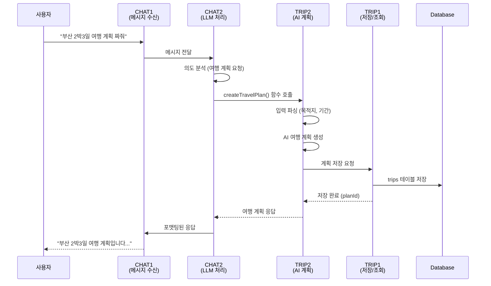
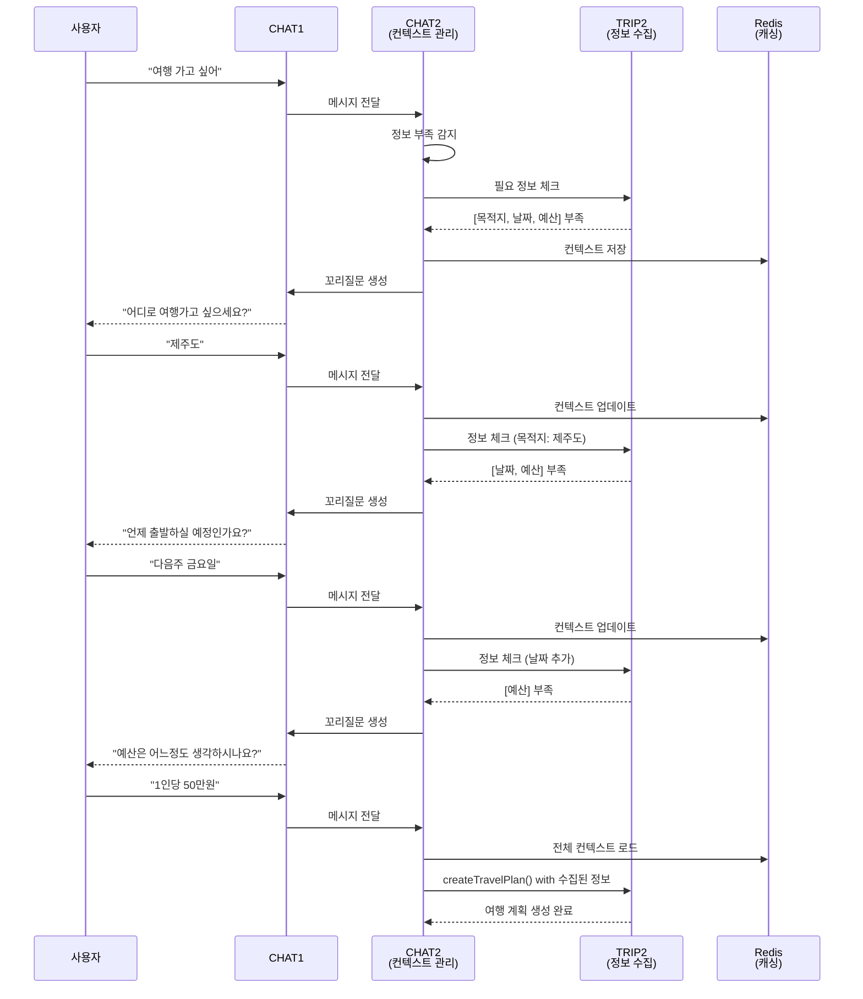
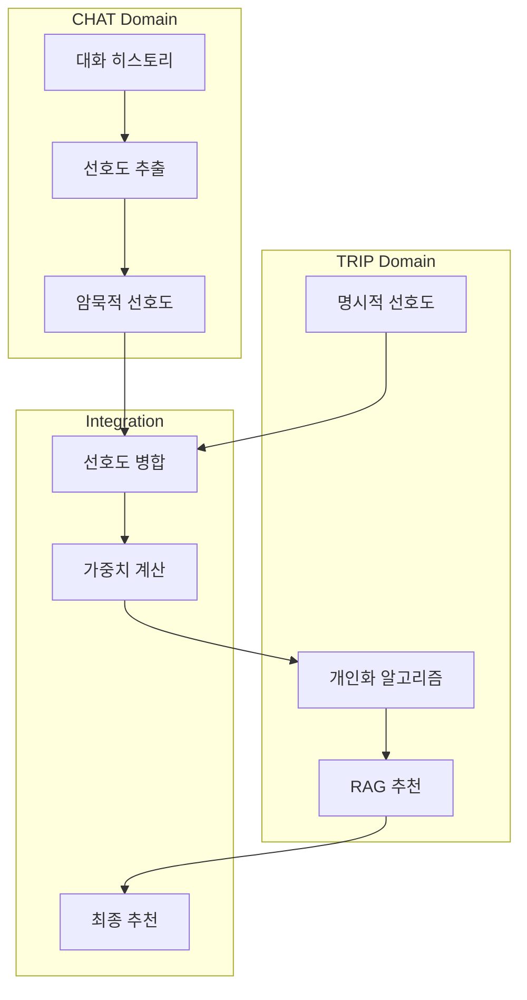
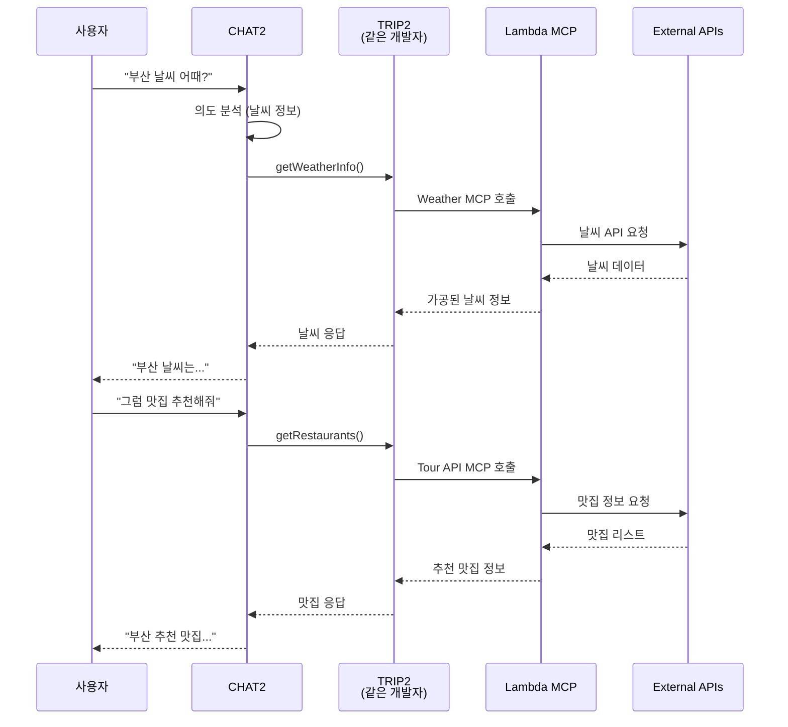

# 🔄 TRIP-CHAT 도메인 워크플로우 분석

## 📋 개요
TRIP과 CHAT 도메인 간의 의존성 관계와 데이터 흐름을 정의합니다. 
특히 TRIP2와 CHAT2를 같은 개발자가 담당하므로 통합 개발 전략을 수립합니다.

---

## 🎯 핵심 통합 포인트

### 1. TRIP2-CHAT2 동일 개발자 시너지
- **LLM + Function Calling 통합 관리**: 한 명이 전체 AI 파이프라인 관리
- **컨텍스트 일관성**: 대화 컨텍스트와 여행 계획 컨텍스트 통합
- **Lambda MCP 직접 연동**: CHAT에서 Lambda 함수 직접 호출 가능

### 2. 도메인 간 주요 의존성
```
USER → CHAT: JWT 인증, 사용자 정보
USER → TRIP: 사용자 ID, 인증 정보
CHAT ⇄ TRIP: 양방향 데이터 교환
MEDIA → CHAT: OCR 텍스트 전달
MEDIA → TRIP: 여행 관련 이미지 정보
```

---

## 🌊 주요 워크플로우

### 📱 워크플로우 1: 대화형 여행 계획 생성



### 🔄 워크플로우 2: 꼬리질문을 통한 정보 수집



### 🎨 워크플로우 3: 개인화된 추천



### 🔌 워크플로우 4: Lambda MCP 통합 호출



---

## 🔗 API 인터페이스 정의

### 1. CHAT → TRIP 인터페이스

#### 여행 계획 생성 요청
```java
// CHAT2에서 TRIP2 Function 호출
public interface TravelPlanFunction {
    TravelPlan createTravelPlan(TravelRequest request);
    TravelPlan optimizeTravelPlan(Long planId, OptimizationOptions options);
    List<Recommendation> getRecommendations(UserContext context);
}
```

#### 정보 수집 체크
```java
// TRIP2가 제공하는 유틸리티
public class TravelInfoValidator {
    public ValidationResult checkRequiredInfo(Map<String, Object> collectedInfo) {
        List<String> missing = new ArrayList<>();
        if (!collectedInfo.containsKey("destination")) missing.add("목적지");
        if (!collectedInfo.containsKey("startDate")) missing.add("출발일");
        if (!collectedInfo.containsKey("budget")) missing.add("예산");
        return new ValidationResult(missing);
    }
}
```

### 2. TRIP → CHAT 인터페이스

#### 꼬리질문 생성 요청
```java
// TRIP1에서 CHAT2로 요청
public interface FollowUpQuestionService {
    String generateFollowUpQuestion(List<String> missingInfo);
    String generateClarificationQuestion(String ambiguousInfo);
}
```

### 3. 공통 컨텍스트 관리

```java
// TRIP2-CHAT2 공유 컨텍스트 (같은 개발자가 관리)
@Component
public class SharedContextManager {
    private final RedisTemplate<String, Object> redisTemplate;
    
    public void saveContext(String sessionId, TravelContext context) {
        String key = "context:" + sessionId;
        redisTemplate.opsForValue().set(key, context, 30, TimeUnit.MINUTES);
    }
    
    public TravelContext loadContext(String sessionId) {
        String key = "context:" + sessionId;
        return (TravelContext) redisTemplate.opsForValue().get(key);
    }
    
    public void updateContext(String sessionId, Map<String, Object> updates) {
        TravelContext context = loadContext(sessionId);
        if (context == null) context = new TravelContext();
        context.merge(updates);
        saveContext(sessionId, context);
    }
}
```

---

## 📊 데이터 흐름 매트릭스

| 출발 도메인 | 도착 도메인 | 데이터 타입 | 빈도 | 동기/비동기 |
|------------|------------|------------|------|------------|
| CHAT2 | TRIP2 | 여행 계획 요청 | 높음 | 동기 |
| TRIP2 | CHAT2 | 꼬리질문 | 중간 | 동기 |
| CHAT2 | TRIP1 | 계획 저장 요청 | 높음 | 비동기 |
| TRIP1 | CHAT2 | 선호도 데이터 | 낮음 | 동기 |
| CHAT1 | CHAT2 | 메시지 | 매우 높음 | 동기 |
| CHAT2 | Redis | 컨텍스트 | 높음 | 비동기 |
| TRIP2 | Lambda | API 호출 | 중간 | 동기 |
| MEDIA | CHAT2 | OCR 텍스트 | 낮음 | 비동기 |

---

## 🚀 TRIP2-CHAT2 통합 개발 전략

### 1단계: 기반 구축 (Week 1)
```
CHAT2 개발자가 동시에 구축:
├── Spring AI 설정 (CHAT2)
├── LLM 연동 (CHAT2)
├── Function Calling 프레임워크 (CHAT2)
└── 여행 계획 Functions (TRIP2)
```

### 2단계: 통합 구현 (Week 2)
```
통합 기능 개발:
├── 컨텍스트 관리 시스템
├── Lambda MCP 연동
├── 꼬리질문 생성 로직
└── 정보 수집 파이프라인
```

### 3단계: 고도화 (Week 3)
```
개인화 및 최적화:
├── RAG 기반 추천
├── 에이전트 패턴 구현
├── 개인화 알고리즘
└── 성능 최적화
```

---

## ⚠️ 의존성 관리 전략

### 1. 순환 의존성 방지
```java
// ❌ 잘못된 예: 순환 의존성
@Service
public class ChatService {
    @Autowired private TripService tripService; // 순환 참조
}

// ✅ 올바른 예: 이벤트 기반
@Service  
public class ChatService {
    @Autowired private ApplicationEventPublisher eventPublisher;
    
    public void processTravelRequest(String message) {
        // 이벤트 발행
        eventPublisher.publishEvent(new TravelRequestEvent(message));
    }
}
```

### 2. 인터페이스 기반 통신
```java
// 공통 인터페이스 정의
public interface TravelPlanningService {
    TravelPlan createPlan(TravelRequest request);
}

// TRIP2 구현
@Service
public class TripPlanningServiceImpl implements TravelPlanningService {
    // 구현
}

// CHAT2에서 사용
@Service
public class ChatService {
    @Autowired private TravelPlanningService planningService;
}
```

### 3. 비동기 처리
```java
@Service
public class AsyncTravelService {
    @Async
    public CompletableFuture<TravelPlan> generatePlanAsync(TravelRequest request) {
        // 비동기 처리로 의존성 완화
        return CompletableFuture.completedFuture(generatePlan(request));
    }
}
```

---

## 📈 성능 최적화 포인트

### 1. 캐싱 전략
- **Redis 캐싱**: 자주 사용되는 여행 정보
- **컨텍스트 캐싱**: 30분 TTL로 대화 컨텍스트 유지
- **Lambda 응답 캐싱**: DynamoDB로 외부 API 응답 캐싱

### 2. 병렬 처리
- **Lambda MCP 병렬 호출**: CompletableFuture 활용
- **다중 LLM 병렬 처리**: Gemini + GPT 동시 호출
- **배치 처리**: 여러 추천 요청 일괄 처리

### 3. 연결 최적화
- **Connection Pool**: DB 연결 풀 최적화
- **HTTP Client Pool**: RestTemplate 풀 관리
- **Redis Connection**: Lettuce 연결 풀 설정

---

## 🔍 모니터링 포인트

### 핵심 메트릭
1. **응답 시간**: CHAT → TRIP 왕복 시간
2. **Function 호출 빈도**: 시간당 Function 호출 횟수
3. **캐시 적중률**: Redis 캐시 효율성
4. **에러율**: 도메인 간 통신 실패율
5. **Lambda 성능**: Cold Start 빈도 및 실행 시간

### 알람 설정
```yaml
alerts:
  - name: "High Response Time"
    condition: response_time > 3s
    action: notify_slack
    
  - name: "Function Call Failure"
    condition: error_rate > 5%
    action: page_oncall
    
  - name: "Cache Miss Rate High"
    condition: cache_hit_rate < 70%
    action: notify_team
```

---

## 📝 개발 체크리스트

### TRIP2-CHAT2 개발자 (동일인)
- [ ] Spring AI 기본 설정 완료
- [ ] Gemini/GPT 연동 테스트
- [ ] Function Calling 구현
- [ ] 여행 계획 Functions 작성
- [ ] Lambda MCP 연동
- [ ] 컨텍스트 관리 시스템
- [ ] 꼬리질문 생성 로직
- [ ] 통합 테스트 작성

### TRIP1 개발자
- [ ] Trip 도메인 엔티티 설계
- [ ] 여행 계획 CRUD API
- [ ] 선호도 관리 API
- [ ] 개인화 알고리즘 구현

### CHAT1 개발자
- [ ] 채팅 메시지 CRUD
- [ ] 의도 분류 시스템
- [ ] 라우팅 로직 구현
- [ ] 에이전트 패턴 구현

---

## 🎯 성공 지표

### 기술적 지표
- API 응답 시간 < 3초
- 시스템 가용성 > 99%
- 테스트 커버리지 > 70%
- 캐시 적중률 > 80%

### 비즈니스 지표
- 여행 계획 생성 성공률 > 95%
- 꼬리질문 통한 정보 수집률 > 90%
- 개인화 추천 만족도 > 85%
- Lambda MCP 호출 성공률 > 98%