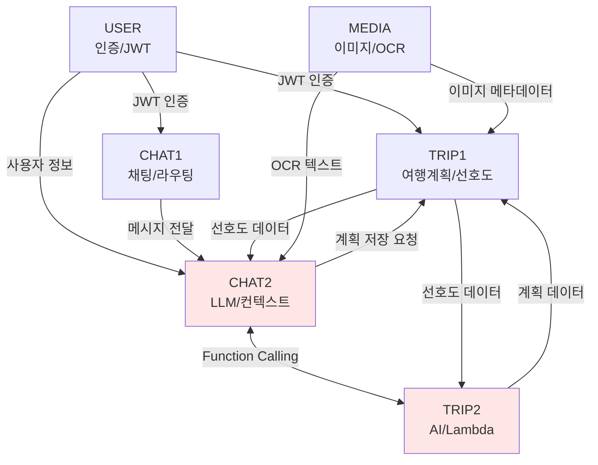

# 🔗 도메인 의존성 매트릭스

## 📊 의존성 관계 정리

### 도메인 간 의존성 맵



**Note**: TRIP2와 CHAT2는 같은 개발자가 담당 (빨간색 표시)

---

## 🎯 의존성 타입별 분류

### 1. 강한 의존성 (필수)
| 소스 | 타겟 | 의존 내용 | 타입 |
|------|------|----------|------|
| CHAT1 | USER | JWT 인증 필수 | 동기 |
| TRIP1 | USER | JWT 인증 필수 | 동기 |
| CHAT2 | CHAT1 | 메시지 수신 | 동기 |
| TRIP2 | TRIP1 | 계획 저장 | 동기 |
| CHAT2 | TRIP2 | Function 호출 | 동기 |

### 2. 약한 의존성 (선택적)
| 소스 | 타겟 | 의존 내용 | 타입 |
|------|------|----------|------|
| TRIP1 | CHAT2 | 선호도 조회 | 비동기 |
| MEDIA | CHAT2 | OCR 결과 전달 | 비동기 |
| MEDIA | TRIP1 | 이미지 정보 | 비동기 |
| CHAT2 | Redis | 캐싱 | 비동기 |

### 3. 런타임 의존성
| 소스 | 타겟 | 의존 내용 | 타입 |
|------|------|----------|------|
| TRIP2 | Lambda | API 호출 | 동기 |
| CHAT2 | LLM API | AI 모델 호출 | 동기 |
| TRIP1 | PostgreSQL | 데이터 저장 | 동기 |
| CHAT1 | PostgreSQL | 메시지 저장 | 동기 |

---

## 🚦 개발 순서 최적화

### Phase 1: 기반 구축 (Week 1 - Day 1-2)
```
병렬 개발 가능:
├── USER: Spring Security + JWT 설정
├── MEDIA: S3 설정 + 업로드 API
└── 공통: DB 스키마 + 테이블 생성
```

### Phase 2: 핵심 도메인 (Week 1 - Day 3-4)
```
순차 개발 필요:
1. TRIP1: Trip 엔티티 + 기본 CRUD
2. CHAT1: Chat 엔티티 + 메시지 CRUD
3. CHAT2 + TRIP2 통합 개발:
   ├── Spring AI 설정 (CHAT2)
   ├── LLM 연동 (CHAT2)
   └── Function 구현 (TRIP2)
```

### Phase 3: 통합 및 테스트 (Week 1 - Day 5)
```
통합 작업:
├── CHAT2 ↔ TRIP2 Function Calling 테스트
├── USER → CHAT1/TRIP1 인증 통합
├── End-to-End 시나리오 테스트
└── 성능 테스트
```

---

## 🔄 순환 의존성 해결 전략

### 문제 상황
```
CHAT2 → TRIP2 → TRIP1 → CHAT2 (순환)
```

### 해결 방안

#### 1. Event-Driven Architecture
```java
// Event Publisher (CHAT2)
@Service
public class ChatService {
    @Autowired
    private ApplicationEventPublisher eventPublisher;
    
    public void requestTravelPlan(String message) {
        eventPublisher.publishEvent(
            new TravelPlanRequestEvent(message)
        );
    }
}

// Event Listener (TRIP2)
@Component
public class TravelPlanEventListener {
    @EventListener
    public void handleTravelPlanRequest(TravelPlanRequestEvent event) {
        // 여행 계획 생성 로직
    }
}
```

#### 2. Message Queue (Redis Pub/Sub)
```java
// Publisher (CHAT2)
@Service
public class ChatMessagePublisher {
    @Autowired
    private RedisTemplate<String, Object> redisTemplate;
    
    public void publishTravelRequest(TravelRequest request) {
        redisTemplate.convertAndSend("travel-request", request);
    }
}

// Subscriber (TRIP2)
@Service
public class TravelRequestSubscriber {
    @RedisListener(topic = "travel-request")
    public void handleTravelRequest(TravelRequest request) {
        // 처리 로직
    }
}
```

#### 3. Shared Service Layer
```java
// 공통 서비스 (도메인 중립적)
@Service
public class TravelContextService {
    // CHAT2, TRIP2 모두 이 서비스를 통해 통신
    public TravelContext getContext(String sessionId) {
        // Redis에서 컨텍스트 조회
    }
    
    public void updateContext(String sessionId, Map<String, Object> data) {
        // 컨텍스트 업데이트
    }
}
```

---

## 📝 인터페이스 계약

### USER → 타 도메인
```java
public interface AuthenticationService {
    UserDetails getCurrentUser();
    boolean validateToken(String token);
    String getUserIdFromToken(String token);
}
```

### CHAT1 → CHAT2
```java
public interface MessageProcessingService {
    ChatResponse processMessage(ChatMessage message);
    void processMessageAsync(ChatMessage message);
}
```

### CHAT2 ↔ TRIP2 (동일 개발자)
```java
// 통합 인터페이스
public interface TravelAIService {
    // CHAT2가 호출
    TravelPlan generatePlan(TravelRequest request);
    List<String> getRequiredInfo(Map<String, Object> context);
    
    // TRIP2가 호출
    String generateFollowUpQuestion(List<String> missing);
    void updateUserPreferences(Map<String, Object> preferences);
}
```

### TRIP1 데이터 접근
```java
public interface TripRepository {
    Trip save(Trip trip);
    Optional<Trip> findById(Long id);
    List<Trip> findByUserId(String userId);
    void updatePreferences(String userId, UserPreferences prefs);
}
```

### MEDIA → 타 도메인
```java
public interface MediaService {
    MediaUploadResponse uploadImage(MultipartFile file);
    OCRResult extractText(Long mediaId);
    void deleteMedia(Long mediaId);
}
```

---

## 🛠️ 의존성 주입 설정

### 1. 패키지 구조
```
com.compass
├── common           # 공통 모듈
│   ├── auth        # 인증 관련
│   ├── config      # 설정
│   └── utils       # 유틸리티
├── domain
│   ├── user        # USER 도메인
│   ├── trip        # TRIP1, TRIP2
│   ├── chat        # CHAT1, CHAT2
│   └── media       # MEDIA 도메인
└── integration      # 도메인 간 통합
    ├── events      # 이벤트 정의
    ├── dto         # 공통 DTO
    └── service     # 통합 서비스
```

### 2. Spring Configuration
```java
@Configuration
@ComponentScan(basePackages = {
    "com.compass.common",
    "com.compass.domain",
    "com.compass.integration"
})
public class DomainConfiguration {
    
    @Bean
    @ConditionalOnProperty(name = "feature.trip2.enabled", havingValue = "true")
    public TravelAIService travelAIService() {
        return new TravelAIServiceImpl();
    }
    
    @Bean
    @ConditionalOnProperty(name = "feature.chat2.enabled", havingValue = "true")
    public LLMService llmService() {
        return new LLMServiceImpl();
    }
}
```

---

## 🔍 의존성 테스트 전략

### 1. 단위 테스트 (Mock)
```java
@Test
public void testChatWithoutTrip() {
    // TRIP 서비스를 Mock으로 대체
    when(mockTripService.generatePlan(any()))
        .thenReturn(mockTravelPlan());
    
    ChatResponse response = chatService.processMessage("여행 계획");
    assertNotNull(response);
}
```

### 2. 통합 테스트
```java
@SpringBootTest
@TestPropertySource(properties = {
    "feature.all.enabled=true"
})
public class DomainIntegrationTest {
    @Test
    public void testEndToEndTravelPlanning() {
        // 전체 플로우 테스트
    }
}
```

### 3. 의존성 격리 테스트
```java
@ActiveProfiles("test-isolation")
public class IsolatedDomainTest {
    // 각 도메인 독립적 테스트
}
```

---

## 📊 의존성 모니터링

### 메트릭 수집
```yaml
metrics:
  domain_calls:
    - source: CHAT2
      target: TRIP2
      count: 1234
      avg_latency: 150ms
      error_rate: 0.1%
    
  cache_usage:
    - domain: CHAT2
      hit_rate: 85%
      miss_rate: 15%
    
  api_health:
    - service: Lambda MCP
      availability: 99.9%
      avg_response: 200ms
```

### 알림 설정
```yaml
alerts:
  - name: "도메인 간 통신 실패"
    condition: error_rate > 1%
    severity: WARNING
    
  - name: "순환 의존성 감지"
    condition: circular_dependency_detected
    severity: CRITICAL
    
  - name: "의존 서비스 다운"
    condition: service_unavailable
    severity: ERROR
```

---

## ✅ 의존성 체크리스트

### 개발 전 확인사항
- [ ] 도메인 간 인터페이스 정의 완료
- [ ] 순환 의존성 체크
- [ ] Mock 객체 준비
- [ ] 비동기 처리 전략 수립
- [ ] 에러 처리 방안 정의

### 개발 중 확인사항
- [ ] 의존성 주입 정상 동작
- [ ] 타임아웃 설정
- [ ] 재시도 로직 구현
- [ ] 캐싱 전략 적용
- [ ] 로깅 및 모니터링

### 개발 후 확인사항
- [ ] 통합 테스트 통과
- [ ] 성능 테스트 완료
- [ ] 의존성 문서화
- [ ] 모니터링 대시보드 구성
- [ ] 장애 대응 시나리오 검증