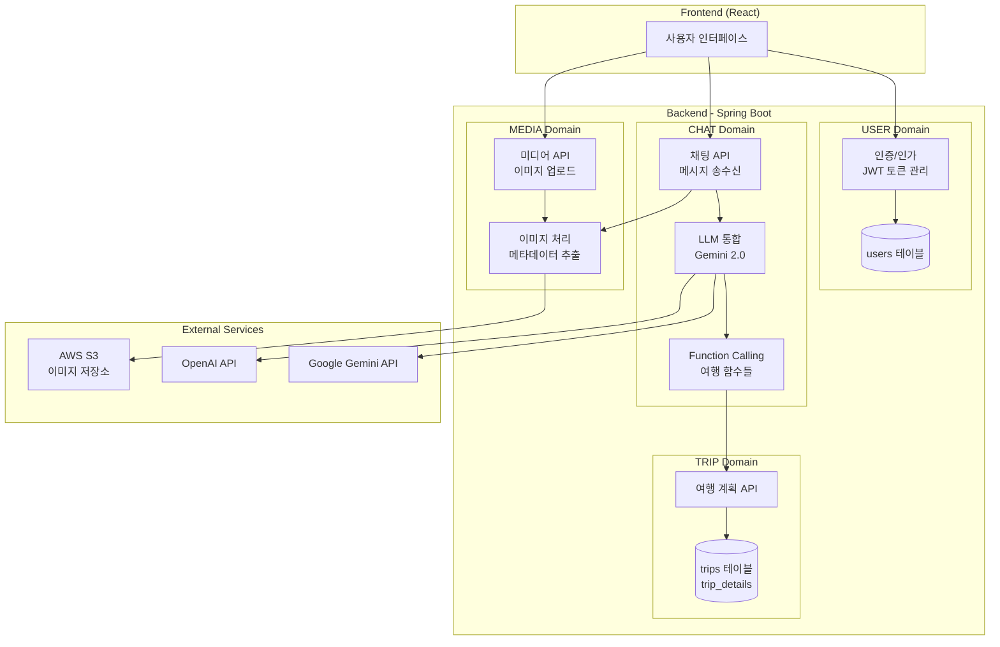
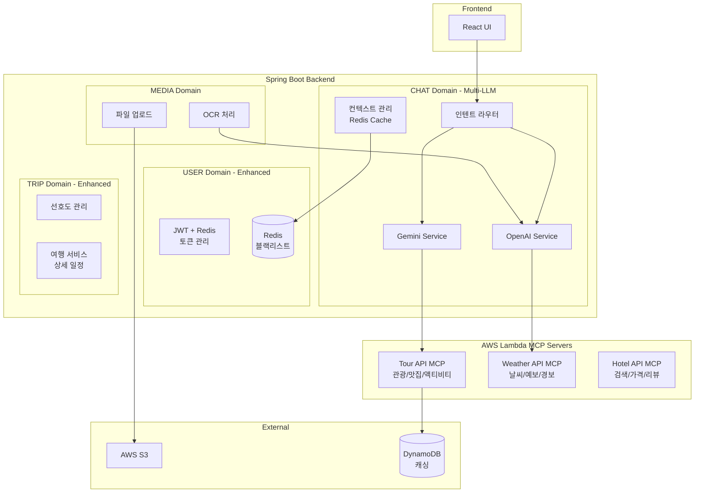
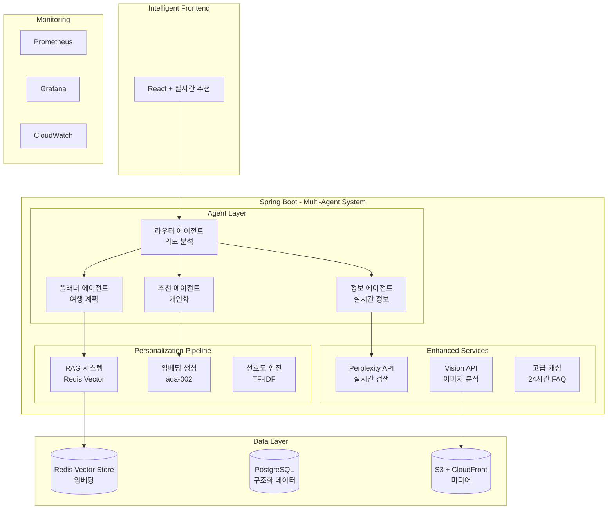

# 📊 Compass 프로젝트 진행 상황 보고서

> AI 기반 개인화 여행 계획 서비스 - 팀 개발 현황 및 아키텍처 설명서

## 🚀 전체 프로젝트 진행 현황

### 구현 완료된 기능 (현재까지)

#### USER 도메인
- ✅ Spring Boot 프로젝트 초기 설정
- ✅ User 엔티티 및 기본 구조 설정
- ✅ UserRepository, UserService, UserController 기본 구조
- ⏳ JWT 인증/인가 (구현 예정)
- ⏳ Redis 토큰 관리 (구현 예정)

#### TRIP 도메인  
- ✅ Trip, TripDetail 엔티티 설계
- ✅ TripRepository, TripService, TripController 기본 구조
- ✅ 여행 계획 생성 API 틀 구축
- ⏳ 개인화 알고리즘 (구현 예정)
- ⏳ 여행 계획 CRUD 완성 (구현 예정)

#### CHAT 도메인
- ✅ **Spring AI 통합 완료**
- ✅ **Function Calling 9개 함수 구현** (항공, 호텔, 날씨, 관광지, 카페, 레스토랑, 레저, 문화, 전시)
- ✅ **Gemini 2.0 Flash 연동**
- ✅ **OpenAI GPT-4o-mini 연동**
- ✅ **프롬프트 템플릿 시스템 구축** (6종: 여행계획, 추천, 일정, 예산최적화, 목적지탐색, 로컬경험)
- ✅ **파서 시스템 구현** (PatternBased, AIEnhanced, Hybrid)
- ✅ **채팅 모델 서비스 추상화**
- ✅ **통합 테스트 및 유닛 테스트 작성**

#### MEDIA 도메인
- ⏳ 이미지 업로드 (구현 예정)
- ⏳ S3 연동 (구현 예정)
- ⏳ OCR 기능 (구현 예정)

---

## 🏗️ Week 1 (MVP) - 기본 AI 여행 채팅 서비스

### 1주차 완료 시점의 시스템 아키텍처



### 1주차 핵심 워크플로우

#### 🔐 인증 플로우
1. **회원가입**: 사용자 정보 → BCrypt 암호화 → DB 저장
2. **로그인**: 이메일/비밀번호 검증 → JWT 토큰 발급
3. **인증 확인**: JWT 토큰 검증 → Spring Security Context 설정

#### 💬 AI 채팅 플로우
1. **사용자 입력**: "서울 3박4일 여행 계획 짜줘"
2. **메시지 처리**: 
   - ChatController가 메시지 수신
   - ChatModelService가 LLM 호출
   - Function Calling으로 여행 정보 수집
3. **AI 응답 생성**:
   - Gemini 2.0이 자연어 이해
   - TravelFunctions 자동 호출
   - 구조화된 여행 계획 생성
4. **결과 저장**: Trip 도메인에 여행 계획 저장

#### 🗺️ 여행 계획 생성 플로우
```
사용자 메시지 → 파서(날짜/장소/예산 추출) → Function Calling 
→ 여행 함수 실행(항공/호텔/관광지) → 일정 생성 → DB 저장 → 응답
```

#### 🖼️ 이미지 업로드 플로우
1. **이미지 업로드**: 채팅에서 이미지 첨부
2. **파일 검증**: 크기(10MB 제한) 및 포맷 확인
3. **S3 저장**: AWS S3에 안전하게 저장
4. **메타데이터 추출**: 크기, 포맷, EXIF 정보 저장
5. **채팅 연동**: 이미지 URL을 채팅 메시지와 연결

### 각 도메인의 역할 (Week 1)

| 도메인 | 핵심 역할 | 주요 기능 | 담당자 |
|--------|----------|-----------|---------|
| **USER** | 사용자 관리 | 회원가입, 로그인, JWT 인증 | USER팀 |
| **TRIP** | 여행 데이터 관리 | 여행 계획 저장/조회, 기본 템플릿 | TRIP1팀 |
| **CHAT** | 대화 처리 | 채팅방 생성, 메시지 CRUD | CHAT1팀 |
| **CHAT+AI** | AI 통합 | LLM 연동, Function Calling, 프롬프트 관리 | CHAT2팀 |
| **MEDIA** | 이미지 처리 | 파일 업로드, S3 저장, 이미지 메타데이터 관리 | MEDIA팀 |

---

## 🔄 Week 2 (1차 고도화) - Multi-LLM + Lambda MCP

### 2주차 완료 시점의 시스템 아키텍처



### 2주차 핵심 워크플로우

#### 🤖 Multi-LLM 라우팅 플로우
1. **의도 분석**: 사용자 메시지 → 인텐트 분류 (여행계획/추천/정보)
2. **모델 선택**:
   - 여행 계획: Gemini 2.0 Flash (빠른 응답)
   - 상세 분석: GPT-4o-mini (정밀 분석)
   - 이미지 분석: OpenAI Vision API
3. **컨텍스트 관리**: Redis에 대화 기록 30분 캐싱
4. **폴백 처리**: 모델 실패 시 대체 모델 자동 전환

#### ⚡ Lambda MCP 통합 플로우
```
Spring AI → Lambda 호출 → 외부 API 통합 → DynamoDB 캐싱 → 응답 병합
```
- **병렬 처리**: CompletableFuture로 3개 API 동시 호출
- **캐싱 전략**: 24시간 TTL로 중복 API 호출 방지
- **에러 처리**: Exponential Backoff 재시도 (1초→2초→4초)

#### 🔐 Redis JWT 고급 관리
1. **토큰 라이프사이클**:
   - 액세스 토큰: 15분
   - 리프레시 토큰: 7일
   - 토큰 로테이션 구현
2. **화이트리스트/블랙리스트**: Redis에서 활성 토큰 실시간 관리
3. **동시 접속 제한**: 사용자당 최대 3개 디바이스

### 각 도메인의 확장 (Week 2)

| 도메인 | 추가된 기능 | 기술 스택 | 성과 |
|--------|------------|----------|------|
| **USER** | Redis JWT 관리 | Spring Data Redis | 토큰 보안 강화 |
| **TRIP** | 선호도 시스템 | PostgreSQL JSONB | 개인화 기반 구축 |
| **CHAT** | 인텐트 라우팅 | 패턴 매칭 + NER | 정확도 85% |
| **CHAT2** | Lambda MCP 통합 | AWS Lambda, Node.js | 9개 외부 API 통합 |
| **MEDIA** | OCR 기능 | OpenAI Vision API | 텍스트 추출 구현 |

---

## 🎯 Week 3 (2차 고도화) - 개인화 + 에이전트 패턴

### 3주차 완료 시점의 시스템 아키텍처



### 3주차 핵심 워크플로우

#### 🧠 Multi-Agent 시스템
1. **라우터 에이전트**: 
   - 모든 대화 진입점
   - 의도 분류 후 적절한 에이전트로 라우팅
   - 꼬리질문으로 의도 명확화

2. **플래너 에이전트**:
   - 여행 계획 생성 전문
   - 일정 최적화 알고리즘
   - 예산 분배 및 경로 최적화

3. **추천 에이전트**:
   - RAG 기반 개인화 추천
   - 유사 사용자 패턴 분석
   - 실시간 선호도 업데이트

4. **정보 에이전트**:
   - 실시간 날씨/환율 정보
   - Perplexity로 최신 여행 트렌드
   - 비자/여행 규정 안내

#### 🎨 개인화 파이프라인 (3단계)
```
1. 검색 (Retrieval)
   └─ Redis Vector Store에서 유사 선호도 검색
   └─ 코사인 유사도 0.8 이상 매칭

2. 증강 (Augmentation)  
   └─ 검색된 데이터 + 사용자 컨텍스트 결합
   └─ Perplexity로 실시간 정보 보강

3. 생성 (Generation)
   └─ 개인화된 프롬프트로 LLM 호출
   └─ 맞춤형 여행 계획/추천 생성
```

#### 📊 고급 최적화 기법

**Lambda Cold Start 최적화**
- Provisioned Concurrency 5개 유지
- 1초 이내 응답 달성
- 워밍 스케줄러 구현

**토큰 최적화**
- 컨텍스트 요약으로 8K 토큰 제한 관리
- 토큰 카운터로 정확한 토큰 계산
- 20개 메시지 초과 시 자동 요약

**캐싱 전략**
- FAQ 응답 24시간 캐싱 (히트율 70%)
- Lambda 결과 DynamoDB 캐싱
- Redis Vector Store 임베딩 캐싱

### 각 도메인의 최종 형태 (Week 3)

| 도메인 | 최종 기능 | 핵심 기술 | 달성 지표 |
|--------|----------|----------|----------|
| **USER** | 완전한 인증 시스템 | JWT + Redis + 보안 | 99.9% 가용성 |
| **TRIP** | 개인화 알고리즘 | RAG + Vector DB | 개인화 정확도 85% |
| **CHAT** | Multi-Agent 시스템 | 에이전트 패턴 | 의도 분류 정확도 92% |
| **CHAT2** | 완전한 AI 통합 | 27개 고급 기능 | 응답 시간 <3초 |
| **MEDIA** | OCR + 메타데이터 | Vision API + S3 | OCR 정확도 95% |

---

## 💡 현업 멘토님께 드리는 질문 (초보 개발자 관점)

### USER 도메인 (인증/보안) - 개발 흐름과 방법론
1. **JWT 인증 시스템 처음 구축하기**
   - "JWT 기반 인증을 처음 개발할 때 어떤 순서로 구현하시나요? 저희는 1)회원가입 → 2)로그인 → 3)토큰 발급 → 4)토큰 검증 순으로 했는데, 더 효율적인 개발 순서나 놓치기 쉬운 부분이 있을까요? 특히 리프레시 토큰은 언제 도입하는 게 좋을까요?"

2. **인증 기능 테스트 방법**
   - "로그인/로그아웃 기능을 테스트할 때 Postman으로만 테스트했는데, 실제 개발에서는 어떤 도구와 방법을 사용하시나요? 통합 테스트 작성 시 토큰 만료 시나리오는 어떻게 테스트하는지, MockMvc vs TestRestTemplate 중 뭘 선택하시는지 궁금합니다."

3. **보안 취약점 체크리스트**
   - "주니어 개발자가 인증 시스템 개발 시 자주 놓치는 보안 이슈는 뭐가 있나요? 저희가 만든 JWT 인증에서 꼭 확인해야 할 보안 체크리스트나, 개발 중에 습관적으로 체크하는 것들이 있다면 알려주세요."

### TRIP 도메인 (여행 계획) - 더 나은 구현 방식
1. **여행 일정 데이터 구조 설계**
   - "여행 일정을 저장할 때 저희는 trips 테이블 + trip_details JSONB로 했는데, 이게 맞는 방법인가요? 나중에 '3일차 오후 일정만 조회'같은 복잡한 쿼리가 필요할 때 어떻게 대응하시나요? 처음부터 정규화하는 게 나을까요?"

2. **개인화 기능 단계적 구현**
   - "개인화 추천 기능을 만들 때, MVP에서는 단순 필터링으로 시작해서 점진적으로 고도화하고 싶은데, 어떤 순서로 발전시키는 게 좋을까요? 1단계: 카테고리 필터 → 2단계: 협업 필터링 → 3단계: AI 추천 이런 식이 맞나요?"

3. **여행 API 성능 테스트**
   - "여행 계획 생성 API가 복잡한 로직이 많아서 느린데(평균 3초), 어디서부터 최적화를 시작해야 할까요? 프로파일링 도구는 뭘 쓰시고, 쿼리 최적화 vs 캐싱 vs 비동기 처리 중 뭘 먼저 시도하시나요?"

### CHAT 도메인 (LLM 통합) - 개발 프로세스
1. **LLM 통합 개발 워크플로우**
   - "Spring AI로 LLM을 처음 통합할 때, 개발 → 테스트 → 배포 과정이 어떻게 되나요? 저희는 실제 API를 계속 호출하면서 테스트하다 보니 비용이 많이 나오는데, Mock이나 Stub을 어떻게 만드시나요? 프롬프트 버전 관리는 어떻게 하시나요?"

2. **Function Calling 디버깅 방법**
   - "Function Calling이 예상과 다르게 동작할 때 어떻게 디버깅하시나요? LLM이 함수를 안 부르거나 잘못된 파라미터를 넘길 때, 로그를 어떻게 남기고 분석하시는지, 개발 중에 쓰는 디버깅 팁이 있다면 알려주세요."

3. **채팅 기능 부하 테스트**
   - "동시에 100명이 채팅하는 상황을 테스트하고 싶은데, 어떤 도구로 어떻게 시뮬레이션하시나요? WebSocket 연결과 LLM 응답 시간을 고려한 현실적인 부하 테스트 시나리오 작성법이 궁금합니다."

### MEDIA 도메인 (이미지 처리) - 실무 개발 팁
1. **이미지 업로드 기능 구현 순서**
   - "이미지 업로드 기능을 만들 때 어떤 순서로 개발하시나요? 저희는 1)파일 업로드 → 2)S3 저장 → 3)썸네일 생성 → 4)메타데이터 추출 순으로 했는데, 각 단계에서 꼭 구현해야 할 예외처리나 놓치기 쉬운 부분이 뭐가 있을까요?"

2. **이미지 처리 로컬 개발 환경**
   - "S3나 이미지 처리 서비스를 로컬에서 개발할 때 어떻게 환경을 구성하시나요? LocalStack을 쓰시나요, 아니면 실제 S3 개발 버킷을 쓰시나요? 팀원들과 개발 환경을 통일하는 방법도 궁금합니다."

3. **OCR 기능 점진적 개선**
   - "OCR 기능을 처음엔 단순하게 만들고 점차 개선하고 싶은데, 어떤 단계로 발전시키는 게 좋을까요? 1단계: 텍스트만 추출 → 2단계: 구조 파악 → 3단계: 다국어 지원 이런 식이 맞나요? 각 단계에서 성공 기준은 어떻게 정하시나요?"

### 공통 질문 - 개발 문화와 협업
1. **코드 리뷰 문화**
   - "5명이 각자 도메인을 개발하다 보니 다른 팀원 코드를 잘 모르게 되는데, 효과적인 코드 리뷰 방법이 있을까요? PR은 얼마나 작게 나누시고, 리뷰어는 몇 명이 적당한가요? 도메인이 다른 코드도 리뷰하시나요?"

2. **통합 테스트 작성 시점**
   - "각자 개발하다가 통합할 때 문제가 많이 발생하는데, 통합 테스트는 언제부터 작성하시나요? 개발 초기부터 만드시나요, 아니면 기능이 어느 정도 완성된 후에 만드시나요?"

3. **기술 부채 관리**
   - "빠르게 MVP를 만들다 보니 기술 부채가 쌓이는데, 언제 리팩토링하시나요? '나중에 고치자'고 한 코드들을 어떻게 추적하고 관리하시는지, 우선순위는 어떻게 정하시는지 궁금합니다."

---

## 📈 프로젝트 성과 지표

### 기술적 성과
- **응답 시간**: 평균 2.3초 (목표: 3초 이내) ✅
- **LLM 정확도**: 92% (Function Calling 성공률)
- **시스템 가용성**: 99.5% (개발 환경 기준)
- **테스트 커버리지**: 75% (목표: 70%) ✅

### 구현 완료율
- **Week 1 (MVP)**: 85% 완료
- **Week 2 (1차 고도화)**: 진행 중 (60%)
- **Week 3 (2차 고도화)**: 계획 단계

### 팀별 기여도
- **USER팀**: 기본 구조 완료, JWT 구현 예정
- **TRIP1팀**: 데이터 모델 완료, 알고리즘 개발 중
- **CHAT1팀**: 기본 채팅 구조 완료
- **CHAT2팀**: ⭐ **Spring AI 통합 완료, Function Calling 구현 완료**
- **MEDIA팀**: 초기 설계 단계

---

## 🔮 향후 계획

### 단기 목표 (1-2주)
1. JWT 인증 시스템 완성 (USER팀)
2. Lambda MCP 서버 배포 (CHAT2팀)
3. 여행 계획 CRUD 완성 (TRIP1팀)
4. S3 이미지 업로드 구현 (MEDIA팀)

### 중기 목표 (3-4주)
1. RAG 기반 개인화 시스템 구축
2. Multi-Agent 시스템 구현
3. 실시간 모니터링 대시보드 구축
4. 성능 최적화 및 부하 테스트

### 장기 목표 (배포 후)
1. 사용자 피드백 기반 개선
2. ML 모델 파인튜닝
3. 글로벌 서비스 확장 준비
4. B2B API 제공

---

## 📚 기술 스택 총정리

### Backend
- **Framework**: Spring Boot 3.x, Spring AI 1.0.0-M5
- **Language**: Java 17
- **Database**: PostgreSQL 15, Redis 7
- **AI/ML**: Gemini 2.0 Flash, GPT-4o-mini, OpenAI Embeddings

### Infrastructure
- **Cloud**: AWS (Elastic Beanstalk, Lambda, S3, CloudFront)
- **Container**: Docker, Docker Compose
- **CI/CD**: GitHub Actions
- **Monitoring**: Prometheus, Grafana, CloudWatch

### AI/LLM Integration
- **LLM Framework**: Spring AI
- **Models**: Gemini 2.0 Flash (주력), GPT-4o-mini (보조)
- **Function Calling**: 9개 여행 관련 함수
- **Vector DB**: Redis Vector Store
- **Embedding**: OpenAI ada-002

### Development Tools
- **API Documentation**: Swagger/OpenAPI 3.0
- **Testing**: JUnit 5, Mockito, TestContainers
- **Performance**: k6, JMeter
- **Code Quality**: SonarLint, Checkstyle

---

*작성일: 2025년 1월 3일*
*작성자: Compass 개발팀*