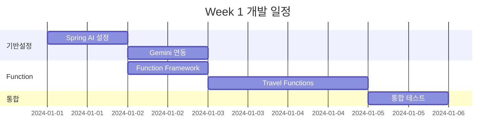
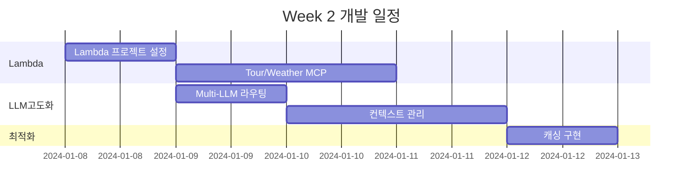
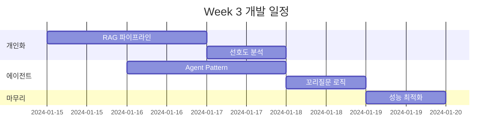

# 🔄 TRIP2-CHAT2 통합 개발 가이드

## 👤 개발자 정보
**담당자**: TRIP2 + CHAT2 통합 개발 (1명)
**핵심 역할**: AI/LLM 통합, Function Calling, Lambda MCP, 컨텍스트 관리

---

## 🎯 통합 개발의 이점

### 1. 시너지 효과
- **단일 AI 파이프라인**: LLM과 Function Calling을 한 명이 관리
- **일관된 컨텍스트**: 대화와 여행 계획 컨텍스트 통합 관리
- **빠른 디버깅**: AI 관련 이슈를 한 곳에서 추적 가능
- **효율적 최적화**: 전체 AI 플로우 최적화 가능

### 2. 개발 효율성
- 도메인 간 통신 오버헤드 감소
- 인터페이스 정의 단순화
- 통합 테스트 용이
- 코드 재사용 극대화

---

## 📦 통합 패키지 구조

```
com.compass
├── ai                          # AI/LLM 통합 모듈
│   ├── config                 # Spring AI 설정
│   │   ├── OpenAIConfig.java
│   │   ├── GeminiConfig.java
│   │   └── FunctionConfig.java
│   ├── service                # 핵심 서비스
│   │   ├── LLMService.java   # LLM 통합 관리
│   │   ├── FunctionService.java # Function Calling
│   │   └── ContextService.java  # 컨텍스트 관리
│   └── function              # AI Functions
│       ├── TravelPlanFunction.java
│       ├── WeatherFunction.java
│       └── RecommendFunction.java
├── domain
│   ├── chat
│   │   └── service
│   │       └── ChatOrchestrator.java # CHAT2 메인
│   └── trip
│       └── service
│           └── TripOrchestrator.java # TRIP2 메인
└── lambda
    └── mcp                    # Lambda MCP
        ├── TourMCP.java
        ├── WeatherMCP.java
        └── HotelMCP.java
```

---

## 🏗️ 개발 로드맵

### Week 1: 기반 구축


### Week 2: Lambda MCP + 고도화


### Week 3: 개인화 + 에이전트


---

## 💻 핵심 구현 코드

### 1. 통합 AI 서비스 (Week 1)

```java
package com.compass.ai.service;

import org.springframework.ai.chat.ChatClient;
import org.springframework.ai.chat.ChatResponse;
import org.springframework.ai.chat.messages.Message;
import org.springframework.ai.chat.prompt.Prompt;
import org.springframework.ai.embedding.EmbeddingClient;
import org.springframework.ai.vertexai.gemini.VertexAiGeminiChatClient;
import org.springframework.ai.openai.OpenAiChatClient;
import org.springframework.stereotype.Service;

@Service
public class UnifiedAIService {
    
    private final VertexAiGeminiChatClient geminiClient;
    private final OpenAiChatClient openAiClient;
    private final FunctionRegistry functionRegistry;
    private final ContextManager contextManager;
    
    public UnifiedAIService(
            VertexAiGeminiChatClient geminiClient,
            OpenAiChatClient openAiClient,
            FunctionRegistry functionRegistry,
            ContextManager contextManager) {
        this.geminiClient = geminiClient;
        this.openAiClient = openAiClient;
        this.functionRegistry = functionRegistry;
        this.contextManager = contextManager;
    }
    
    /**
     * 통합 메시지 처리 - CHAT2 핵심 로직
     */
    public ChatResponse processMessage(String userId, String message) {
        // 1. 컨텍스트 로드
        TravelContext context = contextManager.loadContext(userId);
        
        // 2. 의도 분석
        Intent intent = analyzeIntent(message);
        
        // 3. LLM 선택 (라우팅)
        ChatClient selectedClient = selectLLM(intent);
        
        // 4. Function 준비
        List<Function> functions = prepareFunctions(intent, context);
        
        // 5. 프롬프트 생성
        Prompt prompt = buildPrompt(message, context, functions);
        
        // 6. LLM 호출 (Function Calling 포함)
        ChatResponse response = selectedClient.call(prompt);
        
        // 7. 컨텍스트 업데이트
        contextManager.updateContext(userId, response);
        
        return response;
    }
    
    /**
     * 여행 계획 생성 - TRIP2 핵심 로직
     */
    public TravelPlan generateTravelPlan(TravelRequest request) {
        // 1. 입력 검증 및 파싱
        validateAndParse(request);
        
        // 2. 사용자 선호도 로드
        UserPreferences preferences = loadUserPreferences(request.getUserId());
        
        // 3. AI 프롬프트 구성
        String prompt = buildTravelPlanPrompt(request, preferences);
        
        // 4. Function Calling으로 외부 데이터 수집
        Map<String, Object> externalData = gatherExternalData(request);
        
        // 5. AI 모델 호출
        TravelPlan plan = callAIWithFunctions(prompt, externalData);
        
        // 6. 계획 최적화
        plan = optimizePlan(plan, preferences);
        
        // 7. 저장 및 반환
        return saveTravelPlan(plan);
    }
    
    private Intent analyzeIntent(String message) {
        // Gemini를 사용한 의도 분석
        String intentPrompt = "다음 메시지의 의도를 분석하세요: " + message;
        ChatResponse response = geminiClient.call(new Prompt(intentPrompt));
        return parseIntent(response);
    }
    
    private ChatClient selectLLM(Intent intent) {
        // 의도에 따른 LLM 선택
        switch (intent.getType()) {
            case TRAVEL_PLANNING:
            case COMPLEX_REASONING:
                return geminiClient;  // Gemini Pro for complex tasks
            case SIMPLE_CHAT:
            case INFORMATION:
                return openAiClient;  // GPT-4 for general chat
            default:
                return geminiClient;
        }
    }
}
```

### 2. Function Registry (Week 1)

```java
package com.compass.ai.function;

import org.springframework.ai.model.function.FunctionCallback;
import org.springframework.context.annotation.Bean;
import org.springframework.context.annotation.Configuration;
import org.springframework.context.annotation.Description;

@Configuration
public class TravelFunctionConfiguration {
    
    private final TripService tripService;
    private final WeatherService weatherService;
    private final LambdaMCPClient lambdaClient;
    
    /**
     * 여행 계획 생성 Function
     */
    @Bean
    @Description("사용자 요구사항을 기반으로 AI 여행 계획을 생성합니다")
    public FunctionCallback createTravelPlanFunction() {
        return FunctionCallback.builder()
            .function("createTravelPlan", (TravelRequest request) -> {
                // 입력 파싱
                TravelContext context = parseTravelContext(request);
                
                // 필수 정보 체크
                List<String> missingInfo = checkRequiredInfo(context);
                if (!missingInfo.isEmpty()) {
                    return RequestMoreInfoResponse.of(missingInfo);
                }
                
                // AI 계획 생성
                TravelPlan plan = generateAIPlan(context);
                
                // 외부 API 데이터 보강 (Lambda MCP)
                enrichWithExternalData(plan);
                
                // 개인화 적용
                applyPersonalization(plan, context.getUserPreferences());
                
                return plan;
            })
            .inputType(TravelRequest.class)
            .outputType(TravelPlan.class)
            .build();
    }
    
    /**
     * 날씨 정보 조회 Function
     */
    @Bean
    @Description("특정 지역의 날씨 정보를 조회합니다")
    public FunctionCallback getWeatherFunction() {
        return FunctionCallback.builder()
            .function("getWeather", (WeatherRequest request) -> {
                // Lambda MCP 호출
                return lambdaClient.getWeather(
                    request.getLocation(),
                    request.getDate()
                );
            })
            .inputType(WeatherRequest.class)
            .outputType(WeatherInfo.class)
            .build();
    }
    
    /**
     * 관광지 추천 Function
     */
    @Bean
    @Description("여행지의 추천 관광지를 조회합니다")
    public FunctionCallback getAttractionsFunction() {
        return FunctionCallback.builder()
            .function("getAttractions", (AttractionRequest request) -> {
                // Lambda MCP Tour API 호출
                List<Attraction> attractions = lambdaClient.getAttractions(
                    request.getDestination(),
                    request.getCategory()
                );
                
                // 사용자 선호도 기반 필터링
                return filterByPreferences(attractions, request.getPreferences());
            })
            .inputType(AttractionRequest.class)
            .outputType(List.class)
            .build();
    }
    
    /**
     * 꼬리질문 생성 Function
     */
    @Bean
    @Description("부족한 정보를 수집하기 위한 꼬리질문을 생성합니다")
    public FunctionCallback generateFollowUpFunction() {
        return FunctionCallback.builder()
            .function("generateFollowUp", (ContextInfo context) -> {
                List<String> missingInfo = analyzeMissingInfo(context);
                return createNaturalFollowUpQuestion(missingInfo);
            })
            .inputType(ContextInfo.class)
            .outputType(String.class)
            .build();
    }
}
```

### 3. Lambda MCP Client (Week 2)

```java
package com.compass.lambda.mcp;

import software.amazon.awssdk.services.lambda.LambdaClient;
import software.amazon.awssdk.services.lambda.model.InvokeRequest;
import org.springframework.stereotype.Component;
import com.fasterxml.jackson.databind.ObjectMapper;

@Component
public class LambdaMCPClient {
    
    private final LambdaClient lambdaClient;
    private final ObjectMapper objectMapper;
    private final RedisTemplate<String, Object> redisCache;
    
    /**
     * Tour API MCP 호출
     */
    public TourResponse callTourAPI(TourRequest request) {
        // 캐시 체크
        String cacheKey = "tour:" + request.hashCode();
        TourResponse cached = (TourResponse) redisCache.opsForValue().get(cacheKey);
        if (cached != null) {
            return cached;
        }
        
        // Lambda 호출
        InvokeRequest lambdaRequest = InvokeRequest.builder()
            .functionName("compass-tour-mcp")
            .payload(SdkBytes.fromUtf8String(toJson(request)))
            .build();
            
        InvokeResponse response = lambdaClient.invoke(lambdaRequest);
        TourResponse tourResponse = fromJson(response.payload().asUtf8String(), TourResponse.class);
        
        // 캐시 저장 (30분)
        redisCache.opsForValue().set(cacheKey, tourResponse, 30, TimeUnit.MINUTES);
        
        return tourResponse;
    }
    
    /**
     * Weather API MCP 호출
     */
    public WeatherResponse callWeatherAPI(String location, LocalDate date) {
        Map<String, Object> request = Map.of(
            "location", location,
            "date", date.toString()
        );
        
        InvokeRequest lambdaRequest = InvokeRequest.builder()
            .functionName("compass-weather-mcp")
            .payload(SdkBytes.fromUtf8String(toJson(request)))
            .build();
            
        InvokeResponse response = lambdaClient.invoke(lambdaRequest);
        return fromJson(response.payload().asUtf8String(), WeatherResponse.class);
    }
    
    /**
     * Hotel API MCP 호출 (병렬 처리)
     */
    public CompletableFuture<HotelResponse> callHotelAPIAsync(HotelRequest request) {
        return CompletableFuture.supplyAsync(() -> {
            InvokeRequest lambdaRequest = InvokeRequest.builder()
                .functionName("compass-hotel-mcp")
                .payload(SdkBytes.fromUtf8String(toJson(request)))
                .build();
                
            InvokeResponse response = lambdaClient.invoke(lambdaRequest);
            return fromJson(response.payload().asUtf8String(), HotelResponse.class);
        });
    }
}
```

### 4. 컨텍스트 관리자 (Week 2)

```java
package com.compass.ai.context;

import org.springframework.data.redis.core.RedisTemplate;
import org.springframework.stereotype.Service;

@Service
public class UnifiedContextManager {
    
    private final RedisTemplate<String, Object> redisTemplate;
    private final UserPreferenceService preferenceService;
    
    /**
     * 통합 컨텍스트 관리 - CHAT2 + TRIP2 공유
     */
    public class TravelChatContext {
        // 대화 컨텍스트 (CHAT2)
        private List<Message> conversationHistory;
        private String currentIntent;
        private Map<String, Object> extractedEntities;
        
        // 여행 컨텍스트 (TRIP2)
        private TravelPlan currentPlan;
        private UserPreferences preferences;
        private Map<String, Object> collectedInfo;
        
        // 공통 메타데이터
        private String sessionId;
        private String userId;
        private LocalDateTime lastUpdated;
        
        public void mergeConversationData(ChatMessage message) {
            // 대화에서 여행 정보 추출
            extractTravelInfo(message);
            // 선호도 업데이트
            updateImplicitPreferences(message);
        }
        
        public List<String> getMissingRequiredInfo() {
            List<String> required = Arrays.asList(
                "destination", "startDate", "endDate", "budget", "numberOfPeople"
            );
            return required.stream()
                .filter(key -> !collectedInfo.containsKey(key))
                .collect(Collectors.toList());
        }
    }
    
    /**
     * 컨텍스트 로드 (캐시 우선)
     */
    public TravelChatContext loadContext(String sessionId) {
        String key = "context:" + sessionId;
        TravelChatContext context = (TravelChatContext) redisTemplate.opsForValue().get(key);
        
        if (context == null) {
            context = new TravelChatContext();
            context.setSessionId(sessionId);
            context.setConversationHistory(new ArrayList<>());
            context.setCollectedInfo(new HashMap<>());
        }
        
        return context;
    }
    
    /**
     * 컨텍스트 저장 (TTL 30분)
     */
    public void saveContext(TravelChatContext context) {
        String key = "context:" + context.getSessionId();
        context.setLastUpdated(LocalDateTime.now());
        redisTemplate.opsForValue().set(key, context, 30, TimeUnit.MINUTES);
    }
    
    /**
     * 꼬리질문을 위한 정보 수집 상태 체크
     */
    public FollowUpStrategy determineFollowUp(TravelChatContext context) {
        List<String> missing = context.getMissingRequiredInfo();
        
        if (missing.isEmpty()) {
            return FollowUpStrategy.READY_TO_PLAN;
        } else if (missing.size() == 1) {
            return FollowUpStrategy.ASK_SPECIFIC;
        } else {
            return FollowUpStrategy.ASK_GENERAL;
        }
    }
}
```

### 5. 개인화 엔진 (Week 3)

```java
package com.compass.ai.personalization;

import org.springframework.ai.embedding.EmbeddingClient;
import org.springframework.ai.vectorstore.RedisVectorStore;
import org.springframework.stereotype.Service;

@Service
public class PersonalizationEngine {
    
    private final EmbeddingClient embeddingClient;
    private final RedisVectorStore vectorStore;
    private final UserPreferenceAnalyzer analyzer;
    
    /**
     * RAG 기반 개인화 추천 파이프라인
     */
    public PersonalizedRecommendations generateRecommendations(
            String userId, 
            TravelContext context) {
        
        // 1단계: 사용자 임베딩 생성
        UserEmbedding userEmbedding = createUserEmbedding(userId);
        
        // 2단계: 유사 여행 계획 검색
        List<SimilarPlan> similarPlans = vectorStore.similaritySearch(
            userEmbedding.getVector(),
            10  // top-10
        );
        
        // 3단계: 개인화 점수 계산
        Map<String, Double> scores = calculatePersonalizationScores(
            similarPlans,
            context.getPreferences()
        );
        
        // 4단계: 추천 생성
        return buildRecommendations(scores, context);
    }
    
    /**
     * 암묵적 선호도 추출 (대화 분석)
     */
    public void extractImplicitPreferences(List<ChatMessage> messages) {
        Map<String, Integer> keywordFrequency = new HashMap<>();
        
        for (ChatMessage message : messages) {
            // 키워드 추출
            List<String> keywords = extractKeywords(message.getContent());
            
            // 빈도 계산
            for (String keyword : keywords) {
                keywordFrequency.merge(keyword, 1, Integer::sum);
            }
        }
        
        // 선호도 벡터 생성
        PreferenceVector vector = convertToVector(keywordFrequency);
        
        // Redis에 저장
        savePreferenceVector(vector);
    }
    
    /**
     * 부정 선호 필터링
     */
    public List<Recommendation> filterNegativePreferences(
            List<Recommendation> recommendations,
            UserPreferences preferences) {
        
        Set<String> blacklist = preferences.getBlacklist();
        
        return recommendations.stream()
            .filter(rec -> !containsBlacklistedItem(rec, blacklist))
            .collect(Collectors.toList());
    }
}
```

---

## 🧪 통합 테스트 전략

### 1. 단위 테스트
```java
@Test
public void testFunctionCalling() {
    // Given
    TravelRequest request = TravelRequest.builder()
        .destination("부산")
        .startDate(LocalDate.now().plusDays(7))
        .budget(1000000)
        .build();
    
    // When
    TravelPlan plan = unifiedAIService.generateTravelPlan(request);
    
    // Then
    assertNotNull(plan);
    assertEquals("부산", plan.getDestination());
    assertTrue(plan.getActivities().size() > 0);
}
```

### 2. 통합 테스트
```java
@SpringBootTest
@ActiveProfiles("test")
public class EndToEndIntegrationTest {
    
    @Test
    public void testCompleteConversationFlow() {
        // 1. 초기 메시지
        ChatResponse response1 = chatService.processMessage("여행 가고 싶어");
        assertTrue(response1.getContent().contains("어디"));
        
        // 2. 목적지 응답
        ChatResponse response2 = chatService.processMessage("제주도");
        assertTrue(response2.getContent().contains("언제"));
        
        // 3. 날짜 응답
        ChatResponse response3 = chatService.processMessage("다음주 금요일부터 3일");
        assertTrue(response3.getContent().contains("예산"));
        
        // 4. 예산 응답 및 계획 생성
        ChatResponse response4 = chatService.processMessage("100만원");
        assertTrue(response4.getContent().contains("여행 계획"));
        assertNotNull(response4.getMetadata().get("travelPlanId"));
    }
}
```

---

## 📊 성능 최적화 체크리스트

### Week 1
- [ ] Spring AI 기본 설정 완료
- [ ] Gemini 연동 및 테스트
- [ ] Function Calling 프레임워크 구축
- [ ] 기본 여행 계획 Function 구현
- [ ] End-to-End 테스트 통과

### Week 2
- [ ] Lambda 프로젝트 설정
- [ ] Tour/Weather/Hotel MCP 구현
- [ ] Multi-LLM 라우팅 로직
- [ ] Redis 캐싱 구현
- [ ] 컨텍스트 관리 시스템
- [ ] 병렬 처리 최적화

### Week 3
- [ ] RAG 파이프라인 구축
- [ ] 개인화 알고리즘 구현
- [ ] 에이전트 패턴 적용
- [ ] 꼬리질문 로직 완성
- [ ] 성능 튜닝 (목표: <3초)
- [ ] 부하 테스트 완료

---

## 🚀 배포 전 체크리스트

### 코드 품질
- [ ] 테스트 커버리지 > 70%
- [ ] SonarQube 분석 통과
- [ ] 코드 리뷰 완료

### 성능
- [ ] 응답 시간 < 3초
- [ ] 동시 사용자 10명 처리
- [ ] 메모리 사용량 < 1GB

### 모니터링
- [ ] CloudWatch 알람 설정
- [ ] Grafana 대시보드 구성
- [ ] 로그 집계 설정

### 문서화
- [ ] API 문서 업데이트
- [ ] Swagger 정의 완료
- [ ] README 업데이트