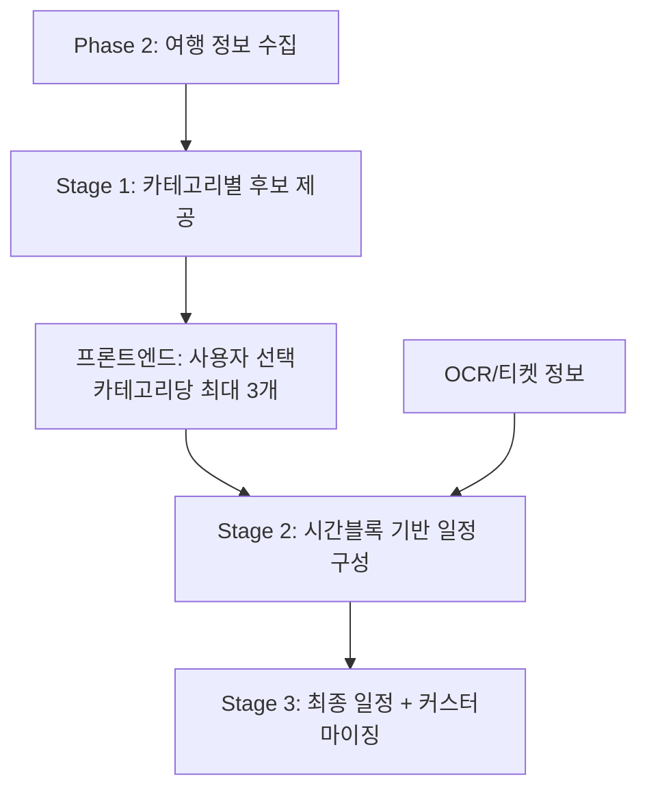

# Stage 1-2-3 통합 플로우 문서

## 📊 전체 흐름도



---

## 🎯 Stage 1: 초기 후보 제공

### 목적
Phase 2에서 수집된 정보를 기반으로 카테고리별 후보 제공

### 입력
- Phase 2 데이터: 목적지, 여행 스타일, 날짜, 예산
- Pre-Stage 데이터: DB에 저장된 여행지 정보

### 처리
1. 목적지 기반 지역 필터링
2. 카테고리별 분류 (관광명소, 맛집, 카페, 쇼핑 등)
3. Google Places API로 리뷰수 조회
4. 리뷰수 기반 각 카테고리당 상위 10개 선별

### 출력
```json
{
  "destination": "서울",
  "categories": {
    "관광명소": [10개 장소],
    "맛집": [10개 장소],
    "카페": [10개 장소],
    // ...
  }
}
```

### 프론트엔드 상호작용
- 사용자는 각 카테고리에서 **1개씩 선택**
- 선택된 장소들이 Stage 2로 전달

---

## 🗓️ Stage 2: 시간블록 기반 일정 구성

### 목적
사용자 선택 장소와 확정 일정을 시간블록에 배치하고, 주변 후보 추천

### 입력
1. **최우선 확정 일정** (OCR, 항공권, 티켓)
2. **사용자 선택 장소** (Stage 1에서 선택)
3. **여행 기간** (당일~2박3일)

### 시간블록 구조
```
하루 시간블록 (6개):
- BREAKFAST (07:00-09:00)          - 아침식사 - 2개 장소 가능
- MORNING_ACTIVITY (09:00-12:00)   - 오전일과 - 2개 장소 가능
- LUNCH (12:00-14:00)              - 점심식사 - 2개 장소 가능
- AFTERNOON_ACTIVITY (14:00-18:00) - 오후일과 - 2개 장소 가능
- DINNER (18:00-20:00)             - 저녁식사 - 2개 장소 가능
- EVENING_ACTIVITY (20:00-22:00)   - 저녁일과 - 2개 장소 가능
```

### 처리 프로세스

#### Step 1: 확정 일정 우선 배치
```python
1. OCR/티켓 정보 파싱
2. 해당 날짜와 시간블록 확인
3. 해당 시간블록에 고정 배치
예) 항공권 14:00 → Day1 AFTERNOON_ACTIVITY 블록 고정
```

#### Step 2: 사용자 선택 장소 배치
```python
1. 선택된 장소들의 카테고리 분석
2. 적절한 시간블록 매칭
   - 맛집 → BREAKFAST/LUNCH/DINNER
   - 카페 → AFTERNOON_ACTIVITY (오후일과에 포함)
   - 관광지 → MORNING/AFTERNOON/EVENING_ACTIVITY
3. 거리 최적화 고려하여 날짜 할당
```

#### Step 3: 클러스터 형성
```python
각 날짜별로:
1. 배치된 장소들로 K-means 클러스터링 수행
2. 클러스터 중심점 계산
3. 클러스터 반경 및 밀도 분석
```

#### Step 4: 추가 후보 추천
```python
각 시간블록별로:
1. 빈 슬롯 확인 (시간블록당 2개까지 가능)
2. 클러스터 중심에서 가까운 후보 검색
3. 거리 기반 점수 계산:
   - 5km 이내: 높은 점수
   - 5-10km: 중간 점수
   - 10km 이상: 낮은 점수
4. 카테고리 다양성 고려
5. 시간블록당 5-10개 후보 생성
```

### 거리 최적화 방법

#### 옵션 1: K-means 클러스터링
- 장점: 빠른 처리, 명확한 그룹핑
- 단점: 실제 도로 거리 미반영

#### 옵션 2: 카카오 모빌리티 API
- 장점: 실제 이동 시간/거리 계산
- 단점: API 호출 제한, 처리 시간

**하이브리드 접근**:
1. K-means로 초기 클러스터링
2. 카카오 API로 정밀 조정

### 출력 구조
```json
{
  "day1": {
    "confirmed": [
      {
        "timeBlock": "MORNING_ACTIVITY",
        "places": [확정된 장소들]
      }
    ],
    "candidates": {
      "LUNCH": [5-10개 후보],
      "AFTERNOON_ACTIVITY": [5-10개 후보],
      // ...
    }
  },
  "day2": { /* ... */ },
  "day3": { /* ... */ }
}
```

---

## 🎨 Stage 3: 최종 일정 및 커스터마이징

### 목적
AI 추천 일정 제시 및 사용자 커스터마이징 지원

### 입력
- Stage 2 출력 (확정 + 후보)

### 처리

#### AI 추천 일정 생성
```python
각 시간블록별로:
1. 후보 중 최적 장소 선택
   - 거리 점수 (40%)
   - 품질 점수 (30%)
   - 카테고리 다양성 (30%)
2. 전체 동선 최적화 (TSP)
3. 예상 이동 시간 계산
```

#### 커스터마이징 UI 구성
```json
{
  "recommended": {
    "day1": [
      {"time": "09:00", "place": "경복궁", "duration": 120},
      {"time": "12:00", "place": "토속촌", "duration": 60},
      // ...
    ]
  },
  "alternatives": {
    "day1": {
      "MORNING_ACTIVITY": [
        {"place": "창덕궁", "distance": 2.1, "rating": 4.5},
        {"place": "북촌한옥마을", "distance": 1.5, "rating": 4.3},
        // ... 나머지 후보들 (장바구니)
      ],
      // ...
    }
  }
}
```

### 커스터마이징 기능

1. **장소 교체**
   - 추천 장소 → 후보 장소로 드래그 앤 드롭
   - 실시간 동선 재계산

2. **장소 추가/삭제**
   - 시간블록당 최대 2개까지
   - 전체 일정 시간 자동 조정

3. **순서 변경**
   - 같은 날 내에서 순서 조정
   - TSP 재실행으로 최적화

4. **실시간 피드백**
   - 총 이동 거리
   - 예상 소요 시간
   - 이동 수단별 경로

---

## 📝 핵심 규칙 정리

### 우선순위
1. **최우선**: OCR/티켓 (시간 고정)
2. **우선**: 사용자 선택 장소
3. **일반**: AI 추천 장소

### 제약사항
- 시간블록당 최대 2개 장소
- 하루 최대 12개 장소 (6블록 × 2)
- 하루 이동거리 권장 20km 이내

### 최적화 목표
1. 이동 거리 최소화
2. 카테고리 다양성 확보
3. 사용자 선호 반영
4. 시간 효율성

---

## 🔄 구현 순서

1. **Stage 2 핵심 로직**
   - 시간블록 배치 알고리즘
   - 클러스터링 구현
   - 후보 추천 로직

2. **Stage 3 기본 구현**
   - AI 추천 생성
   - 대안 리스트 구성

3. **커스터마이징 API**
   - 장소 교체 엔드포인트
   - 동선 재계산 로직

4. **최적화**
   - 카카오 API 연동
   - 성능 튜닝